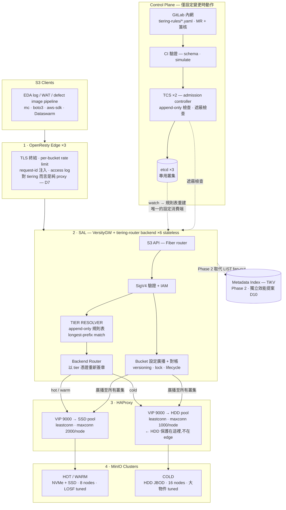
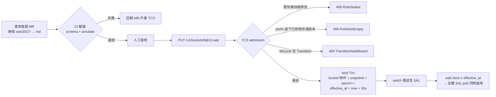
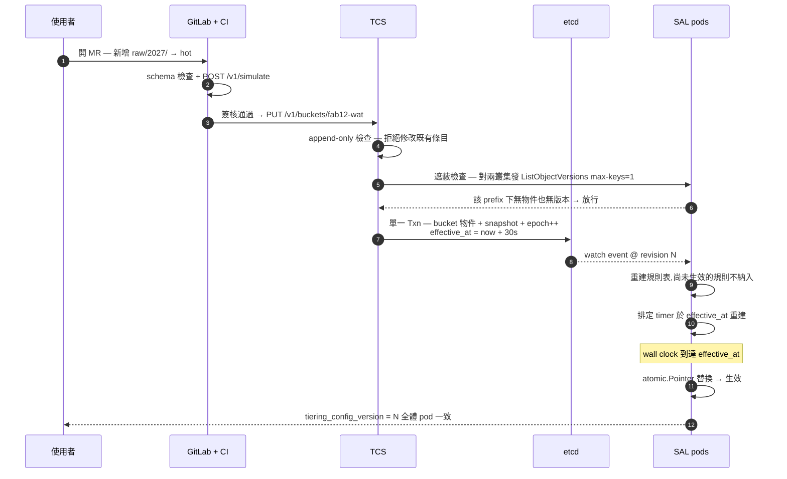
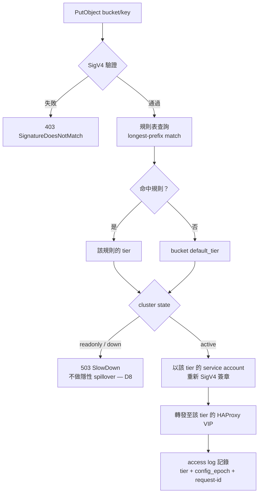
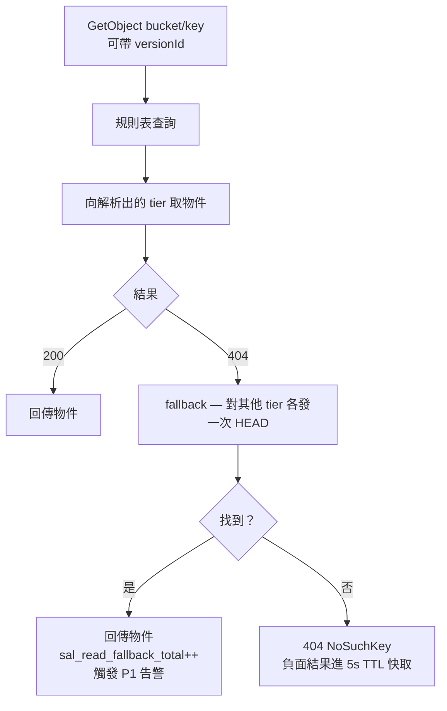
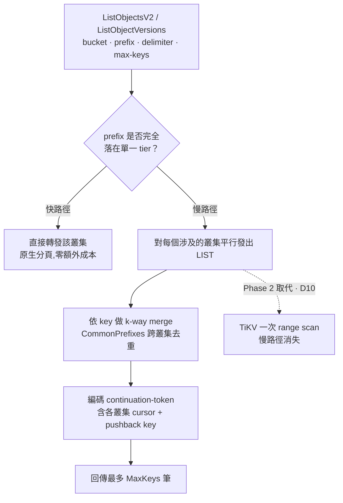
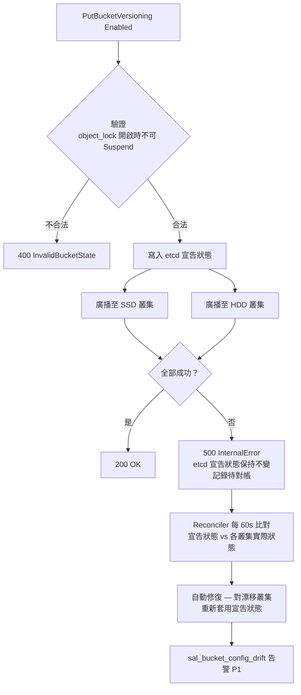
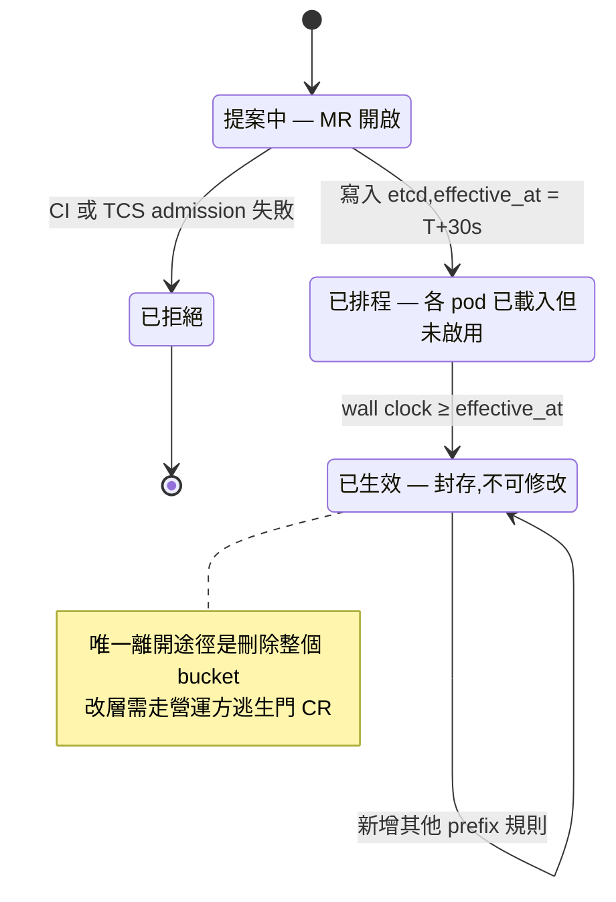
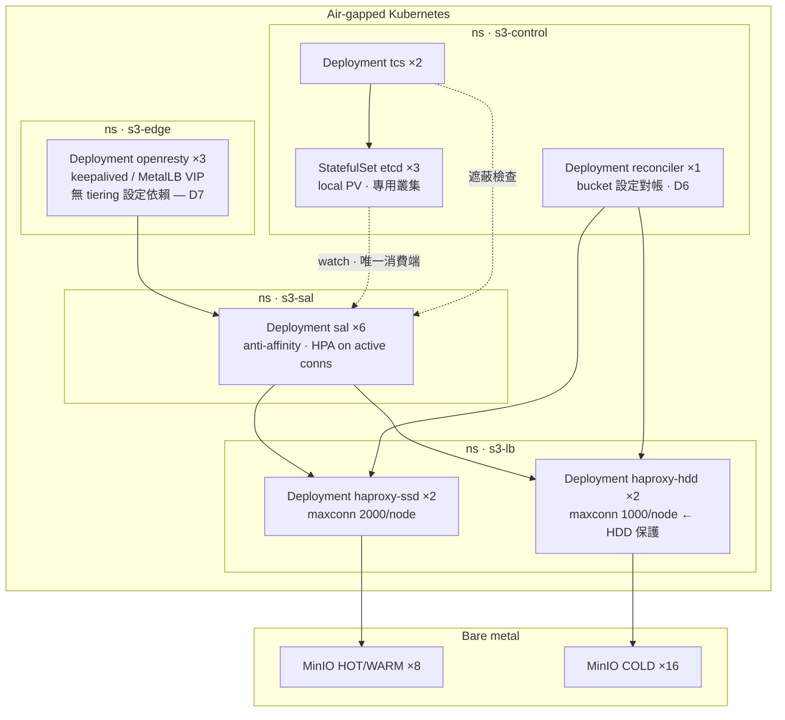
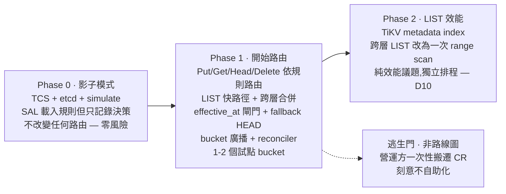

# MinIO Static Tiering Service — 系統設計

| | |
|---|---|
| **文件狀態** | For review |
| **版本** | Rev C |
| **核心決策** | Tiering 決策放在 SAL;設定管理獨立為 TCS + 專用 etcd |
| **關鍵約束** | 規則 append-only,封存後不可修改 |
| **本版新增決策** | 不支援 per-prefix versioning;不做 tier-aware 限流 |
| **環境** | Air-gapped on-premises Kubernetes |

### 本版相對 Rev B 的變更

| 變更 | 影響範圍 |
|---|---|
| **D6 不支援 per-prefix versioning** | Versioning / Object Lock / Lifecycle 全部收斂為 bucket-level 且跨叢集一致。新增廣播與對帳機制(§9.6)。**連帶修正遮蔽檢查的一個漏洞**(§10.1) |
| **D7 不做 tier-aware 限流** | **OpenResty 完全退出 tiering 設定迴圈。**原需求 F4「OpenResty 免重啟更新 tiering 設定」隨之作廢 — 前提不成立。etcd watch 消費端由 2 個減為 1 個,Lua 實作整段移除 |
| 新增決策紀錄章節 | §2,收錄 11 條架構決策的理由與後果 |
| 新增 bucket / prefix 邊界準則 | §4.3,D6 讓 bucket 設計變成使用者必須提前決定的事 |

---

## 目錄

1. [決策摘要](#1-決策摘要)
2. [決策紀錄](#2-決策紀錄)
3. [需求與約束](#3-需求與約束)
4. [名詞與邊界準則](#4-名詞與邊界準則)
5. [整體架構](#5-整體架構)
6. [元件放置決策分析](#6-元件放置決策分析)
7. [Control Plane 設計](#7-control-plane-設計)
8. [設定熱更新機制](#8-設定熱更新機制)
9. [Data Plane 設計](#9-data-plane-設計)
10. [維持不變量的兩道防線](#10-維持不變量的兩道防線)
11. [實作骨架](#11-實作骨架)
12. [部署拓撲](#12-部署拓撲)
13. [失效模式與降級行為](#13-失效模式與降級行為)
14. [可觀測性](#14-可觀測性)
15. [分階段落地](#15-分階段落地)
16. [給主管的決策論點](#16-給主管的決策論點)
17. [未解決問題](#17-未解決問題)
18. [附錄:關鍵設定](#18-附錄關鍵設定)
19. [參考](#19-參考)

---

## 1. 決策摘要

**Tiering 的決策邏輯放在 SAL**(VersityGW 的 tiering-router backend);**設定管理獨立成 control plane**(Tiering Config Service + 專用 etcd);**OpenResty 與 HAProxy 完全不碰 tiering 邏輯**。

理由一句話:tiering 不只是「挑一個後端」,它同時決定 **LIST 跨叢集合併**、**multipart 路由一致性**、**跨層 CopyObject**、以及 **bucket-level 設定的跨叢集廣播**。這四件事只有懂 S3 語意的那一層做得對,而那層就是 SAL。把它下推到 OpenResty 或 HAProxy,等於要在不懂 S3 的地方重造 S3。

### 核心不變量

> **對任一 key,其解析出的 tier 永不改變。**

規則一旦設定即封存,因此規則同時是寫路徑與讀路徑的權威來源。這條不變量讓我們不需要 metadata index 來保證正確性,也不需要資料搬遷子系統。

⚠️ 但要注意:**「規則不可修改」不等於「解析結果不可變」**。在 longest-prefix-match 之下,**新增**一條更精確的規則就足以改變既有 key 的解析結果。§10 說明維持不變量所需的兩道防線。

### 由核心不變量導出的一條有用引理

> **引理。** Tier 是 key 的純函數,且 key 不會改變 ⟹ **同一個 key 的所有 version、delete marker、multipart part 必然落在同一個叢集。**

這個引理在 D6(不支援 per-prefix versioning)之下讓 `ListObjectVersions` 的跨層合併簡化成純 key 層級的 k-way merge — 不需要處理「同一 key 的 version 散落在不同叢集」的情況。這比一般的多後端聯邦簡單得多,值得在實作時明確依賴。

---

## 2. 決策紀錄

| # | 決策 | 理由 | 後果 |
|---|---|---|---|
| **D1** | Tiering 決策放在 SAL,不放 OpenResty / HAProxy / MinIO ILM | LIST 合併、multipart 一致性、跨層 copy、bucket 廣播都需要 S3 語意 | SAL 需要一個新的 backend 實作。OpenResty 與 HAProxy 零改動 |
| **D2** | Control plane 獨立為 TCS + **專用** etcd | 設定變更需可審核、可 dry-run、可回溯(C2);共用 k8s etcd 會讓設定流量影響整個控制面 | 多一個服務與一組 etcd。需要新 CR |
| **D3** | 規則 append-only,封存後不可修改 | 使用者決定 | 資料搬遷子系統移出 v1;TCS 縮成 admission controller;讀路徑不需索引即正確。代價轉移為使用者的一次性決策壓力(§10.3) |
| **D4** | 解析語意用 longest-prefix match,不用 priority 數字 | 結果唯一且可預測;使用者不需理解 priority 相對關係 | 需要遮蔽檢查(§10.1)才能讓重疊規則安全 |
| **D5** | 三個邏輯 tier(hot/warm/cold),兩個物理叢集 | 規則不可改,若現在只給兩個 tier,日後加中間層必須讓使用者重新宣告 | 短期內 hot 與 warm 行為相同,需人為製造實質差異(§18.3)。見 Q1 |
| **D6** | **不支援 per-prefix versioning** | S3 語意本來就是 bucket-level;per-prefix 版控需在 SAL 自建版本索引,複雜度不成比例 | Versioning / Object Lock / Lifecycle 全部 bucket-level 且跨叢集一致。需廣播 + 對帳(§9.6)。使用者若需不同版控策略必須**拆 bucket**(§4.3) |
| **D7** | **不做 tier-aware 限流** | HDD 保護在 HAProxy 的 per-server `maxconn` 做更貼近資源、更有效(連線層背壓而非邏輯層分類) | **OpenResty 完全不需要 tiering 設定。**原需求 F4 作廢。etcd 消費端只剩 SAL,Lua 工作量歸零 |
| **D8** | 叢集不可用時回 503,不做隱性 spillover | 對歸檔正確性,可預測性優於可用性;在不可變模型下寫錯層的資料**永遠讀不到** | 單一 tier 故障即該 tier 的 prefix 不可寫。需明確告警與使用者溝通 |
| **D9** | SAL 優先用 plugin backend,不 fork | 上游升級不需 rebase(C4 的抽換彈性) | 受 Go `plugin` 的 toolchain 綁定約束;每次上游升級需重編 plugin。見 Q6 |
| **D10** | Metadata index(TiKV)是**獨立的效能提案**,不是 tiering 的前提 | D3 讓讀路徑正確性不再需要索引 | Phase 2 可獨立排程;tiering 不被索引的複雜度拖住 |
| **D11** | Bucket 一律在所有叢集上建立 | 任何 prefix 日後可能宣告成任何 tier,該叢集上必須已有 bucket | 少數空 bucket,成本可忽略。`CreateBucket` 需廣播且可回滾 |

---

## 3. 需求與約束

### 3.1 功能需求

| # | 需求 | 說明 |
|---|---|---|
| F1 | 使用者自行宣告分層 | 以 `bucket + key prefix` 為粒度。不做基於存取熱度的自動搬遷 — 這是 *static* 的定義 |
| F2 | 規則不可修改 | 一旦設定即封存。唯一允許的寫入操作是**新增**新的 prefix 規則;不可改層、不可刪除 |
| F3 | 單一 endpoint、單一 namespace | Client 只看到 `s3.fab.corp`。`ListBuckets` 需合併兩個叢集的結果 |
| ~~F4~~ | ~~OpenResty 免重啟更新 tiering 設定~~ | **已作廢(D7)。** OpenResty 不再需要 tiering 設定,此需求前提不成立 |
| F4′ | **SAL** 免重啟更新設定 | 新增規則後 SAL 不重啟即生效。這是 F4 收斂後的唯一範圍 |
| F5 | 不得資料遺失 | 新增規則不能讓既有物件變成讀不到。**注意這件事不會因為 F2 而自動成立** |
| F6 | S3 API 相容 | 現有 EDA 工具鏈與 boto3 / aws-sdk 不需改動 |
| F7 | Bucket-level 設定跨叢集一致 | Versioning、Object Lock、Lifecycle 在所有叢集上必須相同(D6 的直接後果) |

### 3.2 環境約束

| # | 約束 | 對設計的影響 |
|---|---|---|
| C1 | Air-gapped | 不能依賴外部 SaaS 或雲端 tier;所有元件離線可部署,依賴須 vendoring |
| C2 | 嚴格變更管理 | 每次設定變更需可審核、可回溯、可 dry-run。這是把 config 抽成獨立服務(而非散在 nginx.conf / HAProxy map)的**主要驅動力** |
| C3 | LIST 效能已是既有痛點 | 單叢集約 50 億物件時 LIST 明顯退化;任何設計不得加重 LIST 負擔 |
| C4 | MinIO CE 上游停止維護 | 設計必須讓「未來抽換某一層的儲存引擎」可行,不能綁死 MinIO 原生功能 |
| C5 | 既有網路架構固定 | OpenResty → SAL → HAProxy → MinIO 四層已定案,不重新設計 |

### 3.3 非目標

- 自動熱度偵測與搬遷(dynamic tiering)
- **Per-prefix versioning**(D6)
- **Tier-aware 限流**(D7)
- 跨 region 複寫
- 物件層級的 tier 覆寫(只支援 prefix 粒度)
- 使用者自助改層(見 §10.3 的逃生門)
- MinIO ILM Transition(§6.3;SAL 會主動拒絕含 Transition 的 lifecycle 設定)

---

## 4. 名詞與邊界準則

### 4.1 名詞

| 名詞 | 定義 |
|---|---|
| **Tier** | 邏輯層級:`hot` / `warm` / `cold`。這是使用者宣告的單位 |
| **Cluster** | 物理 MinIO 叢集。目前兩個:SSD 叢集、HDD 叢集 |
| **Tier → Cluster 映射** | `hot` 與 `warm` → SSD 叢集;`cold` → HDD 叢集 |
| **Rule** | 一條 `(prefix, tier)` 宣告,附帶 `sealed_at` 與 `effective_at` |
| **Snapshot** | TCS 編譯後的完整設定,SAL 唯一需要 watch 的 etcd key |
| **Epoch** | 單調遞增的設定版本號,用於收斂偵測 |
| **Shadowing** | 新增一條更精確的規則,使既有 key 的解析結果改變 |
| **Canonical cluster** | 一個 bucket 的 `default_tier` 所對應的叢集;bucket-level 設定的讀取來源 |

### 4.2 為什麼三個 tier 但只有兩個叢集(D5)

保留 `hot` 與 `warm` 的區分,是為了讓未來拆出第三個叢集時**不需要重寫使用者規則**。若現在只給兩個 tier,日後要加入中間層就必須讓使用者重新宣告 — 而規則是不可修改的(D3),這會變成一場遷移災難。

代價是短期內兩者行為相同,可能造成困惑。緩解方式:在 SSD 叢集內用不同 bucket 與不同 EC parity 讓兩者有實質差異(§18.3),使區分從第一天就有意義。

### 4.3 Bucket 與 Prefix 的邊界準則(D6 的直接後果)

D6 讓 bucket 設計變成使用者**必須提前決定**的事。給使用者的準則:

> **Bucket 的邊界由 bucket-level 設定決定;Prefix 的邊界由 tier 決定。**

| 需求 | 做法 |
|---|---|
| 同一批資料要分不同 tier | **同一個 bucket,用 prefix 區分** |
| 不同的 versioning 策略(要/不要版控) | **拆成不同 bucket** |
| 不同的 Object Lock 保留期或模式 | **拆成不同 bucket**(S3 限制:Object Lock 只能在建立時開啟) |
| 不同的 lifecycle expiration 天數 | 同 bucket 內可用 lifecycle 的 prefix filter 區分,不需拆 |
| 不同的存取權限 | 同 bucket 內用 bucket policy 的 prefix condition,或拆 bucket |

⚠️ 這條準則必須寫進使用者文件的**第一頁**。因為 tiering 規則不可修改(D3),使用者若在 bucket 邊界上決策錯誤,補救成本很高。

---

## 5. 整體架構



### 這張圖要看到的兩件事

**一、四層裡面只有一層需要為 tiering 改動。** HAProxy 只調整 `maxconn`,MinIO 完全不動,而在 D7 之後 **OpenResty 也完全不動**(它原本要多讀一份設定給 tier-aware 限流用,現在不需要了)。變更範圍最小化,可直接寫進 CR。

**二、etcd 的設定消費端只有一個。** Rev B 有兩個(SAL 與 OpenResty),需要處理兩種語言的 watch、兩套版本收斂監控。D7 之後只剩 SAL — 收斂偵測、失效處理、測試面都減半。

---

## 6. 元件放置決策分析

### 6.1 先釐清:這是兩個不同的東西

| | 決策(data plane) | 設定管理(control plane) |
|---|---|---|
| **輸入** | bucket + key | 一條新規則 |
| **輸出** | tier + cluster endpoint | 寫入 etcd 或拒絕 |
| **頻率** | 每個 request | 極低(每天到每月) |
| **要求** | 微秒級、無外部依賴 | 正確性、可稽核、可 dry-run |

把這兩者混在一起是常見的設計錯誤,結果就是「改個設定要重啟 gateway」或「設定寫在 nginx.conf 裡沒有稽核軌跡」。**兩者必須分開放置。**

### 6.2 候選放置點對照

| 放置點 | 熱更新 | LIST 跨層合併 | Multipart 一致性 | 跨層 Copy | Bucket 廣播 | Blast radius | 結論 |
|---|---|---|---|---|---|---|---|
| **OpenResty (Lua)** | 容易 | ✗ 需在 Lua 做 XML 聚合 + k-way merge | △ 靠 prefix 巧合一致 | ✗ | ✗ | **高** — edge 掛則全站掛 | ✗ |
| **SAL (VersityGW)** | etcd watch + atomic swap | ✓ S3 語意在手 | ✓ UploadId 編碼 clusterID | ✓ 串流讀寫 | ✓ | 中 — stateless、可 canary | **✓ 推薦** |
| **HAProxy** | ✓ map + Runtime API 免 reload | ✗ | △ | ✗ | ✗ | 中 | ✗ 應保持純 LB |
| **MinIO 原生 ILM** | ✗ 非宣告式放置 | ✗ metadata 留在來源叢集 | n/a | ✓ | n/a | 高 — 單一 namespace | ✗ |
| **獨立 routing microservice** | ✓ | △ 邏輯還是得回 SAL | △ | △ | △ | 高 — 新增 in-path 依賴 | ✗ 多此一舉 |

### 6.3 為什麼不用 MinIO 原生 ILM tiering

這題主管一定會問,四個理由:

1. **它不是宣告式放置,是生命週期搬遷。** ILM transition 需要 age 或 date 觸發條件。就算設 `days=0`,物件仍然是**先落在 SSD、再由背景 scanner 搬到 HDD**。對「這個 prefix 天生就是 cold」的需求,這是純粹的 SSD 寫入放大加上延遲搬遷。

2. **Metadata 與 LIST 負擔留在來源叢集。** ILM 把資料搬走但 metadata 留下,LIST 仍然打在 SSD 叢集上。這完全不解決 C3,只是把 capacity 搬走。

3. **失效域不獨立。** 來源叢集永遠是 namespace 的單一擁有者,升級或故障會同時影響 hot 與 cold。分成兩個叢集最大的營運價值就是**獨立升級窗口** — 在 fab 這是排 downtime 的關鍵。

4. **策略風險(C4)。** 把核心分層能力押在停止維護的上游原生功能上,等於把未來的抽換彈性交出去。

> **實作後果:** 既然我們不使用 ILM Transition,SAL 必須**主動拒絕**含有 `Transition` 或 `NoncurrentVersionTransition` 動作的 `PutBucketLifecycleConfiguration` 請求(§9.6.4)。否則使用者可能繞過 tiering 機制,在單一叢集內私自建立第二套分層,造成規則與實際位置不符 — 而在不可變模型下這種資料永遠讀不到。

### 6.4 SAL 的改法:優先用 plugin,而非 fork(D9)

VersityGW 的 `backend.Backend` interface 約 50 個方法,所有 backend 都內嵌 `BackendUnsupported`,只需實作用得到的操作。更關鍵的是它已有 **shared-library plugin 框架**(CERN 貢獻),backend 可獨立 repo 開發、runtime 動態載入,不需 fork 或 patch core。

| 方案 | 維護成本 | 風險 | 建議 |
|---|---|---|---|
| **Plugin backend**<br/>`tiering-router.so`,獨立 repo | 低 — 上游升級不需 rebase | Go plugin 要求 toolchain 與 build flag 完全一致;僅 Linux | **首選。** Air-gapped 的 build image 本來就鎖版本,這個約束反而好滿足 |
| **Minimal fork**<br/>只加一個 backend 註冊點 | 中 — 但衝突面極小 | 無動態載入的脆弱性 | **備案。** 若 plugin ABI 不穩就走這條;改動限制在 `cmd/` 註冊與新增目錄,core 不碰 |
| **Heavy fork**<br/>改 `s3api` handler | 高 | 高 | **避免。** LIST fan-out 應以 backend 層的 `ListObjectsV2` 實作承接,不改 HTTP 層 |

---

## 7. Control Plane 設計

### 7.1 etcd 資料模型

> **注意 key 改名。** Rev B 是 `/rules/{bucket}`,Rev C 改為 `/buckets/{bucket}` — 因為 D6 之後這個物件不只放規則,還放 bucket-level 設定的宣告狀態。

```jsonc
// /config/tiering/v1/buckets/fab12-wat
{
  "bucket": "fab12-wat",

  // ---- Tiering:append-only,既有條目封存不可改 ----
  "default_tier": "cold",              // 未命中任何規則的歸屬,絕不留 undefined
  "rules": [
    { "prefix": "raw/2026/", "tier": "hot",
      "sealed_at":    "2026-08-12T03:10:00Z",   // 稽核用
      "effective_at": "2026-08-12T03:10:30Z" }, // 排程啟用,見 §10.2
    { "prefix": "raw/",      "tier": "warm", "sealed_at": "2026-05-02T…" },
    { "prefix": "archive/",  "tier": "cold", "sealed_at": "2026-05-02T…" }
  ],

  // ---- Bucket-level 設定(D6):宣告狀態的唯一真實來源 ----
  // 必須在所有叢集上一致。漂移由 reconciler 自動修復(§9.6.3)。
  "versioning": "Enabled",             // Unversioned | Enabled | Suspended
  "object_lock": {                     // S3 限制:只能在建立 bucket 時開啟
    "enabled": true,
    "default_mode": "COMPLIANCE",
    "default_days": 2555
  },
  "lifecycle": [                       // 只允許 Expiration 類動作,見 §9.6.4
    { "id": "expire-scratch", "prefix": "scratch/", "expiration_days": 30 }
  ],

  "added_by": "jason.lin",
  "mr": "tiering-rules!482"
}
```

```jsonc
// /config/tiering/v1/clusters/cold
{
  "id": "hdd-01",
  "endpoint": "http://haproxy-hdd.s3-lb.svc:9000",
  "cred_ref": "k8s://secret/sal-cold",   // 憑證本身不進 etcd,只放參照
  "path_style": true,
  "state": "active"                       // active | draining | readonly
}
```

```
/config/tiering/v1/snapshot     ← SAL 唯一需要 watch 的 key(編譯後全表)
/config/tiering/v1/epoch        ← 單調遞增,收斂偵測用
```

**為什麼同時存 per-bucket 物件與編譯後的 snapshot?** Per-bucket key 是可稽核的來源;snapshot 讓 SAL 只需 watch 一個 key,不會看到半套設定。兩者在同一個 etcd Txn 內原子寫入。若 snapshot 超過約 1 MB,依 bucket hash 分片成 `snapshot/0..15`。

### 7.2 解析語意:最長前綴優先(D4)

刻意選用和路由表相同的語意,而不是「優先權數字」。原因是**最長前綴的結果唯一且可預測**,不會出現兩條規則 priority 相同而行為未定義的情況;使用者也不需要理解 priority 的相對關係。

以 7.1 的規則為例:

| Key | 命中規則 | 解析結果 |
|---|---|---|
| `raw/2026/lot123.gz` | `raw/2026/` | `hot` |
| `raw/2025/lot001.gz` | `raw/` | `warm` |
| `archive/2019/x.tar` | `archive/` | `cold` |
| `misc/scratch.log` | 無 → default | `cold` |

### 7.3 TCS:規則新增的 admission controller

因為規則不可修改(D3),TCS 不需要規則生命週期狀態機,它的角色收斂成一個 **admission controller**。



四項 admission 檢查:

1. **Schema 與 tier 有效性** — tier 名稱存在,cluster `state == active`
2. **Append-only 檢查** — 既有規則條目必須逐字未變(§11.8)
3. **遮蔽檢查** — 新規則的 prefix 底下,任何叢集都不得已有物件**或版本**(§10.1)
4. **Lifecycle 檢查** — 拒絕含 `Transition` / `NoncurrentVersionTransition` 的設定(§6.3)

### 7.4 API 規格

| Method | Path | 用途 | 回應 |
|---|---|---|---|
| `GET` | `/v1/buckets/{bucket}` | 讀取現行設定(規則 + bucket-level) | `200` |
| `POST` | `/v1/buckets/{bucket}/provision` | **主要流程** — 建立時一次宣告完整 manifest | `201` |
| `PUT` | `/v1/buckets/{bucket}` | 例外流程 — 事後新增規則 | `202` + `effective_at`<br/>`409 RuleSealed`<br/>`409 PrefixNotEmpty`<br/>`400 TransitionNotAllowed` |
| `POST` | `/v1/simulate` | Dry-run:一批 key → 解析結果 | `200` |
| `GET` | `/v1/clusters` | Tier → cluster 映射與狀態 | `200` |
| `GET` | `/v1/drift` | 目前偵測到的 bucket 設定漂移 | `200` |
| `GET` | `/v1/audit/{bucket}` | 設定變更歷史 | `200` |
| `GET` | `/healthz` `/metrics` | 健檢與 Prometheus | — |

`/v1/simulate` 範例:

```http
POST /v1/simulate
{
  "bucket": "fab12-wat",
  "pending_rules": [ { "prefix": "raw/2027/", "tier": "hot" } ],
  "keys": ["raw/2027/lot9.gz", "raw/2026/lot1.gz", "misc/a.log"]
}
```

```jsonc
{
  "results": [
    { "key": "raw/2027/lot9.gz", "tier": "hot",  "matched": "raw/2027/", "changed_from": "warm" },
    { "key": "raw/2026/lot1.gz", "tier": "hot",  "matched": "raw/2026/", "changed_from": null },
    { "key": "misc/a.log",       "tier": "cold", "matched": null,        "changed_from": null }
  ],
  "shadowing_check": {
    "raw/2027/": { "ssd-01": 0, "hdd-01": 0, "probe": "ListObjectVersions", "verdict": "safe" }
  }
}
```

> `changed_from` 是使用者自我驗證的關鍵。任何非 null 的值都代表「這條規則會改變既有 key 的歸屬」,使用者在送 MR 前就能看到。
>
> `probe` 欄位顯示遮蔽檢查用了哪種 API — 版控 bucket 必須用 `ListObjectVersions`,原因見 §10.1。

### 7.5 為什麼選 etcd

| 選項 | 問題 |
|---|---|
| **ConfigMap** | kubelet 同步延遲可達分鐘級,且 volume 更新不保證觸發應用重載;要靠 informer watch API server,等於自己實作 watch |
| **關聯式資料庫** | 沒有原生 watch,只能輪詢;in-path 的 DB 依賴不符合 fail-open 目標 |
| **Consul** | 功能足夠,但技術棧內已有 etcd,不值得多養一套 |
| **etcd** ✓ | 有 revision 語意的 watch(可精確續傳)、Txn 原子性、離線可部署,已在既有技術棧內 |

⚠️ **務必用專用 etcd 叢集,不要共用 k8s control-plane etcd**(D2)。這需要一張新的 CR。

---

## 8. 設定熱更新機制

**D7 之後只有一個消費端:SAL。** 全程無 process 重啟、無 rolling restart。



### 8.1 SAL 端的關鍵實作點

**啟動順序很重要:先 `Get` 取得當前值與 revision,再 `Watch(WithRev(rev+1))`。** 反過來會有事件空窗。

設定物件放在 `atomic.Pointer[Table]`,收到事件時**建新表再整體替換**,不做 in-place 修改 — 所以進行中的 request 不會看到半套規則,也完全不需要鎖。實作見 §11.4。

### 8.2 OpenResty 需要什麼(以及不需要什麼)

| | 狀態 |
|---|---|
| Tiering 規則 snapshot | ❌ **不需要**(D7)。OpenResty 對 tiering 而言是純 proxy |
| Per-bucket rate limit 設定 | ✅ 需要,但這是**既有系統**、獨立的 etcd namespace,不在本設計範圍 |
| Tier-aware 限流設定 | ❌ 不做(D7)。HDD 保護改在 HAProxy,見 §9.7 |

這是 D7 帶來的最大簡化:Rev B 需要寫一整套 Lua consumer(worker-0 watcher、shared dict 扇出、per-worker LRU、epoch counter 避免逐請求 JSON decode),Rev C **整段刪除**。

### 8.3 傳播 SLO

| 指標 | 目標 |
|---|---|
| etcd Txn → 所有 SAL pod 收到 watch event | p99 ≤ 2s |
| 收到 event → 規則表重建完成 | p99 ≤ 200ms |
| 全體 `sal_config_version` 收斂 | ≤ 30s(受 `effective_at` 閘門控制) |
| 版本分歧持續時間告警閾值 | > 30s 即視為事故 |

### 8.4 失效處理

| 情況 | 處理 |
|---|---|
| watch 中斷 | 重新 `Get` 取得 revision,再 `Watch(rev+1)` — 不會漏事件 |
| revision 被 compact | 同上,完整重新同步 |
| snapshot JSON 解析失敗 | 保留現有設定,`sal_config_parse_errors` 計數並告警。**絕不 fail-closed** |
| etcd 全部不可用 | 沿用記憶體中的 last-known-good;冷啟動讀本機落地檔 `/var/lib/sal/tiering.json`。I/O 不中斷,告警 |

---

## 9. Data Plane 設計

### 9.1 各 S3 操作的處理分類

| 類別 | 操作 | 路由方式 |
|---|---|---|
| **Key-routed** | `PutObject` `GetObject` `HeadObject` `DeleteObject` `GetObjectAttributes` `*ObjectTagging` `*ObjectAcl` `*ObjectRetention` `*ObjectLegalHold` | 查規則表 → tier → cluster。**帶 `versionId` 時同樣按 key 路由**(引理保證同 key 的所有 version 在同一叢集) |
| **Key-routed at creation** | `CreateMultipartUpload` | 查規則表,並把 clusterID 編碼進 UploadId |
| **UploadId-routed** | `UploadPart` `UploadPartCopy` `CompleteMultipartUpload` `AbortMultipartUpload` `ListParts` | 從 UploadId 解碼 clusterID,**不再查規則表** |
| **Fan-out + merge** | `ListBuckets` `ListObjects` `ListObjectsV2` `ListObjectVersions` `ListMultipartUploads` | 平行查詢,依 key 合併 |
| **Grouped fan-out** | `DeleteObjects` | 依 tier 分組後平行發送,再合併 `Deleted` / `Errors` |
| **Broadcast** | `CreateBucket` `DeleteBucket` `PutBucketVersioning` `PutBucketPolicy` `PutBucketTagging` `PutBucketLifecycleConfiguration` `PutObjectLockConfiguration` | **對所有叢集執行**,見 §9.6 |
| **Canonical read** | `GetBucket*` `HeadBucket` | 從 canonical cluster 讀取 |
| **Special** | `CopyObject` | 同層轉發原生 copy;跨層由 SAL 串流讀寫(§9.5) |
| **Aggregate** | 用量統計 / quota | 跨叢集加總 |
| **Rejected** | 含 `Transition` 的 lifecycle 設定 | `400 TransitionNotAllowed`(§9.6.4) |

### 9.2 寫路徑



**不做隱性 spillover(D8)。** 若 hot 叢集不可用,明確回 503 而非悄悄寫到 cold。理由:對歸檔正確性而言,可預測性優於可用性;悄悄寫到別層會製造出「規則與實際位置不符」的資料,而在不可變模型下這種資料**永遠讀不到**。

### 9.3 讀路徑



因規則不可變(D3),規則解析結果即為權威 — fallback 只是傳播窗口的保險(§10.2),觸發率應趨近於零。這讓 `sal_read_fallback_total` 成為**乾淨的告警訊號而非日常程式路徑**。

### 9.4 LIST 跨層合併



**判斷快路徑的方法。** 在規則表上查詢 `prefix` 的子樹。若該子樹內所有規則(含繼承來的 default)都指向同一個 tier,即為快路徑。這個判斷是 O(子樹大小),遠小於 LIST 本身的成本。

**慢路徑的四個步驟:**

1. 對每個涉及的叢集發出 LIST,各取 `MaxKeys` 筆
2. 依 key 做 k-way merge(S3 保證字典序)
3. `CommonPrefixes` 跨叢集去重
4. **continuation-token 編碼每個叢集各自的 cursor**,加上尚未回傳的緩衝 key

```
token = base64( json{ "v":1, "cursors": {"ssd-01":"…","hdd-01":"…"}, "pushback":"raw/2026/x.gz" } )
```

帶版本號以便日後演進。**務必寫 fuzz 測試**:隨機 prefix、隨機 MaxKeys、隨機在中途中斷再續傳,比對與單叢集基準的結果一致。這是整個設計最容易出錯的地方 — token 對 client 是不透明字串,但必須保證同一 token 重放時結果一致。

#### `ListObjectVersions` 因為引理而變簡單

一般的多後端聯邦要處理「同一個 key 的不同 version 散落在不同後端」,需要在 version 層級做二次合併。**本設計不需要** — §1 的引理保證同一 key 的所有 version 都在同一叢集,所以:

- 合併只在 **key 層級**進行,version 順序由後端叢集自己保證
- `KeyMarker` + `VersionIdMarker` 的續傳只需記錄「上次停在哪個叢集的哪個 key」,不需要跨叢集的 version 對齊
- Delete marker 與 noncurrent version 自然跟著 key 走

**單一叢集失敗時回 503,不回部分結果。** S3 client 無法辨識「部分結果」,會誤判資料不存在。

### 9.5 Multipart 與跨層 CopyObject

**UploadId 編碼**是讓 SAL 保持 stateless 的關鍵:

```
UploadId_client = base64url( clusterID + ":" + UploadId_backend )
```

三個好處:SAL 不需狀態儲存記住「這個 upload 在哪個叢集」;規則在上傳中途新增也不會讓後續 part 走錯叢集;任何 SAL pod 都能處理任何 part。

⚠️ 需驗證 client SDK 無硬編碼 UploadId 長度假設。實測 `aws-sdk-go-v2` 與 `boto3` 無此問題,自製工具需檢查。

**跨層 CopyObject:**

```
同層 → 直接轉發,MinIO 原生 server-side copy,零 SAL 頻寬
跨層 → SAL 串流讀寫:
        ≤ 5 GB → GetObject → PutObject 串流
        > 5 GB → CreateMultipartUpload + 分段 range GET → UploadPart(part size 256 MB)
```

**在不可變模型下這是使用者唯一的「改層」出路,重要性上升。** 必須:設併發上限(建議 per-pod 4 個並行);匯出 `sal_cross_tier_copy_bytes` 納入頻寬規劃。

### 9.6 Bucket-level 設定:廣播、對帳、限制(D6)

D6 讓這一節從「nice-to-have」升級為**硬性不變量(F7)**:versioning、object lock、lifecycle 在所有叢集上必須相同。

#### 9.6.1 為什麼必須廣播

因為 D11(bucket 一律在所有叢集建立),同一個 bucket 在兩個叢集上都存在。若 versioning 只在 SSD 叢集開啟,那寫到 `hot` prefix 的物件有版控、寫到 `cold` prefix 的沒有 — **同一個 bucket 內出現兩種語意**,這是 D6 明確要排除的情況。

#### 9.6.2 廣播與失敗處理



**為什麼可以自動修復?** 因為 etcd 持有宣告狀態(declared truth),reconciler 只是把實際狀態推回宣告狀態,不需要判斷孰是孰非。這比「拒絕服務直到人工介入」好 — 設定漂移不會造成資料遺失,只造成語意不一致,用停機來換不划算。

**Versioning 狀態轉換的可行性。** S3 的 versioning 狀態機是 `Unversioned → Enabled ⇄ Suspended`,**永遠回不到 Unversioned**。所以:

| 宣告狀態 | 叢集實際狀態 | 修復動作 | 可行 |
|---|---|---|---|
| `Enabled` | `Unversioned` | Enable | ✅ |
| `Enabled` | `Suspended` | Enable | ✅ |
| `Suspended` | `Enabled` | Suspend | ✅ |
| `Unversioned` | `Enabled` / `Suspended` | — | ❌ **不可能** |

最後一列意味著:**一旦任何叢集開啟過 versioning,該 bucket 的宣告狀態就不能再回到 `Unversioned`**。TCS 必須擋掉這種宣告,回 `400 InvalidBucketState`。

#### 9.6.3 Object Lock 實質上是不可變的

S3 規定 Object Lock 只能在 `CreateBucket` 時透過 `x-amz-bucket-object-lock-enabled` 開啟,且開啟後必須有 versioning。因此:

- Object Lock **必須**在 provisioning manifest 裡宣告,不能事後加
- 開啟 Object Lock ⟹ versioning 必為 `Enabled` 且不可 `Suspend`
- 這條和 D3 的規則不可變性質相同 — 都是「建立時決定,之後封存」

這強化了 §10.3 的建議:**把 provisioning 當主要流程**。Bucket 建立時要一次決定的東西比想像的多。

#### 9.6.4 Lifecycle:允許 Expiration,拒絕 Transition

| 動作 | 處理 |
|---|---|
| `Expiration` | ✅ 廣播至所有叢集,各自過期它持有的物件 |
| `NoncurrentVersionExpiration` | ✅ 同上 |
| `AbortIncompleteMultipartUpload` | ✅ 同上 |
| `Transition` | ❌ **`400 TransitionNotAllowed`** |
| `NoncurrentVersionTransition` | ❌ **`400 TransitionNotAllowed`** |

拒絕 Transition 的理由見 §6.3:允許它等於讓使用者在單一叢集內私建第二套分層,造成規則與實際位置不符 — 而在不可變模型下這種資料永遠讀不到。**這是必須擋在 API 層的,不能只寫在文件裡。**

⚠️ 已知副作用:各叢集的 lifecycle scanner 進度獨立,同一條 expiration 規則在兩個叢集上的實際刪除時間會有差異(通常數小時內)。對歸檔用途應可接受,但需向使用者說明。見 Q2。

### 9.7 後端保護:為什麼不需要 tier-aware 限流(D7)

原本 tier-aware 限流的動機是「保護 HDD 叢集不被大量小檔請求打爆」。這個需求是真的,但 edge 不是解決它的地方。三層防護,由近到遠:

| 層 | 機制 | 為什麼比 edge 好 |
|---|---|---|
| **HAProxy** | per-server `maxconn` + queue<br/>SSD 2000 / HDD 1000 | **連線層背壓**,正是 HDD 真正在意的維度。超限時請求在 HAProxy 排隊而非被拒絕,對 client 是延遲而非錯誤 |
| **MinIO** | `MINIO_API_REQUESTS_MAX` 在 HDD 叢集設較低 | 最貼近資源本身,叢集自己知道它的極限 |
| **SAL** | 跨層 copy 併發上限(per-pod 4) | 唯一由 SAL 產生的大量後端 I/O,在源頭限制 |

而 edge 的 tier-aware 限流有三個缺點:需要在 edge 解析 key 並查規則表(引入 tiering 設定依賴);限的是**請求數**而非連線數,和 HDD 的實際瓶頸不對齊;誤設定的 blast radius 在 edge。

**保留的 edge 限流:** per-bucket rate limit(既有系統)不受影響 — 它針對的是「單一使用者打爆整個平台」,和後端媒體特性無關。

### 9.8 SigV4 處理鏈

```
Client ──SigV4(client key)──▶ OpenResty ──原樣轉發,Host 不改──▶ SAL
                                                                    │
                                    驗證 client 簽章(SAL 自己的 IAM)
                                                                    │
                                    ──SigV4(tier service account)──▶ HAProxy ──▶ MinIO
```

1. **OpenResty 必須原樣保留 Host header**(`proxy_set_header Host $http_host`)。SigV4 簽章覆蓋 Host,改了就驗不過。
2. **SAL 重新簽章**,每個 tier 用獨立 service account。叢集層權限可分離(cold 叢集憑證只有 SAL 的 cold backend 持有)。

---

## 10. 維持不變量的兩道防線

> ⚠️ **最容易被漏掉的一件事**
>
> **「規則不可修改」不等於「解析結果不可變」。** 在 longest-prefix-match 之下,**新增**一條更精確的規則就足以改變既有 key 的解析結果 — 完全不需要動到任何既有條目。因此 F5 不會因為 F2 而自動成立。

### 規則生命週期



### 10.1 防線一:遮蔽檢查

**具體案例。** `raw/` → `warm` 已封存,`raw/2026/lot1.gz` 已寫在 SSD 上。使用者新增一條 `raw/2026/` → `cold`。沒有任何規則被修改,但解析結果變了,那個既有物件立刻變成 **404**。

**檢查規則。** 新規則的 prefix 底下,任何叢集都不得已有物件。

**成本。** 對每個叢集發一次 `max-keys=1` 的 LIST — 兩個叢集共兩次請求,次秒級完成,可同步在 API 內跑完。**不需要依賴 metadata index。**

> ### ⚠️ D6 帶出的一個漏洞修正
>
> Rev B 的遮蔽檢查用 `ListObjectsV2`。**在版控 bucket 上這是錯的。**
>
> `ListObjectsV2` 只回**目前版本**。若一個 prefix 底下的所有物件都已被刪除(只剩 delete marker 與 noncurrent version),`ListObjectsV2` 會回 `KeyCount=0`,遮蔽檢查會**誤判放行**。但那些 noncurrent version 在物理上還存在,而且仍可透過 `GET ?versionId=` 讀取 — 新規則生效後它們就變成讀不到。
>
> **修正:** 版控 bucket(`versioning != Unversioned`)的遮蔽檢查必須用 **`ListObjectVersions`**,它會回 delete marker 與 noncurrent version。實作見 §11.8。

**附帶好處。** 這道檢查讓**重疊規則變成安全的**,所以 longest-prefix-match(D4)可以保留。使用者仍能寫「`raw/` 全部走 warm,但 `raw/2026/` 例外走 hot」,不必窮舉每一年。若改用「禁止重疊」來迴避遮蔽問題,使用者體驗會明顯變差。

### 10.2 防線二:排程啟用(`effective_at`)

這是不可變模型下**唯一剩下的正確性缺口**,也是最難重現的一種 bug。

**案例。** T0 新增 `raw/2027/` → `hot`。在 T0 到 T0+p99 之間,部分 pod 已載入新規則、部分還沒。此時若有 client 寫入 `raw/2027/x.gz`,舊設定的 pod 會把它寫到 cold。收斂後讀取解析成 hot → **404**。

而且因為防線一保證了該 prefix 原本是空的,這個寫入**必然是該 prefix 下的第一個物件** — 剛好是最容易被忽略、最難重現的案例。

| 機制 | 作用 | 殘餘窗口 |
|---|---|---|
| **主要:`effective_at = now + 30s`**<br/>所有 pod 先載入,依 wall clock 閘門啟用 | 把切換點從「各 pod 各自收到事件的時刻」變成「一個共同的絕對時間」 | 從不確定的傳播延遲(秒級、變動)壓縮到**時鐘偏差**。Fab 既有 NTP/PTP,實務上毫秒級 |
| **保險:404 時一次 fallback HEAD**<br/>依 hot → warm → cold 固定順序 | 兜住時鐘偏差窗口內的漏網物件 | 觸發率趨近於零,因此該指標是乾淨的告警訊號 |

> **D7 讓這道防線變簡單。** Rev B 有兩個消費端,`effective_at` 必須在 SAL 與 OpenResty 兩邊都正確實作,而兩者的時鐘與重建時機不同。Rev C 只有 SAL 一個消費端,閘門邏輯只需寫一次、測一次。

### 10.3 誠實面對的代價:改層只能靠複製

不可變模型把工程複雜度轉移成了**使用者的一次性決策壓力**。若使用者把某個 prefix 誤宣告成 cold,平台的官方答案是「複製到一個新的 prefix」— 使用者要自己更新引用路徑。**這件事必須在使用者文件裡寫清楚,不能等到事故發生才解釋。**

而 D6 讓這個壓力更大:除了 tiering 規則,使用者在建 bucket 時還要一次決定 versioning 與 Object Lock(§9.6.3),以及 bucket 的邊界怎麼切(§4.3)。

三個配套措施:

1. **把宣告時機前移到建立 bucket。** 因為遮蔽檢查會隨著 bucket 被填滿而越來越嚴格(可宣告的空間只會縮小),最自然的流程是「建 bucket 時一次提交完整 manifest」— 含 tiering 規則、versioning、object lock、lifecycle。TCS 應把 `/v1/buckets/{bucket}/provision` 當成**主要流程**,事後新增規則是例外路徑。

2. **Dry-run 從加分項升級為必要條件。** `/v1/simulate` 在不可變模型下更重要 — 使用者只有一次機會,必須能在送 MR 前確認每個 key 的歸屬,特別是 `changed_from` 欄位。

3. **保留一個刻意不方便的逃生門。** 定義「營運方執行的一次性搬遷」作為正式 CR 流程,不開放自助。理由很直接:「永不」這種政策撐不過 fab 最重要的內部客戶提出例外請求。**有一條受管制的路,總比有人繞過平台自己搬要好。** 這一條需要主管明確背書。

### 10.4 兩個決定讓我們刪掉什麼

| 原設計元素 | Rev C 狀態 | 因為 |
|---|---|---|
| Data mover / 搬遷服務 | 移出 v1,僅保留營運方逃生門 | D3 |
| 規則 `pending → active` 生命週期 | 不需要 | D3 |
| 物件層級 `generation` metadata | 不需要,access log 記錄即可 | D3 |
| 「規則決定寫、索引決定讀」雙軌設計 | 收斂成單一不變量 | D3 |
| Metadata index 作為讀路徑正確性前提 | 不再必要,改為獨立效能提案 | D3 + D10 |
| **OpenResty 的 Lua tiering consumer** | **整段刪除** | **D7** |
| **OpenResty 版本收斂監控** | **不需要** | **D7** |
| **Tier-aware 限流設定與其 etcd namespace** | **不需要** | **D7** |
| **SAL 內建的 per-prefix 版本索引** | **不需要** | **D6** |
| **`ListObjectVersions` 的 version 層級跨叢集合併** | **不需要**(引理保證) | **D6** |

### 10.5 主管可能會問:既然變簡單了,為什麼不放 OpenResty?

路由決策本身確實很單純(一次前綴查詢)。但放置決策的依據從來不是路由本身的複雜度,而是**另外四件事**:

1. 跨層 LIST 的 fan-out 與 k-way merge(§9.4)
2. Multipart 的 UploadId 一致性(§9.5)
3. **Bucket-level 設定的跨叢集廣播與對帳(§9.6)— D6 讓這一項的重要性明顯上升**
4. 跨層 CopyObject(§9.5)— D3 之下它是使用者唯一的改層出路

這四件事都需要 S3 語意,Lua 做不了。而 D7 之後 OpenResty 連 tiering 設定都不需要,這個問題其實已經自動消解 — 它從「要不要把邏輯放 edge」變成「edge 根本不參與」。

---

## 11. 實作骨架

### 11.1 型別定義

```go
package tiering

// Tier 是邏輯層級;物理叢集由 Cluster 決定。
// hot 與 warm 目前共用同一個 SSD 叢集,但保持獨立 tier(D5),
// 讓未來拆出第三個叢集時不需改寫使用者規則 —— 規則是不可修改的。
type Tier string

const (
	TierHot  Tier = "hot"
	TierWarm Tier = "warm"
	TierCold Tier = "cold"
)

type Rule struct {
	Prefix      string    `json:"prefix"`
	Tier        Tier      `json:"tier"`
	SealedAt    time.Time `json:"sealed_at"`
	EffectiveAt time.Time `json:"effective_at"`
}

// VersioningState 對應 S3 的 bucket versioning 狀態機。
// 轉換方向：Unversioned → Enabled ⇄ Suspended。永遠回不到 Unversioned。
type VersioningState string

const (
	VersioningUnversioned VersioningState = "Unversioned"
	VersioningEnabled     VersioningState = "Enabled"
	VersioningSuspended   VersioningState = "Suspended"
)

type ObjectLockConfig struct {
	Enabled     bool   `json:"enabled"`      // S3 限制：只能在 CreateBucket 時開啟
	DefaultMode string `json:"default_mode"` // GOVERNANCE | COMPLIANCE
	DefaultDays int    `json:"default_days"`
}

// LifecycleRule 只支援 Expiration 類動作。Transition 由 TCS 與 SAL 雙重拒絕（§9.6.4）。
type LifecycleRule struct {
	ID                        string `json:"id"`
	Prefix                    string `json:"prefix"`
	ExpirationDays            int    `json:"expiration_days,omitempty"`
	NoncurrentExpirationDays  int    `json:"noncurrent_expiration_days,omitempty"`
	AbortIncompleteMPUDays    int    `json:"abort_incomplete_mpu_days,omitempty"`
}

// BucketConfig 是一個 bucket 的完整宣告狀態，etcd 中的唯一真實來源。
type BucketConfig struct {
	Bucket      string `json:"bucket"`
	DefaultTier Tier   `json:"default_tier"`
	Rules       []Rule `json:"rules"`

	// Bucket-level 設定（D6）：必須在所有叢集上一致。
	Versioning VersioningState  `json:"versioning"`
	ObjectLock ObjectLockConfig `json:"object_lock"`
	Lifecycle  []LifecycleRule  `json:"lifecycle"`
}

type Cluster struct {
	ID        string `json:"id"`
	Endpoint  string `json:"endpoint"`
	PathStyle bool   `json:"path_style"`
	State     string `json:"state"` // active | draining | readonly
	CredRef   string `json:"cred_ref"`
}

// Snapshot 是 TCS 編譯後、SAL 唯一需要 watch 的東西。
type Snapshot struct {
	Epoch    uint64                   `json:"epoch"`
	Buckets  map[string]*BucketConfig `json:"buckets"`
	Clusters map[Tier]Cluster         `json:"clusters"`
}
```

### 11.2 解析:先寫最簡單且明顯正確的版本

```go
// Table 是編譯後的唯讀路由表。它從不被就地修改 ——
// 每次設定變更都建一張新表，整體替換。
type Table struct {
	epoch    uint64
	buckets  map[string]*compiledBucket
	clusters map[Tier]Cluster
}

type compiledBucket struct {
	defaultTier Tier
	versioning  VersioningState // 遮蔽檢查要用它決定探測方式（§11.8）
	// 依 prefix 長度遞減排序。第一個 HasPrefix 命中即最長前綴。
	rules []Rule
}

// Resolve 是熱路徑。O(規則數)，不配置記憶體。
func (t *Table) Resolve(bucket, key string) (Tier, Cluster, bool) {
	b, ok := t.buckets[bucket]
	if !ok {
		return "", Cluster{}, false // bucket 未在 tiering 系統註冊
	}
	tier := b.defaultTier
	for i := range b.rules {
		if strings.HasPrefix(key, b.rules[i].Prefix) {
			tier = b.rules[i].Tier
			break // rules 已依長度遞減排序，第一個命中就是最長前綴
		}
	}
	c, ok := t.clusters[tier]
	return tier, c, ok
}

// TiersUnder 回傳某個 prefix 底下涉及的所有 tier。
// LIST 用它判斷走快路徑還是慢路徑（§9.4）。
func (t *Table) TiersUnder(bucket, prefix string) []Tier {
	b, ok := t.buckets[bucket]
	if !ok {
		return nil
	}
	set := map[Tier]struct{}{}
	// prefix 自身解析出的 tier（可能來自更短的規則或 default）
	base, _, _ := t.Resolve(bucket, prefix)
	set[base] = struct{}{}
	// 任何比 prefix 更長且以它為前綴的規則，都會在子樹內引入新的 tier
	for _, r := range b.rules {
		if strings.HasPrefix(r.Prefix, prefix) {
			set[r.Tier] = struct{}{}
		}
	}
	out := make([]Tier, 0, len(set))
	for tr := range set {
		out = append(out, tr)
	}
	return out
}
```

> **刻意不先寫 radix trie。** 每個 bucket 的規則數是數十到低百位數,線性掃描加 `strings.HasPrefix` 完全足夠,而且**明顯正確、容易測試**。等 profiling 顯示這裡是瓶頸(規則數進入萬級)再換成壓縮前綴樹或 `github.com/armon/go-radix`。過早引入 trie 只是增加一個容易寫錯的元件。

### 11.3 編譯 Snapshot,含 `effective_at` 閘門

```go
// Build 把 snapshot 編譯成路由表。只納入 effective_at 已到的規則 ——
// 這是 §10.2 防線二的實作點。
func Build(snap *Snapshot, now time.Time) *Table {
	t := &Table{
		epoch:    snap.Epoch,
		buckets:  make(map[string]*compiledBucket, len(snap.Buckets)),
		clusters: snap.Clusters,
	}
	for name, bc := range snap.Buckets {
		cb := &compiledBucket{
			defaultTier: bc.DefaultTier,
			versioning:  bc.Versioning,
		}
		for _, r := range bc.Rules {
			if !r.EffectiveAt.IsZero() && r.EffectiveAt.After(now) {
				continue // 尚未生效，這一輪不納入
			}
			cb.rules = append(cb.rules, r)
		}
		sort.Slice(cb.rules, func(i, j int) bool {
			return len(cb.rules[i].Prefix) > len(cb.rules[j].Prefix)
		})
		t.buckets[name] = cb
	}
	return t
}

// nextEffective 回傳下一個尚未生效的 effective_at，用來排定重建 timer。
func (s *Snapshot) nextEffective(now time.Time) (time.Time, bool) {
	var next time.Time
	for _, bc := range s.Buckets {
		for _, r := range bc.Rules {
			if r.EffectiveAt.After(now) && (next.IsZero() || r.EffectiveAt.Before(next)) {
				next = r.EffectiveAt
			}
		}
	}
	return next, !next.IsZero()
}
```

### 11.4 etcd watch + 原子替換

```go
const snapshotKey = "/config/tiering/v1/snapshot"

type Store struct {
	active atomic.Pointer[Table] // 熱路徑只讀這個
	cli    *clientv3.Client
	cache  string // last-known-good 落地路徑
}

func (s *Store) Current() *Table { return s.active.Load() }

func (s *Store) Run(ctx context.Context) error {
	rev, err := s.bootstrap(ctx)
	if err != nil {
		return err
	}

	for {
		// 從 rev 開始 watch。順序顛倒（先 watch 再 get）會有事件空窗。
		wch := s.cli.Watch(ctx, snapshotKey, clientv3.WithRev(rev))
		for wr := range wch {
			if err := wr.Err(); err != nil {
				log.Warn("watch closed, resyncing", "err", err) // 含 revision 被 compact
				break
			}
			for _, ev := range wr.Events {
				if ev.Type == clientv3.EventTypePut {
					s.applySnapshot(ev.Kv.Value)
				}
			}
			rev = wr.Header.Revision + 1
		}

		select {
		case <-ctx.Done():
			return ctx.Err()
		case <-time.After(time.Second):
			if r, err := s.bootstrap(ctx); err == nil {
				rev = r
			}
		}
	}
}

// bootstrap 先 Get 拿到值與 revision。etcd 不可用時退回 last-known-good。
func (s *Store) bootstrap(ctx context.Context) (int64, error) {
	resp, err := s.cli.Get(ctx, snapshotKey)
	if err != nil {
		if t, lerr := s.loadFromDisk(); lerr == nil {
			s.install(t)
			log.Warn("etcd unreachable, serving last-known-good", "epoch", t.epoch)
			metrics.ConfigStale.Set(1)
			return 0, nil // 繼續嘗試 watch
		}
		return 0, fmt.Errorf("no config available at startup: %w", err)
	}
	if len(resp.Kvs) > 0 {
		s.applySnapshot(resp.Kvs[0].Value)
	}
	return resp.Header.Revision + 1, nil
}

// applySnapshot 建新表再整體替換。不做 in-place 修改，
// 所以進行中的請求不會看到半套規則，也完全不需要鎖。
func (s *Store) applySnapshot(raw []byte) {
	var snap Snapshot
	if err := json.Unmarshal(raw, &snap); err != nil {
		metrics.ConfigParseErrors.Inc()
		return // 保留現有設定。絕不 fail-closed。
	}

	now := time.Now()
	s.install(Build(&snap, now))
	_ = s.saveToDisk(raw)
	metrics.ConfigStale.Set(0)

	// 有尚未生效的規則 → 排 timer 在 effective_at 重建
	if next, ok := snap.nextEffective(now); ok {
		time.AfterFunc(next.Sub(now)+50*time.Millisecond, func() {
			s.install(Build(&snap, time.Now()))
			log.Info("scheduled rules activated", "epoch", snap.Epoch)
		})
	}
}

func (s *Store) install(t *Table) {
	s.active.Store(t)
	metrics.ConfigEpoch.Set(float64(t.epoch))
}
```

### 11.5 VersityGW backend 實作

```go
// tieringBackend 包住每個 tier 的 s3 backend，
// 只覆寫需要路由決策的方法；其餘由 BackendUnsupported 提供預設。
type tieringBackend struct {
	backend.BackendUnsupported

	store  *tiering.Store
	byTier map[tiering.Tier]backend.Backend
	byID   map[string]backend.Backend // clusterID → backend，UploadId 路由用
	all    []backend.Backend          // 廣播與 fan-out 用
}

func (b *tieringBackend) forKey(bucket, key string) (backend.Backend, error) {
	tier, cl, ok := b.store.Current().Resolve(bucket, key)
	if !ok {
		return nil, s3err.GetAPIError(s3err.ErrNoSuchBucket)
	}
	if cl.State != "active" {
		return nil, s3err.GetAPIError(s3err.ErrSlowDown) // D8：不做隱性 spillover
	}
	be, ok := b.byTier[tier]
	if !ok {
		return nil, fmt.Errorf("no backend for tier %q", tier)
	}
	metrics.RouteTotal.WithLabelValues(bucket, string(tier)).Inc()
	return be, nil
}

func (b *tieringBackend) PutObject(ctx context.Context, in *s3.PutObjectInput) (s3response.PutObjectOutput, error) {
	be, err := b.forKey(*in.Bucket, *in.Key)
	if err != nil {
		return s3response.PutObjectOutput{}, err
	}
	return be.PutObject(ctx, in)
}

// GetObject 帶 versionId 時同樣按 key 路由 ——
// §1 的引理保證同一 key 的所有 version 都在同一叢集。
func (b *tieringBackend) GetObject(ctx context.Context, in *s3.GetObjectInput) (*s3.GetObjectOutput, error) {
	be, err := b.forKey(*in.Bucket, *in.Key)
	if err != nil {
		return nil, err
	}
	out, err := be.GetObject(ctx, in)
	if err == nil || !isNotFound(err) {
		return out, err
	}
	// §10.2 防線二：傳播窗口的保險。觸發率應趨近於零。
	return b.fallbackGet(ctx, in)
}

// CreateMultipartUpload 把 clusterID 編碼進 UploadId，
// 讓後續 part 不需再查規則表 —— 規則中途新增也不會走錯叢集。
func (b *tieringBackend) CreateMultipartUpload(ctx context.Context, in *s3.CreateMultipartUploadInput) (s3response.InitiateMultipartUploadResult, error) {
	tier, cl, ok := b.store.Current().Resolve(*in.Bucket, *in.Key)
	if !ok {
		return s3response.InitiateMultipartUploadResult{}, s3err.GetAPIError(s3err.ErrNoSuchBucket)
	}
	out, err := b.byTier[tier].CreateMultipartUpload(ctx, in)
	if err != nil {
		return out, err
	}
	out.UploadId = encodeUploadID(cl.ID, out.UploadId)
	return out, nil
}

func (b *tieringBackend) UploadPart(ctx context.Context, in *s3.UploadPartInput) (s3response.UploadPartOutput, error) {
	clusterID, real, err := decodeUploadID(*in.UploadId)
	if err != nil {
		return s3response.UploadPartOutput{}, s3err.GetAPIError(s3err.ErrNoSuchUpload)
	}
	be, ok := b.byID[clusterID] // 不查規則表
	if !ok {
		return s3response.UploadPartOutput{}, s3err.GetAPIError(s3err.ErrNoSuchUpload)
	}
	in.UploadId = &real
	return be.UploadPart(ctx, in)
}
```

### 11.6 Bucket 廣播與對帳(D6)

```go
// CreateBucket 必須廣播（D11）—— 若某 prefix 日後宣告成另一個 tier，
// 那個叢集上必須已經有這個 bucket。空 bucket 的成本可忽略。
func (b *tieringBackend) CreateBucket(ctx context.Context, in *s3.CreateBucketInput, acl []byte) error {
	created := make([]backend.Backend, 0, len(b.all))
	for _, be := range b.all {
		if err := be.CreateBucket(ctx, in, acl); err != nil && !isAlreadyOwned(err) {
			for _, done := range created { // 回滾，避免留下半套
				_ = done.DeleteBucket(ctx, *in.Bucket)
			}
			return err
		}
		created = append(created, be)
	}
	return nil
}

// PutBucketVersioning 廣播 + 驗證狀態機（§9.6.2）。
func (b *tieringBackend) PutBucketVersioning(ctx context.Context, bucket string, st types.VersioningConfiguration) error {
	cfg := b.store.Current().BucketConfig(bucket)
	if cfg == nil {
		return s3err.GetAPIError(s3err.ErrNoSuchBucket)
	}
	// Object Lock 開啟時不得 Suspend versioning。
	if cfg.ObjectLock.Enabled && st.Status == types.BucketVersioningStatusSuspended {
		return s3err.GetAPIError(s3err.ErrInvalidBucketState)
	}
	// 永遠回不到 Unversioned —— 這條由 TCS 在寫入 etcd 前擋掉，
	// 這裡只是第二道保險。
	return b.broadcast(ctx, func(be backend.Backend) error {
		return be.PutBucketVersioning(ctx, bucket, st)
	})
}

// broadcast 對所有叢集執行同一個操作。任一失敗即回錯並記錄待對帳 ——
// 不做部分成功的靜默容忍，因為 F7 要求跨叢集一致。
func (b *tieringBackend) broadcast(ctx context.Context, fn func(backend.Backend) error) error {
	g, gctx := errgroup.WithContext(ctx)
	for _, be := range b.all {
		be := be
		g.Go(func() error { return fn(be) })
	}
	if err := g.Wait(); err != nil {
		metrics.BroadcastFailures.Inc()
		return s3err.GetAPIError(s3err.ErrInternalError)
	}
	_ = gctx
	return nil
}
```

```go
// Reconciler 每 60s 比對 etcd 宣告狀態與各叢集實際狀態，
// 發現漂移即自動修復。可以自動修復是因為 etcd 持有 declared truth，
// reconciler 只是把實際狀態推回宣告狀態，不需判斷孰是孰非。
func (r *Reconciler) reconcileOnce(ctx context.Context) {
	snap := r.store.Current()
	for name, want := range snap.AllBucketConfigs() {
		for _, cl := range r.clusters {
			got, err := r.readBucketState(ctx, cl, name)
			if err != nil {
				metrics.ReconcileErrors.WithLabelValues(cl.ID).Inc()
				continue
			}
			if diff := compareBucketState(want, got); diff != "" {
				metrics.ConfigDrift.WithLabelValues(name, diff).Set(1)
				log.Warn("bucket config drift", "bucket", name, "cluster", cl.ID, "field", diff)
				if err := r.remediate(ctx, cl, name, want); err != nil {
					log.Error("remediation failed", "bucket", name, "cluster", cl.ID, "err", err)
					continue
				}
				metrics.ConfigDrift.WithLabelValues(name, diff).Set(0)
				metrics.Remediations.WithLabelValues(name, diff).Inc()
			}
		}
	}
}
```

### 11.7 Lifecycle 驗證:拒絕 Transition

```go
// validateLifecycle 拒絕任何 Transition 動作（§6.3、§9.6.4）。
// 允許使用者設 Transition 等於讓他們在單一叢集內私建第二套分層，
// 造成規則與實際位置不符 —— 在不可變模型下那種資料永遠讀不到。
func validateLifecycle(cfg *types.BucketLifecycleConfiguration) error {
	for _, r := range cfg.Rules {
		if len(r.Transitions) > 0 || len(r.NoncurrentVersionTransitions) > 0 {
			return &APIError{
				Code: "TransitionNotAllowed",
				HTTP: http.StatusBadRequest,
				Msg: "本平台的分層由 tiering 規則靜態決定，不支援 lifecycle transition。" +
					"若需改變資料所在層級，請走營運方搬遷 CR 流程。",
			}
		}
	}
	return nil
}
```

### 11.8 TCS admission 檢查

```go
// validateAppendOnly 保證所有既有規則條目逐字未變，且只有新增。
func validateAppendOnly(old, incoming *BucketConfig) error {
	if old == nil {
		return nil // 新 bucket，第一次宣告
	}
	if incoming.DefaultTier != old.DefaultTier {
		return errSealed("default_tier 一旦設定即封存")
	}
	// Object Lock 只能在建立時開啟，之後完全封存（§9.6.3）
	if incoming.ObjectLock != old.ObjectLock {
		return errSealed("object_lock 只能在建立 bucket 時宣告")
	}
	// versioning 永遠回不到 Unversioned（§9.6.2）
	if old.Versioning != VersioningUnversioned && incoming.Versioning == VersioningUnversioned {
		return errBadRequest("versioning 已啟用過，無法回到 Unversioned")
	}

	seen := make(map[string]Rule, len(incoming.Rules))
	for _, r := range incoming.Rules {
		if _, dup := seen[r.Prefix]; dup {
			return errBadRequest("重複的 prefix: " + r.Prefix)
		}
		seen[r.Prefix] = r
	}
	for _, o := range old.Rules {
		n, ok := seen[o.Prefix]
		if !ok {
			return errSealed("不可刪除既有規則: " + o.Prefix)
		}
		if n.Tier != o.Tier {
			return errSealed("不可修改既有規則的 tier: " + o.Prefix)
		}
	}
	return nil
}

// checkShadowing 是不可變模型下唯一的 P0 防線（§10.1）。
// 成本：每個叢集一次 max-keys=1 的 LIST。
//
// ⚠️ 版控 bucket 必須用 ListObjectVersions：ListObjectsV2 只回目前版本，
// 會漏掉 delete marker 與 noncurrent version，導致誤判放行。
// 那些版本在物理上還存在，仍可透過 GET ?versionId= 讀取。
func (t *TCS) checkShadowing(ctx context.Context, cfg *BucketConfig, prefix string) error {
	versioned := cfg.Versioning != VersioningUnversioned

	for _, c := range t.clusters {
		var count int32
		var probe string

		if versioned {
			probe = "ListObjectVersions"
			out, err := c.S3.ListObjectVersions(ctx, &s3.ListObjectVersionsInput{
				Bucket:  aws.String(cfg.Bucket),
				Prefix:  aws.String(prefix),
				MaxKeys: aws.Int32(1),
			})
			if err != nil {
				return t.probeFailed(c.ID, err)
			}
			count = int32(len(out.Versions) + len(out.DeleteMarkers))
		} else {
			probe = "ListObjectsV2"
			out, err := c.S3.ListObjectsV2(ctx, &s3.ListObjectsV2Input{
				Bucket:  aws.String(cfg.Bucket),
				Prefix:  aws.String(prefix),
				MaxKeys: aws.Int32(1),
			})
			if err != nil {
				return t.probeFailed(c.ID, err)
			}
			count = aws.ToInt32(out.KeyCount)
		}

		if count > 0 {
			return &ConflictError{
				Code: "PrefixNotEmpty",
				Msg: fmt.Sprintf("prefix %q 在叢集 %s 下已有物件或版本（探測方式 %s）。"+
					"新增此規則會遮蔽既有資料。若確實需要改層，請走營運方搬遷 CR 流程。",
					prefix, c.ID, probe),
			}
		}
	}
	return nil
}

// probeFailed 刻意 fail-closed，與 data plane 的 fail-open 相反：
// 拒絕一次新增只是不方便，放行一次遮蔽是資料遺失。
func (t *TCS) probeFailed(clusterID string, err error) error {
	return fmt.Errorf("shadowing check unavailable on %s, refusing to admit: %w", clusterID, err)
}
```

> **注意 fail-open / fail-closed 是刻意相反的。** Data plane 遇到 etcd 掛掉要 fail-open(沿用舊設定繼續服務);control plane 遇到檢查做不到要 fail-closed(拒絕新增)。兩者代價不對稱:前者的代價是設定稍舊,後者的代價是資料遺失。

### 11.9 OpenResty:不需要實作什麼(D7)

Rev B 在此處有一整套 Lua consumer(worker-0 watcher、shared dict 扇出、per-worker LRU、epoch counter)。**D7 之後全部刪除。**

OpenResty 對本設計的唯一要求是 §18.1 的靜態 proxy 設定 — 特別是 `proxy_set_header Host $http_host`(不改 Host,否則 SigV4 驗不過)與 `proxy_request_buffering off`(大物件不落磁碟)。這些是**啟動時就固定的設定,不需要熱更新**。

---

## 12. 部署拓撲



| 元件 | 副本 | 型態 | 備註 |
|---|---|---|---|
| OpenResty | 3 | Deployment | keepalived / MetalLB VIP。**對 tiering 是純 proxy** |
| SAL | 6 起 | Deployment | Stateless。Anti-affinity 跨節點。HPA 依 active connection 而非 CPU |
| TCS | 2 | Deployment | 無需 leader election — 一致性由 etcd Txn 保證 |
| **Reconciler** | **1** | **Deployment** | **D6 新增。** 單副本即可(週期性對帳,不需 HA);掛掉只是延遲偵測漂移 |
| etcd | 3 | StatefulSet | **專用**,local PV,不與 k8s control plane 共用 |
| HAProxy | 2 per tier | Deployment | 每 tier 獨立 Service + VIP;`maxconn` 差異化即 HDD 保護(D7) |
| MinIO | 8 / 16 | Bare metal | 不動 |

**Canary 策略。** SAL 是 stateless 的,可用 label selector 把一部分 pod 指向 staging snapshot key 做金絲雀驗證。但注意:**設定版本分歧本身是一種失效**(§13),所以 canary 必須是短時窗且有明確結束條件。

---

## 13. 失效模式與降級行為

| 失效 | 影響 | 降級行為 |
|---|---|---|
| **etcd 全掛** | 無法更新設定 | **Fail-open** — 沿用記憶體中的 last-known-good;冷啟動讀本機落地檔。I/O 不中斷,告警 |
| **TCS 掛** | 無法送新規則 | Data plane 完全不受影響 — 這正是 control/data plane 分離的回報 |
| **Reconciler 掛** | 設定漂移偵測延遲 | Data plane 不受影響。漂移不會惡化,只是修復變慢。P3 |
| **SSD 叢集掛** | hot/warm prefix 讀寫失敗 | 明確回 503 + 告警。**不做隱性 spillover**(D8) |
| **HDD 叢集掛** | cold prefix 失敗 | 同上。跨層 LIST 回 503 而非部分結果 |
| **單一 SAL pod 掛** | 無 | Stateless,OpenResty 健檢移除該 upstream |
| **設定版本分歧** | 不同 pod 用不同規則,寫入位置不一致 | **最需要偵測的失效。** 以 `sal_config_version` 的 pod 間 max−min 告警;> 30s 未收斂即事故。**D7 讓監控範圍從兩種元件縮成一種** |
| **新增規則造成遮蔽** | 既有物件變成 404 | TCS admission 在寫入 etcd 前擋掉(§10.1),不傳播到 data plane |
| **規則誤設** | 大量物件寫錯層,且**不可回頭** | 不可變模型下最嚴重的使用者面風險。MR 簽核 + CI simulate 第一道;`sal_tier_route_total` 突變第二道;逃生門最後一道 |
| **Bucket 設定跨叢集漂移** | 同一 bucket 內出現兩種 versioning 語意 | Reconciler 自動修復 + P1 告警(§9.6.2)。不停機 — 漂移不造成資料遺失 |
| **廣播部分成功** | 短暫漂移 | 回 500 給 client,etcd 宣告狀態不變,由 reconciler 收斂 |
| **時鐘偏差過大** | `effective_at` 閘門失效,傳播窗口變寬 | 監控 NTP offset;偏差 > 1s 告警。Fallback HEAD 是第二層保護 |
| **HDD 過載** | cold 請求延遲上升 | HAProxy queue 提供背壓(D7 的替代方案);超過 queue 深度回 503 |

---

## 14. 可觀測性

### 14.1 必備指標

| 指標 | 型別 | 用途 |
|---|---|---|
| `sal_tier_route_total{bucket,tier,op}` | Counter | 流量分佈。誤設定的第二道防線 |
| `sal_config_version` | Gauge | 收斂偵測。**pod 間必須一致** |
| `sal_config_stale` | Gauge | 1 = 正在用 last-known-good |
| `sal_config_parse_errors_total` | Counter | Snapshot 格式問題 |
| `sal_read_fallback_total{from,to}` | Counter | **規則與資料不符的早期警訊。** 應趨近於零 |
| `sal_list_fanout_clusters` | Histogram | 慢路徑 LIST 佔比 → Phase 2 優先度依據(D10) |
| `sal_cross_tier_copy_bytes` | Counter | 頻寬容量規劃輸入 |
| `sal_bucket_config_drift{bucket,field}` | Gauge | **D6 新增。** 跨叢集 bucket 設定漂移 |
| `sal_bucket_remediations_total{bucket,field}` | Counter | **D6 新增。** 自動修復次數 |
| `sal_broadcast_failures_total{op}` | Counter | **D6 新增。** 廣播部分失敗 |
| `sal_lifecycle_transition_rejects_total` | Counter | **D6 新增。** 使用者嘗試設 Transition 的頻率 |
| `tcs_admission_rejects_total{reason}` | Counter | 使用者踩到 append-only 或遮蔽限制的頻率 |
| ~~`openresty_config_version`~~ | — | **已移除(D7)** |

### 14.2 告警

| 告警 | 條件 | 嚴重度 |
|---|---|---|
| 設定版本分歧 | `max(sal_config_version) − min(...) > 0` 持續 30s | **P1** |
| Fallback 讀取出現 | `rate(sal_read_fallback_total) > 0` 持續 5m | **P1** |
| Bucket 設定漂移未修復 | `sal_bucket_config_drift > 0` 持續 5m | **P1** |
| 設定過期 | `sal_config_stale == 1` 持續 10m | P2 |
| 流量分佈突變 | 任一 tier route 佔比 24h 內變化 > 30% | P2 |
| 廣播失敗率上升 | `rate(sal_broadcast_failures_total) > 0` | P2 |
| Transition 拒絕上升 | `sal_lifecycle_transition_rejects_total` 上升 | P3 — 代表使用者文件不清楚 |
| Admission 拒絕率上升 | `tcs_admission_rejects_total{reason="PrefixNotEmpty"}` 上升 | P3 — 同上 |

### 14.3 追蹤

OpenResty 注入 `X-Amz-Request-Id`,SAL、HAProxy、MinIO access log 都記錄同一個 id。SAL 的 access log 額外記錄:

```
request_id | bucket | key | op | resolved_tier | cluster_id | config_epoch | fallback_used | latency_ms
```

`config_epoch` 讓你能事後回答「這個物件是依哪一版規則放的」,取代了原設計中的物件層級 metadata。

---

## 15. 分階段落地



### Phase 0 — 影子模式

刻意讓 Phase 0 **完全不改動資料路徑**。SAL 載入規則、計算「本來會選哪一層」並寫進 access log,但實際路由不變。用真實生產流量驗證解析邏輯,零風險。這對 C2 是最容易過關的切法。

交付:TCS + etcd schema + `/v1/simulate` + SAL shadow logging。

**退出條件:** 影子決策與現行實際位置的一致率 100%,持續兩週。

### Phase 1 — 開始路由

交付:

- tiering-router backend(key-routed / UploadId-routed / fan-out 三類方法)
- `effective_at` 閘門 + fallback HEAD
- **Bucket 廣播 + reconciler + lifecycle Transition 拒絕(D6 新增)**
- LIST 快路徑 + 慢路徑合併,含 continuation-token 的 fuzz 測試
- 遮蔽檢查的**版控/非版控雙路徑**(§11.8)

**退出條件:** 試點 bucket 跑滿 warp S3 測試套件與現有 EDA 工具鏈迴歸;`sal_read_fallback_total == 0`;`sal_bucket_config_drift == 0` 持續一週。

### Phase 2 — LIST 效能

**先量測再決定優先度(D10)。** 用 Phase 1 的 `sal_list_fanout_clusters` 判斷慢路徑實際佔比。若佔比低,可延後;若高,它同時解掉 C3 的既有痛點。

### 逃生門 — 不列入路線圖

以受管制的 CR 流程執行一次性搬遷,刻意不自助化。需要主管背書「這是例外而非功能」。

---

## 16. 給主管的決策論點

### 16.1 變更範圍最小,且可分階段驗證

四層架構裡只有 SAL 需要改動,且優先採用 plugin 而非 fork(D9),上游升級不需 rebase。**D7 之後 OpenResty 完全不動**、HAProxy 只調 `maxconn`、MinIO 完全不動。Phase 0 的影子模式讓我們可以**在生產流量上驗證決策邏輯,而不承擔任何路由風險**。

### 16.2 設定變更成為受控流程,而非手動操作

目前若把規則寫在 nginx.conf 或 HAProxy map,每次變更都是一次手動運維動作,沒有 dry-run、沒有簽核、沒有回溯。改成 GitLab MR → CI 驗證 → TCS API 之後,**每一次分層變更都自動具備稽核軌跡與 dry-run 驗證**,直接對應 C2。全程免重啟,不需排 maintenance window。

### 16.3 本版的兩個決定各換到了什麼

| 決定 | 放棄的能力 | 換到的簡化 |
|---|---|---|
| **D6 不支援 per-prefix versioning** | 使用者不能在同一 bucket 內對不同 prefix 用不同版控策略 — 必須拆 bucket | SAL 不需自建版本索引;`ListObjectVersions` 的跨叢集合併簡化為純 key 層級(§1 引理);**同時修掉了遮蔽檢查在版控 bucket 上的漏洞**(§10.1) |
| **D7 不做 tier-aware 限流** | Edge 無法依 tier 分類限流 | **etcd 消費端由 2 個減為 1 個**;整套 Lua consumer 刪除;版本收斂監控範圍減半;`effective_at` 閘門只需實作一次。HDD 保護移到 HAProxy `maxconn`,那裡是**連線層背壓**,比 edge 的請求數限流更貼近 HDD 的真實瓶頸(§9.7) |

兩個決定的共同效果:**把工程複雜度換成使用者的前期決策成本**,和 D3 是同一個方向。這個取捨划算,但必須用兩件事把使用者成本壓下來 — provisioning-first 的流程,以及必備的 dry-run 工具。

### 16.4 「規則不可修改」是有意識的取捨,不是限制

把規則封存,換來的是整個資料搬遷子系統從 v1 消失、TCS 從狀態機縮成 admission controller、讀路徑不需索引就保證正確。

Metadata index 的價值論述也跟著修正(D10):它**不再是正確性的必要條件**,而是純粹的 LIST 效能投資。這仍是好投資,但應以獨立提案送審,不要和 tiering 綁在一起 — 綁在一起會讓 tiering 的排程被 index 的複雜度拖住。

### 16.5 需要拍板的事項

| # | 事項 | 說明 |
|---|---|---|
| 1 | **人力** | Go(SAL backend + TCS + reconciler)、K8s/etcd 營運。Phase 0–1 估約 **1.2 名工程師 × 一季**(D7 省掉 Lua 工作,較 Rev B 的 1.5 下修) |
| 2 | **專用 etcd 叢集** | 3 節點,不與 k8s control plane 共用。需要新 CR |
| 3 | **「規則封存後不可改層」寫進平台契約** | 需背書 TCS 有權拒絕會造成遮蔽的規則新增 |
| 4 | **核准營運方逃生門流程** | 否則使用者會設法繞過平台自己搬資料 |
| 5 | **背書 D6 的 bucket 邊界準則** | 使用者若需不同版控策略必須拆 bucket。這會增加 bucket 數量,需確認管理上可接受(見 Q9) |
| 6 | **背書拒絕 lifecycle Transition** | 這會擋掉一部分使用者的既有習慣,需要平台立場明確 |
| 7 | **Phase 2 優先度** | 建議先量測慢路徑 LIST 佔比再定,不必在 Phase 1 就承諾 |

---

## 17. 未解決問題

| # | 問題 | 影響 | 誰來回答 |
|---|---|---|---|
| **Q1** | `hot` 與 `warm` 短期內行為相同(D5),是否會造成使用者困惑?要不要在 SSD 叢集內給兩者實質差異(不同 bucket / 不同 parity)? | 使用者體驗;規則不可改所以第一天就要定 | 平台團隊 + 試點使用者 |
| **Q2** | 各叢集 lifecycle scanner 進度獨立,同一條 expiration 規則的實際刪除時間會有數小時差異。對歸檔用途可接受嗎?合規上有問題嗎? | §9.6.4 的使用者溝通 | 需與合規確認 |
| **Q3** | Object Lock COMPLIANCE 模式下,跨叢集的保留期一致性若因廣播失敗而短暫漂移,合規上如何解釋? | §9.6.3;可能需要更強的廣播保證 | 合規 / 稽核 |
| **Q4** | Quota 與用量報表要按 tier 分開計算嗎?跨叢集加總的一致性視窗多長可接受? | 計費/配額系統整合 | 財務 / IT |
| **Q5** | 逃生門搬遷期間,該 prefix 要不要凍結寫入?若不凍結,搬遷中的新寫入落在哪一層? | 逃生門流程設計 | 平台團隊 |
| **Q6** | VersityGW plugin ABI 的版本相容承諾為何?每次上游升級重編 plugin 的流程誰負責? | D9 的方案選擇 | 需向上游詢問 |
| **Q7** | 跨層 CopyObject 的頻寬是否需要獨立的 SAL pod 池(避免拖垮正常 I/O)? | 部署拓撲 | 待 Phase 1 量測 |
| **Q8** | 規則數上限訂多少?每 bucket 100 條?1000 條?超過要硬性拒絕嗎? | `Resolve` 效能與 snapshot 大小 | 平台團隊 |
| **Q9** | **D6 導致使用者拆 bucket,bucket 總數會增加。管理面(權限、監控、命名規範)有上限嗎?MinIO 單叢集的 bucket 數上限是多少?** | §4.3 準則的可行性 | 平台團隊 — **建議在 Phase 0 前確認** |
| **Q10** | 廣播部分失敗到 reconciler 修復之間的窗口(最長 60s)內,使用者會看到不一致的 versioning 行為。這個窗口可接受嗎?要不要縮短對帳週期? | §9.6.2 的參數選擇 | 平台團隊 |

---

## 18. 附錄:關鍵設定

### 18.1 OpenResty(靜態設定,不需熱更新)

```nginx
# S3 相容性的關鍵設定 —— 這幾行錯了會導致 SigV4 驗證失敗或大檔上傳失敗
client_max_body_size      0;      # 不限制,由 SAL/MinIO 決定
proxy_request_buffering   off;    # 大物件上傳不落磁碟
proxy_buffering           off;    # 下載串流
proxy_http_version        1.1;
proxy_set_header Host     $http_host;   # 必須原樣傳遞,SigV4 簽章覆蓋 Host
proxy_set_header Connection "";
proxy_read_timeout        300s;
proxy_send_timeout        300s;

upstream sal {
    server sal.s3-sal.svc.cluster.local:7070;
    keepalive 128;                # 連線重用,降低 SAL 的 TLS/TCP 開銷
}

# D7：這裡沒有 tiering 相關的 lua_shared_dict、沒有 etcd watcher。
# per-bucket rate limit 的設定屬於既有系統，獨立的 etcd namespace。
```

### 18.2 HAProxy — HDD 保護在這裡(D7)

```haproxy
defaults
  mode                http
  option              http-keep-alive
  timeout connect     5s
  timeout client      300s
  timeout server      300s
  timeout tunnel      1h          # 長時間的 multipart part 上傳
  timeout queue       30s         # 排隊超時後回 503，提供背壓而非無限等待

backend minio_ssd
  balance             leastconn   # 非 roundrobin —— 物件請求時長差異極大
  option              httpchk GET /minio/health/live
  http-check expect   status 200
  server ssd1 10.0.1.11:9000 check inter 3s fall 3 rise 2 maxconn 2000
  server ssd2 10.0.1.12:9000 check inter 3s fall 3 rise 2 maxconn 2000
  # … ssd3-8

backend minio_hdd
  balance             leastconn
  option              httpchk GET /minio/health/live
  http-check expect   status 200
  # maxconn 較低 = HDD 保護。超限的請求在 HAProxy 排隊，
  # 對 client 表現為延遲而非錯誤 —— 這是取代 tier-aware 限流的機制。
  server hdd1 10.0.2.11:9000 check inter 3s fall 3 rise 2 maxconn 1000
  # … hdd2-16
```

> `balance leastconn` 而非 `roundrobin`:物件儲存的請求時長從毫秒(HEAD)到分鐘(大檔 PUT)不等,roundrobin 會把長請求不均勻地堆在某些節點上。

### 18.3 MinIO 兩叢集的差異化設定

| 項目 | SSD 叢集(hot/warm) | HDD 叢集(cold) |
|---|---|---|
| 節點數 | 8 | 16 |
| 媒體 | NVMe + SATA SSD | HDD JBOD |
| EC parity | 較低(容量效率優先,重建快) | 較高(耐用性優先) |
| 目標 workload | LOSF、高 IOPS、低延遲 | 大物件、循序吞吐 |
| HAProxy `maxconn`/node | 2000 | 1000 |
| `MINIO_API_REQUESTS_MAX` | 較高 | **較低**(第二層 HDD 保護) |
| 升級窗口 | 獨立 | 獨立 |

具體 parity 值與 erasure set 大小依實際磁碟數決定,由 `MINIO_STORAGE_CLASS_STANDARD` 設定。

> **hot 與 warm 的實質差異(回應 Q1):** 建議在 SSD 叢集內用不同 bucket 承載,並給 hot 較低 parity(重建更快、延遲更穩)、warm 較高 parity(容量效率),讓兩個 tier 從第一天就有可觀測的差異。

### 18.4 Provisioning manifest 範例(主要流程)

```yaml
# tiering-rules/fab12-wat.yaml — 建 bucket 時一次宣告完整設定
bucket: fab12-wat
default_tier: cold

rules:
  - prefix: raw/2026/
    tier: hot
  - prefix: raw/
    tier: warm
  - prefix: archive/
    tier: cold

# D6：以下為 bucket-level 設定，跨叢集必須一致
versioning: Enabled
object_lock:                 # 只能在此宣告，之後封存
  enabled: true
  default_mode: COMPLIANCE
  default_days: 2555
lifecycle:                   # 只允許 Expiration 類動作
  - id: expire-scratch
    prefix: scratch/
    expiration_days: 30
```

---

## 19. 參考

- **VersityGW** — `github.com/versity/versitygw`。Apache 2.0;stateless、可叢集部署;S3 HTTP 層用 Fiber,S3 相容性盡量使用 aws-sdk-go-v2
- **VersityGW `backend.Backend` interface** — 約 50 個方法涵蓋所有 S3 操作;所有 backend 內嵌 `BackendUnsupported`,只實作需要的操作
- **VersityGW S3 backend** — 前端驗證 client 簽章、後端以自有 credentials 重新 SigV4 簽章的行為說明(專案 wiki)
- **Shared-library plugin framework** — CERN 貢獻;backend 可獨立 repo 開發並 runtime 載入,無需 fork core。參考實作 `gmgigi96/eoss3`
- **Go `plugin` 套件限制** — plugin 與主程式須以相同 Go toolchain、build flag、共用相依原始碼編譯;僅支援 Linux
- **etcd watch 語意** — revision-based watch 與 compaction 處理;`Get` 取得 revision 後再 `Watch(rev+1)` 的正確順序
- **S3 Bucket Versioning 狀態機** — `Unversioned → Enabled ⇄ Suspended`,永遠回不到 Unversioned
- **S3 Object Lock** — 只能在 `CreateBucket` 時透過 `x-amz-bucket-object-lock-enabled` 開啟,且要求 versioning 為 Enabled

---

*Rev C · 規則 append-only · 不支援 per-prefix versioning(D6)· 不做 tier-aware 限流(D7)· For review*
