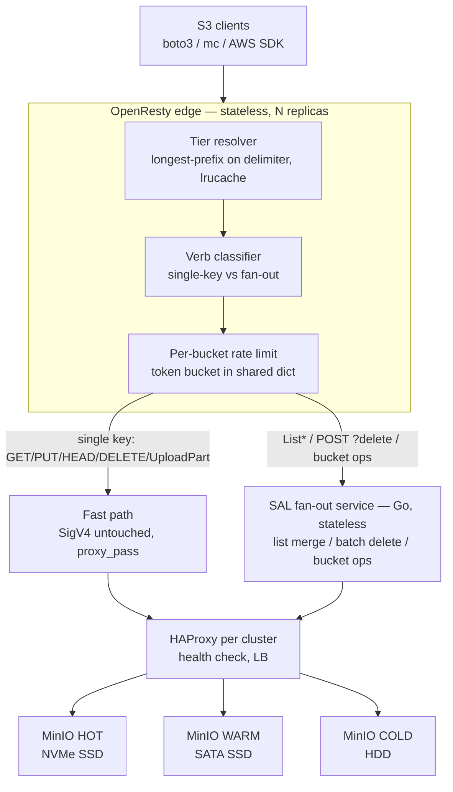
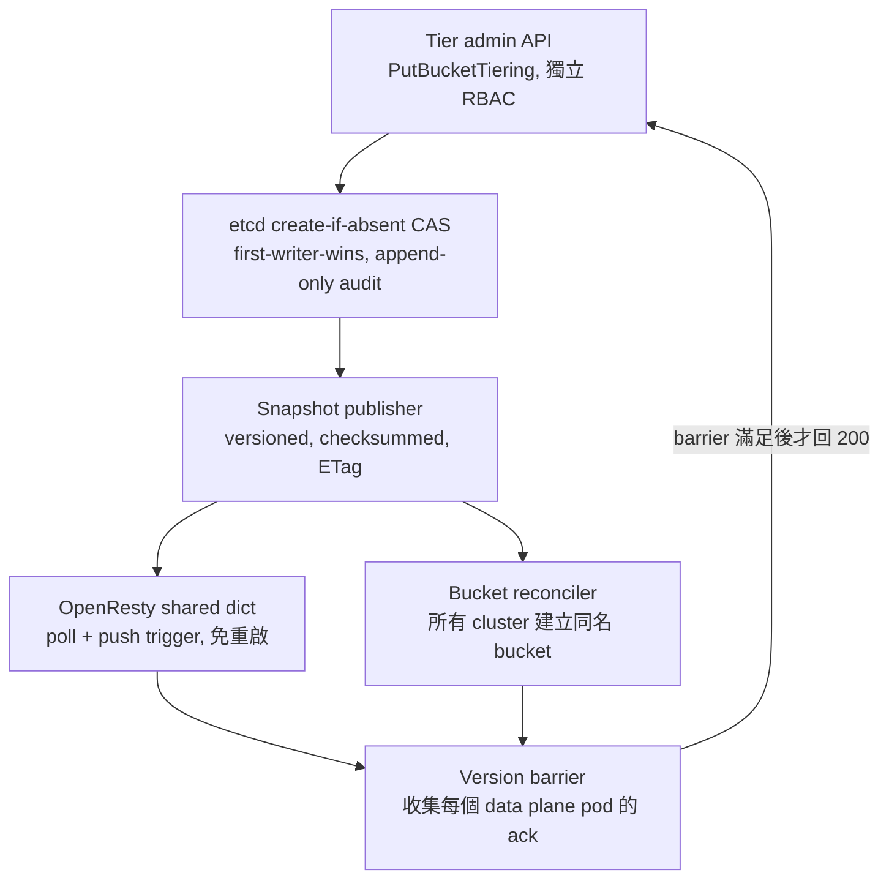
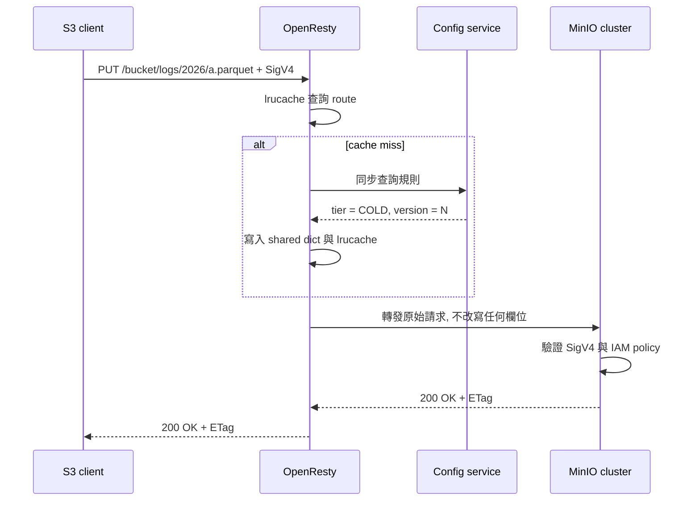
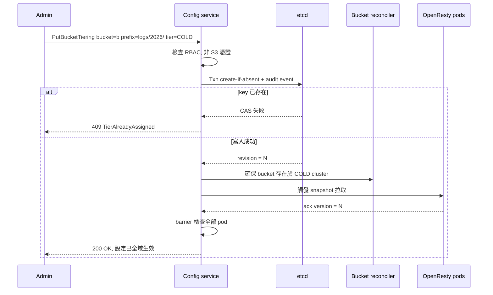
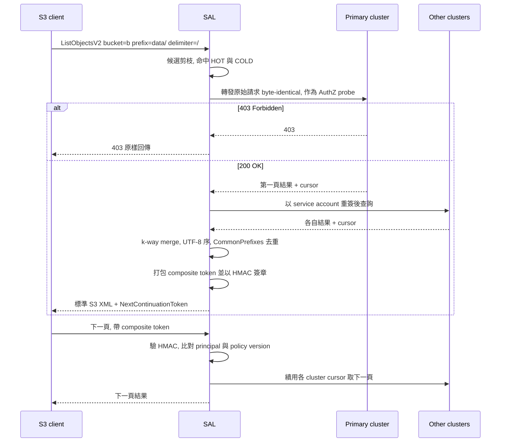
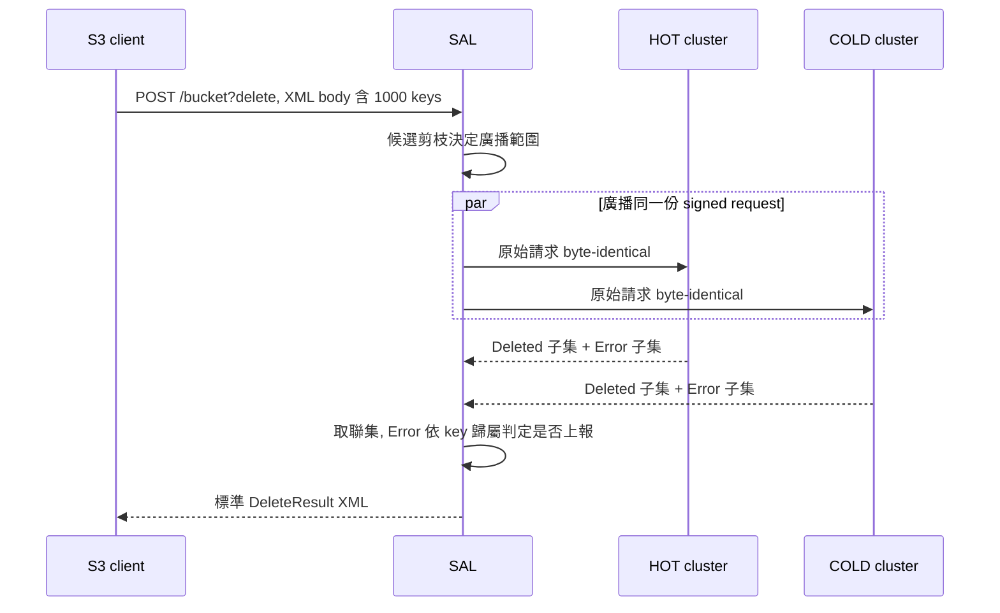

# SAL Static Tiering — 系統設計文件 (System Design Document)

---

## 1. 摘要 (Executive Summary)

PRD 的三條核心原則 — **不做 lifecycle management、不追蹤 access pattern、tier 一經設定不可變** — 在架構上帶來一個決定性的簡化：**tiering 不是資料搬遷系統，而是一個純函數路由問題**。

```
route(bucket, object_key) -> cluster    // 無狀態、可無限快取、無 per-object metadata
```

由此推導出三個設計結論，構成本文件的主軸：

| # | 推論 | 影響 |
|---|---|---|
| 1 | 路由是純函數，且規則 append-only 不可變 | 路由決策可完全在 OpenResty **in-process** 完成，不需要每個 request 查外部 metadata service。這是達成 Hot tier P50 ≤ 2 ms 的前提。 |
| 2 | 無 lifecycle、無 access tracking | 不需要 migration engine、heat table、`last_access_time`。per-object metadata 額外開銷為 **0 B/object**（PRD 目標 ≤ 1 KB/object）。 |
| 3 | 一個 logical bucket 會橫跨多個 physical cluster | 只有三類操作需要跨 cluster fan-out：`ListObjects*`、`DeleteObjects` (batch)、bucket 層級操作。其餘約 99% 流量為單 key 操作，可純 L7 轉發。 |

**與 PRD 2.1 原始網路架構的差異**：PRD 描述的是線性鏈 `OpenResty → SAL → HAProxy → MinIO`。本設計改為**動詞分流 (verb-based split)** — SAL 只處理需要 fan-out 的動作，不出現在單 key 路徑上。理由見 §4.1 延遲預算。

---

## 2. 設計前提與約束

### 2.1 來自 PRD 的硬性約束

| 來源 | 約束 |
|---|---|
| FR-201 / FR-206 | 解析優先序 `per-prefix > per-bucket > DEFAULT (Hot)` |
| FR-203 | Tier 設定寫入即鎖定，不可修改、不可置換 |
| FR-204 / FR-205 | 不得有任何自動遷移；不得記錄 `last_access_time` 或產生 access event |
| FR-102 | 讀取路徑對 client 完全透明 |
| SEC-104 | Tier 設定操作需獨立權限控制 |
| 2.1 延遲目標 | Hot P50 ≤ 2 ms / P99 ≤ 10 ms；Cold P50 ≤ 100 ms |
| 8.2 容量 | 總 ≥ 10B objects / ≥ 100 PB；單 bucket ≥ 1B objects |
| 9.1 | 100% 相容 S3 REST API |

### 2.2 環境約束

- **Air-gapped**：無外部 KMS / IMDS / 公有 registry。SSE-KMS 需 on-prem KES + Vault/HSM；audit log 導向 on-prem SIEM。
- **既有 clusters**：SSD cluster（承載 Hot/Warm）、HDD cluster（承載 Cold）。設計必須容納「三個 tier 對應 N 個 physical cluster」的 N:M 映射，而非硬編碼 3 個。
- **MinIO CE**：不依賴 Enterprise 專屬功能（quota、per-bucket rate limit 等一律在 proxy 層自行實作）。
- **單一 IAM 信任來源**：三個 cluster 必須共用同一組身分（AD/LDAP 或同一份 service account + policy）。此為 §4.2 簽章 pass-through 的前提。

### 2.3 明確不在範圍內 (Non-goals)

Lifecycle management、access time tracking、自動遷移、tiering policy 熱變更（皆依 PRD「明確排除的功能」）。

---

## 3. 系統架構

### 3.1 Data Plane 總覽



### 3.2 元件職責

| 元件 | 技術 | 職責 | 狀態 |
|---|---|---|---|
| OpenResty edge | OpenResty + Lua | Tier 解析、動詞分流、per-bucket 限流、access log 產出 | Stateless（config 為記憶體快取） |
| SAL fan-out service | Go | 跨 cluster list merge、batch delete 廣播、bucket 生命週期代理、跨 tier CopyObject | Stateless |
| Tiering config service | Go | `PutBucketTiering` / `GetBucketTiering`、CAS 寫入、snapshot 發布、version barrier | Stateless（狀態在 etcd） |
| Rule store | etcd | Tier 規則的唯一真實來源；`create-if-absent` 提供不可變性與 first-writer-wins | Stateful |
| Bucket reconciler | Go (K8s controller) | 確保 bucket / policy / versioning / object-lock 在所有 cluster 一致，偵測並修復 drift | Stateless |
| HAProxy | HAProxy | 各 cluster 的健康檢查與負載平衡（去留見 §4.9） | Stateless |

### 3.3 S3 動詞分流表

| 路徑 | 操作 | 處理方式 |
|---|---|---|
| **Fast path** | `PutObject`, `GetObject`, `HeadObject`, `DeleteObject`(單一), `GetObjectTagging`, `CreateMultipartUpload`, `UploadPart`, `CompleteMultipartUpload`, `AbortMultipartUpload` | 解析 tier 後 `proxy_pass`，請求 byte-identical 不改寫 |
| **Fast path** | `CopyObject`（source 與 target 同 tier） | Pass-through，由 MinIO 做 server-side copy |
| **Fan-out (SAL)** | `ListObjectsV2`, `ListObjects`, `ListObjectVersions`, `ListMultipartUploads` | 候選剪枝；單 tier 直通、跨 tier k-way merge |
| **Fan-out (SAL)** | `DeleteObjects` (`POST /bucket?delete`) | 原始請求廣播至所有候選 cluster，結果取聯集 |
| **Fan-out (SAL)** | `CreateBucket`, `DeleteBucket`, `PutBucketVersioning`, `PutBucketPolicy`, `PutObjectLockConfiguration` | 交由 reconciler 對所有 cluster 套用 |
| **Fan-out (SAL)** | `CopyObject`（跨 tier，PRD 10.2） | SAL 中介：串流讀 source cluster、寫 target cluster |
| **Fan-out (SAL)** | `HeadBucket`, `GetBucketLocation`, `ListBuckets` | 只查 primary cluster（reconciler 保證各 cluster bucket 集合一致） |
| **Control plane** | `PutBucketTiering`, `GetBucketTiering` | 完全不進 MinIO，導向 tiering config service |

---

## 4. 關鍵設計決策 (ADR)

### 4.1 ADR-01：SAL 不出現在單 key 路徑上

**Status:** Proposed

**Context** — PRD 2.1 的鏈狀架構會讓每個 GET 多經過一個 Go 服務。Hot tier 的 P50 預算只有 2 ms。

**延遲預算（small object GET, fab 內網）**

| 環節 | 延遲 |
|---|---|
| Client → OpenResty | 0.10 ms |
| OpenResty 路由決策（lrucache hit） | 0.02 ms |
| OpenResty → HAProxy → MinIO（2 hops, keepalive 重用連線） | 0.25 ms |
| MinIO GET（`xl.meta` inline, NVMe） | 0.60–1.00 ms |
| **合計（本設計）** | **0.97–1.37 ms** ✅ |
| 若插入 SAL：TCP + HTTP parse + 重新簽章 HMAC + 轉發 | +0.40–0.70 ms |
| **合計（PRD 原始鏈）** | **1.37–2.07 ms** ⚠️ 無安全邊際 |

**Decision** — 在 OpenResty 做動詞分流；單 key 操作直接轉發至目標 cluster，SAL 僅承接需要跨 cluster 的動作。

**Consequences** — 變容易：Hot 路徑延遲有 ~0.6 ms 邊際、SAL 可獨立擴縮不影響主流量、SAL 故障只影響 list/delete 而非全部讀寫。變困難：路由邏輯分散在兩處（Lua 與 Go），規則解析必須有**共用測試向量**以避免兩邊行為分歧（列為 action item）。

---

### 4.2 ADR-02：Fast path 採 SigV4 pass-through，不重新簽章

**Context** — SigV4 簽名涵蓋 HTTP method、canonical URI、canonical query string、簽名的 headers（含 `Host`）與 payload hash。任何改寫都會使簽章失效。

**Options**

| 方案 | Proxy 是否需持有 secret key | 是否支援 chunked upload / SSE-C | 風險 |
|---|---|---|---|
| A. Pass-through（採用） | 否 | 是 | 需三 cluster 共用 IAM |
| B. 終止並重新簽章 | 是 | `STREAMING-AWS4-HMAC-SHA256` 與 SSE-C 難以安全代理 | Proxy 成為 credential 集中點，blast radius 大，與 SEC-104 精神衝突 |

**Decision** — Fast path 完全不改寫請求（`proxy_set_header Host $http_host`），由 MinIO 自行驗章與授權。OpenResty **不持有任何 secret key**。

**前提條件（必須寫回 PRD）** — 三個 cluster 的 IAM 必須是單一信任來源。否則方案 A 不成立，會被迫退回方案 B。

**例外** — SAL 產生新 subrequest 時必然要重新簽章，使用專屬 service account（policy 僅授予 `s3:ListBucket`、`s3:DeleteObject`），並在 audit log 帶入原始 caller identity（`x-sal-original-principal`）以保留可審計性。

---

### 4.3 ADR-03：Batch delete 採「原始請求廣播」而非按 tier 分割

**Context** — `DeleteObjects` 的 body 內含最多 1000 個 key，可能分屬不同 cluster。直覺做法是依 tier 切成 N 份、分別重簽後送出。

**關鍵觀察** — S3 語意中「刪除不存在的物件」回傳成功。因此可以把**完全相同的 signed request** 廣播給所有候選 cluster，各自刪除自己擁有的 key。

**Decision** — 廣播原始請求，回應取聯集（`Deleted[]` 聯集、`Error[]` 依 key 歸屬判定是否上報）。

**Consequences**

- 簽章無需重簽 → 授權由各 cluster 原生執行，無權限放大風險。
- 無需分散式交易；部分失敗天生可表達（S3 的 `DeleteObjects` 本就是 per-key 結果）。
- 額外紅利：若曾有物件因 config 傳播延遲落在錯誤 tier，廣播刪除會一併清除。
- 成本：後端請求數為 N 倍。因非熱路徑且 body 上限 1000 key，可接受。

---

### 4.4 ADR-04：跨 tier List 採 AuthZ probe + SAL 自簽 composite token

**Context** — List 無法沿用 ADR-03 的廣播技巧：`continuation-token` 必須改寫成各 cluster 各自的 token，而 query string 一改簽章即失效 → **跨 tier list 必須重簽**。重簽代表 SAL 以自身身分打後端，會繞過 caller 的 IAM policy（特別是帶 `s3:prefix` condition 的 `s3:ListBucket`）→ 權限放大。

**Options**

| 方案 | 正確性 | 維護成本 |
|---|---|---|
| A. SAL 自行複製一套 IAM policy 評估邏輯 | 初期可行 | 高：必然與 MinIO 行為 drift |
| B. AuthZ probe + 自簽 token（採用） | 授權判斷始終由 MinIO 執行 | 低 |
| C. 要求 caller 具備整個 bucket 的 ListBucket 權限 | 過度限制，違反最小權限 | 低 |

**Decision（方案 B）**

- **第一頁**：把 client 原始請求 byte-identical 轉給 primary cluster，以其 HTTP status 作為授權 oracle（同時取得第一頁結果）。
- 將「授權結論 + policy version + 各 cluster cursor + principal canonical ID + expiry」打包，以 SAL 的 HMAC key 簽章後回傳為 `NextContinuationToken`。
- **第二頁之後**：驗證 HMAC、比對 principal 與 policy version，再以 service account 執行 fan-out。token 過期或 policy version 變更即失效，client 需重新從第一頁取得授權。

**候選剪枝 (candidate pruning)** — 依規則子樹判斷「哪些 cluster 可能含有符合 prefix 的 key」。若 client 的 prefix 完全落在單一規則子樹內（實務上最常見的情況），直接單 cluster 直通，merge 成本為零。

---

### 4.5 ADR-05：跨 tier List 的效能邊界

**Context** — 跨 tier list 的延遲為 `max(各 cluster)`，被 Cold HDD 決定。MinIO 的 metadata 與資料同存於磁碟（`xl.meta`），list 是一次分散式 walk。PRD 8.2 又要求單 bucket ≥ 1B objects。

**評估結論** — **HDD 上 1B objects 的 bucket 執行 list，P999 ≤ 10 s 不具可行性。** PRD 目前未定義跨 tier list 的 SLO，此為需求缺口。

**Decision（分期）**

- **v1**：明文限制跨 tier list 僅支援 `delimiter=/` 的淺層列舉；深度列舉需指定落在單一 tier 的 prefix。
- **v2**：導入 metadata index（TiKV）承接跨 tier list，把 merge 從「打後端」變成「掃一段有序索引」，同時讓 `S3 Inventory` (PRD 9.2 P1) 自然落地。

---

### 4.6 ADR-06：Tier 規則解析限定於 delimiter 邊界

**Context** — FR-206 需要 longest-prefix match。任意字串的 longest-prefix 需要 trie，在 Lua 中維護與熱更新成本高。

**Decision** — 規則的 prefix 必須以 `/` 結尾。解析時沿 `/` 由最長往最短切段查 shared dict（深度通常 5–10 次，每次亞微秒），再加一層 per-worker `resty.lrucache` 快取 `(bucket, key 前綴) → tier`，穩定態約 100 ns。

**此限制需寫回 PRD**，否則實作與需求描述不一致。

---

### 4.7 ADR-07：不可變性以 etcd CAS 實作

**Decision** — 單一 etcd transaction 同時滿足 PRD 4.2 的兩條要求：

```
Txn()
  .If( Compare(ModRevision(key), "=", 0) )   // key 不存在
  .Then( Put(key, rule), Put(audit_key, event) )
  .Else( Get(key) )                          // 回傳既有設定
```

| PRD 4.2 場景 | 行為 |
|---|---|
| 修改已設定的 bucket/prefix tier | CAS 失敗 → `409 Conflict` + 自訂錯誤碼 `TierAlreadyAssigned` |
| 並發建立同一 bucket/prefix 指定不同 tier | 天然 first-writer-wins，後者收到 `409` |
| 刪除 bucket 後重建同名 bucket | 規則搬移至 `archive/`，live namespace 清空 → 可重新指定（見 §7.2） |

---

### 4.8 ADR-08：Config 熱更新的正確性 — sync lookup on miss + version barrier

**Context（本設計中最重要的正確性問題）** — FR-201（未指定即 default Hot）與「不重啟熱更新」合起來是一個資料放置漏洞：

> 使用者剛把 `logs/2026/` 設為 Cold，設定尚未傳播到某台 OpenResty；此時的寫入會落到 Hot SSD。而 tier 不可變、系統又不做遷移 → **該物件永久留在錯誤的 tier，且沒有任何機制能修正。**

這不是效能問題，是不可逆的資料放置錯誤。

**Decision（兩層防護）**

1. **Cache miss 時同步查詢** — shared dict 找不到規則時，不得直接套用 DEFAULT，須先向 config service 做一次同步查詢（附 negative cache，短 TTL）。僅在確認 store 中確實無規則時才落 Hot。代價為新 prefix 首次寫入多一個 RTT。
2. **Version barrier** — `PutBucketTiering` 不在寫入 etcd 後立即回 200，須等所有 data plane pod 回報 `version ≥ N` 才回應；逾時回 `503 + Retry-After`。API 的成功語意因此變成「全域已生效」。



---

### 4.9 ADR-09：HAProxy 的去留

| 維度 | 保留 HAProxy | 以 `balancer_by_lua` 取代 |
|---|---|---|
| Hot 路徑延遲 | 基準 | 省 ~0.2–0.3 ms 與一次 TCP hop |
| 健康檢查 | 成熟、獨立於 proxy 邏輯 | 需 `lua-resty-healthcheck`，多一份自維護程式碼 |
| 團隊熟悉度 | 高 | 中 |
| 職責分離 | 清楚 | 路由與 LB 混在同一層 |

**建議** — v1 保留 HAProxy（延遲預算仍有邊際，營運風險較低）；將「合併 LB 至 OpenResty」列為延遲優化備案，待實測 P99 不達標時再啟動。決策點：Hot P99 實測若超過 8 ms 即評估合併。

---

## 5. 主要資料流程

### 5.1 單物件寫入（fast path）



### 5.2 Tier 設定寫入（含 barrier）



### 5.3 跨 tier ListObjectsV2 分頁



### 5.4 Batch delete 廣播



---

## 6. 資料模型

### 6.1 etcd key layout

```
/sal/tiering/live/<bucket>/_bucket                  -> {"tier":"HOT","created_at":...,"principal":"..."}
/sal/tiering/live/<bucket>/prefix/<b64url(prefix)>  -> {"tier":"COLD","created_at":...,"principal":"..."}
/sal/tiering/archive/<bucket>/<uuid>/...            -> bucket 刪除後搬移於此，永久保留
/sal/tiering/version                               -> 單調遞增 snapshot version
/sal/dataplane/nodes/<pod-id>/version              -> lease-bound ack，供 version barrier 使用
/sal/audit/<ts>-<uuid>                             -> append-only 事件，另導出至 SIEM
```

`prefix` 以 base64url 編碼，避免 `/` 與 etcd key 階層衝突。

### 6.2 Composite continuation token

```
token   = base64url( payload_json || "." || HMAC-SHA256(K_sal, payload_json) )
payload = {
  "v":   1,
  "b":   "<bucket>",
  "p":   "<prefix>",
  "d":   "<delimiter>",
  "pr":  "<principal canonical id hash>",
  "az":  "<授權結論 + policy version>",
  "c":   { "hot": "<minio cursor>", "cold": "<minio cursor>" },
  "lk":  "<last emitted key>",
  "exp": 1755400000
}
```

`K_sal` 採雙鑰輪替（current + previous），避免輪替瞬間既有 token 全部失效。

---

## 7. 邊界場景實作對應

### 7.1 Tier 設定衝突（PRD 10.3）

| 場景 | 實作 |
|---|---|
| Bucket 設 Warm、其下 prefix 設 Cold / Hot | 解析器依 FR-206 優先序自然處理，無需特例 |
| 並發建立同一 bucket 指定不同 tier | etcd CAS，first-writer-wins（§4.7） |
| 刪除 bucket 後重建同名 bucket | 規則搬至 `archive/`，live namespace 清空即可重新指定 |

### 7.2 Bucket 生命週期的跨 cluster 一致性

- **CreateBucket**：由 reconciler 在**所有** cluster 建立同名 bucket。理由：後續若新增指向其他 tier 的 prefix 規則，目標 cluster 必須已存在該 bucket；bucket 本身成本極低。
- **DeleteBucket**：需先確認**所有** cluster 皆為空，再依序刪除；任一 cluster 非空即回 `409 BucketNotEmpty`。
- **Policy / versioning / object-lock**：desired state 存於 etcd，由 reconciler 持續收斂並偵測 drift（air-gap 環境無跨 cluster 交易，只能靠收斂）。

### 7.3 物件大小（PRD 10.1）

| 場景 | 處理 |
|---|---|
| 小物件 < 128 KB 於 SSD | MinIO 會 inline 進 `xl.meta`，行為良好 |
| 小物件 < 128 KB 於 HDD | 隨機小 IO 會吃滿 IOPS。**建議 v1 明文禁止小物件寫入 Cold，或提供打包層**（需求缺口） |
| 大物件 > 5 GB | S3 Multipart Upload；proxy 需關閉 buffering（`proxy_request_buffering off`、`proxy_buffering off`）避免落盤與 TTFB 惡化 |

---

## 8. 容量與硬體參數對照

| PRD 需求 | 檢核 | 結論 |
|---|---|---|
| 冗餘開銷 < 1.5x | MinIO 16-drive erasure set，`EC:4` = 12+4 → **1.33x** | ✅ 有餘裕；Cold 可放寬至 16+4 (1.25x) |
| Metadata ≤ 1 KB/object | 靜態路由不存 per-object tier，額外開銷 **0 B/object** | ✅ 遠優於目標 |
| 每 object 監控成本 $0 | 不追蹤 `last_access_time` | ⚠️ 需澄清用語，見 §10 |
| 總 ≥ 10B objects / ≥ 100 PB | 三 cluster 各自水平擴展 | ✅ |
| 單 bucket ≥ 1B objects | list 效能受限 | ⚠️ 見 ADR-05 |
| 單節點聚合頻寬 ≥ 10 Gbps | proxy 需 keepalive 連線池 + 關閉 buffering | ✅ 可達，需壓測驗證 |

---

## 9. 可用性與災難復原

一個 logical bucket 橫跨多個 cluster，任一 cluster 失效即造成 namespace 殘缺，而 **S3 沒有「部分 list」語意**。必須明文定義降級行為：

| 情境 | 行為 |
|---|---|
| 單 cluster 失聯，請求落在存活 cluster | 正常服務 |
| 跨 tier list，任一候選 cluster 失聯 | 回 `503 ServiceUnavailable` + 自訂 header 標示失聯 cluster；**不回傳殘缺清單** |
| Batch delete，任一候選 cluster 失聯 | 該 cluster 負責的 key 回報 `Error`，其餘正常刪除 |
| 營運需要時 | 提供 `hot-only degraded mode` 旗標，明示放棄 Cold namespace 的完整性 |
| RPO / RTO | **per-tier 分別訂定**（Cold 允許較長 RTO 才有成本意義） |

---

## 10. 安全性與可觀測性

### 10.1 PRD 安全需求對應

| 需求 | 實作位置 |
|---|---|
| SEC-101 IAM / ACL | MinIO 原生（fast path 不改寫請求，簽章與授權皆由 MinIO 執行） |
| SEC-102 Bucket policy 限制 tier 訪問 | 由 tier→cluster 映射自然達成；policy 由 reconciler 同步至各 cluster |
| SEC-103 VPC endpoint / private link | K8s Service + NetworkPolicy（air-gap 環境對應實作） |
| SEC-104 Tier 設定獨立權限 | 完全獨立的 control plane API 與 RBAC，不使用 S3 憑證；建議加雙人核准 |
| 加密 | TLS 1.3（內部 CA）；SSE-S3 / SSE-KMS 經 on-prem KES + Vault；SSE-C 因 pass-through 天然支援 |
| SEC-301 Object Lock / SEC-302 Retention | MinIO 原生；設定由 reconciler 同步至所有 cluster |
| SEC-303 Audit log 導出 | OpenResty / SAL / config service 統一結構化日誌 → Fluent Bit → on-prem SIEM |

### 10.2 可觀測性的用語澄清（建議寫入 PRD）

FR-205 禁止的是 **per-object 存取紀錄**（`last_access_time`、access event）。它**不禁止 per-bucket / per-tier 的聚合 RED metrics**。若不澄清，reviewer 會誤以為連 SLO 都無法量測。建議指標：

- 每 tier 的 request rate / error rate / latency 分佈（P50 / P99 / P999）
- 跨 tier list 的 fan-out 扇出度與 merge 耗時
- Config snapshot version 落後量、barrier 逾時次數
- Reconciler drift 偵測與修復次數

---

## 11. 需求覆蓋矩陣

| 需求 | 實作元件 | 章節 |
|---|---|---|
| FR-101 S3 API | OpenResty + MinIO | §3.3 |
| FR-102 讀取透明 | Tier resolver + pass-through | §4.2, §5.1 |
| FR-103 寫入導向 | Tier resolver | §4.6 |
| FR-104 Versioning | MinIO 原生，reconciler 同步設定 | §7.2 |
| FR-201 Default Hot | Resolver 的 fallback + **sync lookup on miss** | §4.8 |
| FR-202 建立時指定 tier | `PutBucketTiering` | §5.2 |
| FR-203 設定不可變 | etcd CAS | §4.7 |
| FR-204 無自動遷移 | 架構中不存在 migration 元件 | §1 |
| FR-205 不追蹤 access | 無 per-object metadata 寫入路徑 | §10.2 |
| FR-206 解析優先序 | 沿 delimiter 的 longest-prefix match | §4.6 |
| 4.2 不可變性保證 | etcd CAS + archive namespace | §7.1 |
| 10.1 物件大小 | Multipart + buffering 關閉 | §7.3 |
| 10.2 跨 tier 操作 | SAL 中介 CopyObject | §3.3 |
| 10.3 設定衝突 | Resolver + CAS | §7.1 |

---

## 12. 建議補進 PRD 的需求

| # | 建議需求 | 理由 |
|---|---|---|
| 1 | 跨 tier `ListObjects` 的獨立 SLO 與功能邊界 | 目前 2.1 只定義單物件延遲；跨 tier list 被 Cold HDD 決定，且與 1B objects/bucket 衝突（ADR-05） |
| 2 | `CreateBucket` / `DeleteBucket` 的跨 cluster 一致性語意 | 一個 logical bucket 橫跨多 cluster，需定義部分成功行為（§7.2） |
| 3 | Config 傳播的 staleness bound | 把 FR-203 的不可變性延伸到分散式快取層，否則存在不可逆的錯置風險（ADR-08） |
| 4 | 三 cluster 的 IAM 須為單一信任來源 | 否則簽章 pass-through 前提不成立，會被迫在 proxy 存放 secret key，與 SEC-104 衝突（ADR-02） |
| 5 | 小物件寫入 Cold tier 的政策 | HDD 上的小物件會吃滿 IOPS，需明訂禁止或提供打包層（§7.3） |
| 6 | Prefix 規則須以 delimiter 結尾 | 讓 FR-206 的實作與需求描述一致（ADR-06） |

---

## 13. 開放議題與建議

| # | PRD 開放議題 | 建議 | 狀態 |
|---|---|---|---|
| 1 | 是否允許 super-admin override | **提供，但語意為「作廢 + 重建」而非「修改 tier」**。保留不可變語意，管理員能做的是把規則搬進 archive 並要求重新指定，全程雙人核准 + 稽核。純粹不可變在營運上撐不過第一次誤設。 | 待決議 |
| 2 | 刪除 bucket 後的 tier 紀錄保留 | 永久保留於 `archive/` namespace，與 live 規則分離（§7.1） | 建議採納 |
| 3 | 成本效益分析 (ROI) | 入口放在 `GetBucketTiering` + `S3 Inventory`：先讓使用者看到自己各 prefix 的容量與各層單價，成本自證比政策宣導有效 | 待補 |
| 4 | Multi-tenancy | 配額與限流實作於 OpenResty（per-bucket token bucket in shared dict），**不依賴 MinIO CE quota** | 待評估 |
| 5 | Disaster Recovery | 明文定義降級行為與 per-tier RPO/RTO（§9） | 待評估 |

---

## 14. 交付分期

| 階段 | 範圍 | 驗收標準 |
|---|---|---|
| **v1** | Tier resolver、fast path、etcd CAS、config 熱更新 + barrier、batch delete 廣播、單 tier list 直通、bucket reconciler | Hot P50 ≤ 2 ms / P99 ≤ 10 ms；tier 不可變性通過並發測試；config 傳播無錯置 |
| **v1.1** | 跨 tier list（AuthZ probe + composite token，限 `delimiter=/`）、跨 tier CopyObject、per-bucket 限流 | 跨 tier list 正確性測試（排序、去重、分頁一致性） |
| **v2** | Metadata index (TiKV) 承接跨 tier list、S3 Inventory、per-tier quota 與計費 | 1B objects/bucket 的 list 達成 SLO |

---

## 15. 風險清單

| 風險 | 影響 | 緩解 |
|---|---|---|
| Config 傳播延遲導致物件錯置 | 高（不可逆） | Sync lookup on miss + version barrier（ADR-08） |
| Lua 與 Go 兩份 resolver 行為分歧 | 中（路由不一致） | 共用測試向量（golden test）納入 CI |
| Cold HDD 的 list 延遲 | 中 | 限制列舉深度；v2 導入 metadata index |
| 三 cluster IAM 未統一 | 高（架構前提失效） | 上線前確認 AD/LDAP 單一來源；否則觸發 ADR-02 重新評估 |
| Composite token HMAC key 洩漏 | 中 | 雙鑰輪替、短 TTL、token 綁定 principal |
| 延遲預算無邊際（若保留 HAProxy 且流量增長） | 中 | 預留 `balancer_by_lua` 合併方案（ADR-09） |

---

## 16. Action Items

1. [ ] 確認三個 MinIO cluster 的 IAM 是否可統一至單一信任來源（阻擋 ADR-02）
2. [ ] 實測 Hot 路徑延遲預算（含 HAProxy 一跳），驗證 §4.1 數字
3. [ ] 定義 Lua / Go resolver 的共用 golden test 向量
4. [ ] 與 PRD owner 對齊 §12 的六條需求補充
5. [ ] 決議開放議題 1（super-admin override 語意）
6. [ ] 訂出 per-tier RPO / RTO 目標
7. [ ] 壓測 Cold cluster 在 1B objects/bucket 下的 list 延遲，作為 ADR-05 分期依據

---

## 附錄：名詞

| 名詞 | 說明 |
|---|---|
| SAL | S3 Abstraction Layer，本系統的統稱 |
| Fast path | 單 key 操作路徑，不經 SAL，請求不改寫 |
| Fan-out path | 需跨 cluster 的操作路徑，由 SAL 承接 |
| Candidate pruning | 依規則子樹判斷哪些 cluster 可能含有目標 key，以縮小 fan-out 範圍 |
| Version barrier | 等待所有 data plane 節點確認已載入指定 config version 的機制 |
| AuthZ probe | 以 byte-identical 的原始請求向 primary cluster 取得授權判斷，避免自行複製 IAM 邏輯 |
