# SAL Catalog — Object Metadata Index Service 系統設計方案

## 0. Executive Summary（一頁摘要）

**問題**：目前 fab 的 S3 服務建構在 MinIO 之上，命名空間已達 **~5×10⁹ objects**。MinIO 的 `ListObjectsV2` 是「掃描式」實作 — 沒有全域索引，每次 LIST 都要在 erasure set 的所有 drive 上做目錄樹 walk + 多路合併排序。結果是：

- 大 prefix 的 `ls` 需要 **數十秒到數分鐘**，甚至 timeout；
- 夜間 capacity / chargeback 報表需要 **4–8 小時全掃**，且會排擠正常 GET/PUT 的 IOPS；
- 「找出過去 24 小時修改的檔案」「找出所有 tag=obsolete 的物件」這類需求，**目前根本無法查詢**，只能全命名空間掃描。

**方案**：建置一個 **derived metadata index（衍生索引）**，架構思路對標 MinIO 商業版 AIStor 的 Catalog 功能，但自建、開源棧、無 licensing 綁定。

**四條不可動搖的設計原則（Invariants）**：

| # | 原則 | 說明 |
|---|---|---|
| **INV-1** | `xl.meta` 永遠是唯一 source of truth | 索引**不是** authoritative store。任何 GET / HEAD / 資料存取一律走 MinIO。索引只回答「有哪些 key」。 |
| **INV-2** | 索引可隨時整份丟棄重建 | 索引無獨立價值。刪掉重建 = 零資料風險。這是本案風險最低的根本原因。 |
| **INV-3** | 最終一致 + **有界落後（bounded staleness）** | 用 S3 bucket notification 非同步更新；每筆回應都帶 watermark 與 lag，讓 caller 自行判斷可信度。 |
| **INV-4** | 一定要有降級路徑 | 索引不可用 / 落後超標時，自動 fallback 到 MinIO native list。**慢，但永遠正確。** |

**核心技術選型結論（回答「要不要用 Elasticsearch？」）**：

> **不建議把 Elasticsearch/OpenSearch 當作主索引。** 建議採 **雙層架構**：
> - **Tier-1 主索引 = TiKV**（全域有序 KV + MVCC + 自動 range split）→ 承擔 95%+ 的 `ListObjectsV2` 流量。有序 KV 的 range scan 語意與 S3 LIST **完全同構**，且能做 delimiter **skip-scan**（跳過整個 subtree），複雜度從 O(prefix 底下物件數) 降到 O(回傳筆數)。
> - **Tier-2 搜尋索引 = OpenSearch**（同一條 Kafka topic 餵食，SLA 較寬鬆）→ 承擔 tag / user-metadata 的 ad-hoc 查詢與報表。
>
> 理由詳見 [§9 ADR-001](#9-adr-001索引儲存選型)。簡言之：ES 的 update = delete + reindex，fab 的高 churn 工作負載會造成嚴重的 segment merge 壓力；且 S3 的 delimiter（目錄語意）在 ES 沒有原生對應。

**預期效益（估算，待 POC 驗證）**：

| 場景 | 現況（Native MinIO） | 目標（SAL Catalog） | 倍率 |
|---|---|---|---|
| 1000-key 分頁，淺 prefix | 0.8 – 3 s | < 50 ms (p99) | ~40× |
| 1000-key 分頁，prefix 底下 2M 物件 | 30 – 180 s / timeout | < 120 ms (p99) | ~500× |
| 全 bucket 遞迴計數（5B objects） | 4 – 8 h | < 5 s（DSTAT rollup） | ~4000× |
| 「過去 24h 修改的物件」 | **不支援**，需全掃 | < 2 s | N/A |
| 夜間 capacity report | ~6 h | < 30 s | ~700× |
| **副作用** | LIST 排擠 GET IOPS | LIST 流量完全離開 MinIO | — |

**投入估算**：3 名工程師 × 2 個 quarter；硬體 6× index node + 3× Kafka broker（詳見 [§21 成本與效益](#21-成本與效益分析)）。

**建議決議**：核可 Phase 0（Shadow Mode POC，6 週），以實測數據驗證上表估算後，再核可 Phase 1 生產上線。

---

## 1. 問題陳述：為什麼 MinIO 的 LIST 會慢

### 1.1 根因分析

MinIO 的 metadata 採**完全分散**設計，沒有中央 metadata server（這正是它高可用、無單點的優點，也是 LIST 慢的代價）：

```
/mnt/disk1/bucket/lot/A1234567/wafer_01/run.log/xl.meta   ← 物件即目錄，xl.meta 存 FileInfo
/mnt/disk2/bucket/lot/A1234567/wafer_01/run.log/xl.meta
...                                                        ← 每個 EC drive 各存一份
```

`erasureServerPools.ListObjects()` 的執行路徑大致是：

1. 對每個 server pool、每個 erasure set，發起 `listPathRaw()`；
2. 每個 drive 各自做 `readdir` walk，回傳 lexicographic 排序的 stream；
3. Gateway 端對 N 個 drive stream 做 **N 路合併排序（multi-way merge）**，並做 quorum 解析；
4. `forwardPast(marker)` 前推到 continuation token 位置 → **這一步會把 marker 之前的 entry 全部掃過再丟掉**；
5. 填 metadata、trim 到 maxKeys、回傳。

### 1.2 四個結構性痛點

| # | 痛點 | 後果 |
|---|---|---|
| **P1** | **無全域索引** | LIST 成本正比於 *prefix 底下的 entry 總數*，而非 *回傳筆數*。一個有 2M 物件的 lot 目錄，即使只要前 1000 筆也得付出可觀代價。 |
| **P2** | **Delimiter 語意昂貴** | `delimiter="/"` 要算 CommonPrefixes，仍需掃過該層底下所有 entry 才能去重折疊。目錄有 10M 子項時尤其致命。 |
| **P3** | **Marker 前推是 O(offset)** | 深度分頁（第 5000 頁）比第 1 頁貴 5000 倍。EDA 工具常做完整 recursive list，等於必吃這個代價。 |
| **P4** | **只有一種索引維度：key 的字典序** | 「按 mtime 查」「按 size 查」「按 tag 查」「按 storage class 查」全都做不到 → 退化成全掃。 |

### 1.3 Fab 工作負載讓問題放大

半導體 fab 的 S3 使用型態有幾個特徵，每一個都恰好踩在 MinIO LIST 的弱點上：

- **LOSF（Lots of Small Files）**：EDA log、waveform dump、per-die 量測資料，平均物件 < 256 KB。物件數多 → metadata entry 多 → walk 成本高，但總容量不大。
- **深層且寬的目錄結構**：`/fab12/lot/{lot_id}/wafer_{nn}/step_{nnnn}/tool_{xxx}/{ts}.log` — 典型 6–8 層，單層扇出可達 10⁵–10⁶。
- **高 churn**：大量短命的 scratch / rotate log，建立後數小時內即被 lifecycle 清除 → **寫入與刪除事件量遠高於穩態物件數的增長率**。
- **批次掃描型存取**：分析 job 習慣先 `list --recursive` 拿全清單再處理，而非精準定址。
- **審計與治理需求**：需要按 lot / 製程步驟 / 時間區間做庫存盤點與保留期稽核。

### 1.4 商業方案為何不採用

MinIO 商業版 AIStor 提供 Catalog 功能，官方定位是「解決物件儲存命名空間與 metadata 搜尋的問題，讓維運者能索引、組織並以 GraphQL 介面查詢海量物件」。MinIO 官方部落格也明確指出這是超大規模客戶的痛點 —— 在十億物件規模下，LIST 需要執行約一百萬次才能跑完，計算成本極高且會排擠物件儲存本身的服務能力。AIStor 另外提供排程式的 inventory job，可匯出包含 object key、大小、版本、加密狀態與 storage class 的結構化資料，不需昂貴的 ListObjects 呼叫。（來源：min.io 官方部落格與 AIStor 產品文件，見附錄 D）

**我們的問題定義與 MinIO 完全一致，因此架構思路直接對標。** 但不採用商業版的理由：

1. **CE 版已於 2026 年封存**，社群版與商業版分岔，採用 AIStor 等同接受長期 licensing 綁定與版本升級的被動性；
2. Catalog 綁在 AIStor binary 內，**無法跨異質後端**（我們的 federation 層規劃要同時涵蓋 MinIO / SeaweedFS / Ceph RGW）；
3. Fab 為封閉網路環境，商業支援模式與我們的變更管制流程摩擦大；
4. 自建索引是 **derived** 的（INV-2），實作風險遠低於自建儲存層 — **這是我們少數「可以自己做、而且應該自己做」的元件**。

> 註：AIStor Catalog 的內部實作細節未公開，以下設計為我方自行推導，非逆向其實作。

---

## 2. 目標與非目標

### 2.1 目標（In Scope）

- **G1** 提供與 `ListObjectsV2` / `ListObjectVersions` **語意等價** 的高速列舉，caller 端無需改程式碼。
- **G2** 提供延伸查詢 API：依 mtime、size、storage class、tag、user-metadata 過濾。
- **G3** 提供 prefix 層級的即時聚合：物件數、總 bytes、最舊/最新 mtime（供 quota、chargeback、容量規劃）。
- **G4** 保證**有界落後**並將 staleness **顯式暴露**給 caller。
- **G5** 具備自動對帳（anti-entropy）與全量重建能力，且對帳結果可量化為 SLI。
- **G6** 保留與未來 federation 層（跨 MinIO / SeaweedFS / Ceph 叢集）整合的介面。
- **G7** 授權語意與 MinIO IAM 完全一致 — **不得洩漏 caller 無權見到的 key**。

### 2.2 非目標（Out of Scope）

- **NG1** **不**取代 MinIO 成為 metadata 權威（INV-1）。
- **NG2** **不**提供強一致的 read-after-write，除非 caller 顯式要求 `strong` 模式（該模式直接轉發 MinIO）。
- **NG3** **不**索引物件內容（no full-text of payload），只索引 metadata。
- **NG4** **不**處理資料路徑（GET/PUT body 不經過本服務）。
- **NG5** 第一階段**不**支援跨叢集 global namespace 合併查詢（Phase 3 再議）。
- **NG6** **不**取代 MinIO 的 lifecycle / ILM 執行引擎，僅提供「該掃哪些 key」的加速輸入。

---

## 3. 需求規格

### 3.1 功能需求

| ID | 需求 | 優先級 |
|---|---|---|
| FR-1 | S3 `ListObjectsV2` 相容：`prefix` / `delimiter` / `max-keys` / `continuation-token` / `start-after` / `encoding-type` / `fetch-owner` | P0 |
| FR-2 | S3 `ListObjectVersions` 相容：版本鏈、delete marker、`version-id-marker` | P1 |
| FR-3 | 延伸查詢：mtime 區間、size 區間、storage class、etag 精確比對 | P0 |
| FR-4 | 延伸查詢：object tag、user-defined metadata（`x-amz-meta-*`）過濾 | P1 |
| FR-5 | Prefix 聚合：`count` / `sum(size)` / `min(mtime)` / `max(mtime)` | P0 |
| FR-6 | 一致性等級選擇：`index`（預設，快）/ `bounded`（等 watermark）/ `strong`（轉發 MinIO） | P0 |
| FR-7 | 管理 API：手動觸發對帳、查詢 watermark、觸發全量重建、查索引健康度 | P0 |
| FR-8 | 快照式分頁：同一組 continuation token 在整個分頁過程看到一致的命名空間視圖 | P1 |
| FR-9 | Multi-site / federation 查詢路由介面（預留） | P2 |

### 3.2 非功能需求與 SLO

| 類別 | 指標 | 目標 | 量測方式 |
|---|---|---|---|
| **規模** | 索引物件數 | 現況 5×10⁹，設計餘裕至 2×10¹⁰ | 索引 row count |
| | 單一 prefix 最大扇出 | 5×10⁷ | 壓測 |
| **延遲** | LIST p50 / p99（1000-key page） | < 20 ms / < 120 ms | 服務端 histogram |
| | 延伸查詢 p99 | < 2 s | 同上 |
| | 聚合查詢 p99 | < 500 ms | 同上 |
| **吞吐** | 索引寫入穩態 | 20,000 events/s | Kafka consumer rate |
| | 索引寫入尖峰（30 min 持續） | 100,000 events/s | 同上 |
| | 查詢 QPS | 2,000 req/s | Gateway metrics |
| **新鮮度** | Index lag p50 / p95 / p99 | < 1 s / < 5 s / < 30 s | `now - watermark` |
| | 災難情境下最大可接受 lag | 15 min（超過則自動 fallback） | 熔斷器閾值 |
| **正確性** | False Negative（存在但索引缺漏） | < 1×10⁻⁶ | 每日抽樣稽核 |
| | False Positive（索引有但已刪除） | < 1×10⁻⁵ | 同上 |
| | 全命名空間對帳週期 | ≤ 7 天完成一輪 | 對帳排程器 |
| **可用性** | 服務可用性 | 99.9%（含 fallback 路徑則 99.99%） | 黑箱探測 |
| | 索引不可用時的行為 | 自動降級至 native list，**不得回傳錯誤或不完整清單** | 混沌測試 |
| **安全** | 授權一致性 | 100%，任何未授權 key 洩漏視為 SEV-1 | 授權整合測試 |
| | 靜態加密 / 傳輸加密 | 全程 AES-256 / mTLS | 稽核 |

### 3.3 限制條件

- 封閉網路（air-gapped），**無任何公有雲託管服務**，全部 on-prem bare metal / K8s。
- 變更管制嚴格：生產變更需 CAB 核可，rollback 必須在 5 分鐘內完成。
- 團隊規模：3 名工程師，2 個 quarter。
- 現有技術棧：Go、Kubernetes、Prometheus / Grafana、Kafka（既有叢集可擴充）。
- **Object key 本身即敏感資訊**（lot ID、製程步驟、機台代號會洩漏產能與良率線索），索引儲存的安全等級必須與 MinIO 同級。

---

## 4. 容量模型

### 4.1 索引儲存估算

假設 fab 環境平均 object key 長度 **140 bytes**（例：`fab12/lot/A1234567/wafer_01/step_0450/tool_ABC123/run_20260101_120000_00042.log`）。

| 項目 | 每筆大小 | 5×10⁹ 物件合計 |
|---|---|---|
| 主索引 `OBJ`：key 編碼 145B + value 50B + RocksDB overhead 30B | ~225 B | 1.13 TB |
| 時間索引 `TIME`：8B mtime + 145B key + overhead | ~190 B | 0.95 TB |
| 目錄統計 `DSTAT`：約 2.5×10⁸ 目錄 × 120B | — | 0.03 TB |
| **邏輯合計** | | **~2.11 TB** |
| zstd 壓縮（key 前綴重複度高，實測可望 2.5–3×） | ÷ 2.5 | **~0.85 TB** |
| Space amplification 餘裕（compaction） | × 1.5 | **~1.27 TB** |
| **× 3 副本** | | **~3.8 TB** |
| **成長至 2×10¹⁰ 物件的餘裕** | × 4 | **~15 TB** |

**節點規劃**：6 × TiKV node（每台 2× 3.84 TB NVMe，32 core，256 GB RAM）→ 可用約 23 TB。從 5B 起步，headroom 至 20B 物件無需擴容。

### 4.2 事件管線估算

| 項目 | 數值 | 備註 |
|---|---|---|
| 穩態事件率 | 20,000 /s | 含 PUT + DELETE + lifecycle |
| 尖峰事件率 | 100,000 /s | Batch job / lifecycle 大清理 |
| MinIO 原生事件 JSON 大小 | ~1.4 KB | 冗長，含大量重複欄位 |
| Raw topic 頻寬（穩態 / 尖峰） | 28 MB/s / 140 MB/s | |
| Raw topic 保留 24 h + zstd(≈6×) | ~400 GB × 3 副本 = **1.2 TB** | 只作短期緩衝 |
| **Thinned topic**（protobuf, ~120 B） | 2.4 MB/s | 經 Event Thinner 轉換 |
| Thinned topic 保留 7 天 + 壓縮 | ~480 GB × 3 副本 = **1.45 TB** | 供 replay / 重建 |
| **Kafka 節點** | 3 broker × 4 TB NVMe | 充裕 |

> **設計決定**：導入 **Event Thinner** 這一層無狀態轉換（raw JSON → 精簡 protobuf），把長保留期的成本降低 **~12×**，同時讓下游 consumer（TiKV indexer、OpenSearch indexer、未來的其他訂閱者）共用同一份精簡格式。

### 4.3 全量重建時間預算

| 路徑 | 吞吐 | 5×10⁹ 物件耗時 | 說明 |
|---|---|---|---|
| A. 走 S3 API（64 條平行 prefix stream） | ~10k keys/s/stream → 640k keys/s | **~2.2 h**（理論）／ **4–8 h**（保守） | 官方支援路徑，會佔用 MinIO IOPS |
| B. 直讀 drive 上的 `xl.meta` | ~5× A | **~1 h** | 繞過 gateway，**唯讀**，需版本鎖定 |

**建議**：以 A 為預設，B 作為可選加速器（feature flag，並在啟動時檢查 MinIO `format.json` 版本相容性，不符即拒絕執行）。
---

## 5. 高階架構

### 5.1 元件全貌

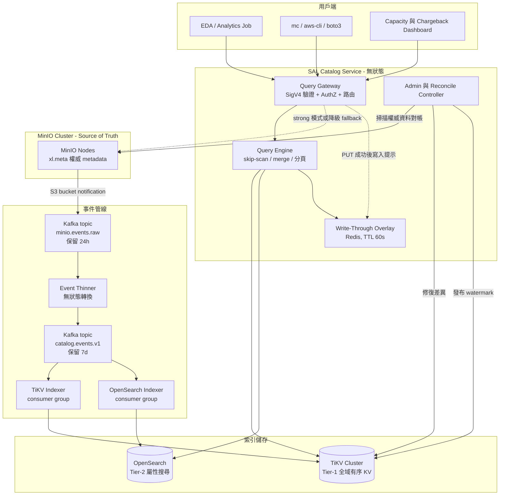

### 5.2 三條資料路徑

| 路徑 | 觸發 | 延遲目標 | 目的 |
|---|---|---|---|
| **熱路徑（Hot）** | 每次物件變更 | 秒級 | 事件驅動增量更新，維持索引新鮮度 |
| **溫路徑（Warm）** | 持續滾動 | 天級 | 分區對帳（anti-entropy），修補漏掉/多餘的 entry |
| **冷路徑（Cold）** | 手動 / 災難復原 | 小時級 | 全量重建，索引完全丟棄後的復原 |

**三條路徑缺一不可**：熱路徑保證新鮮度但**不保證完整性**（事件會掉），溫路徑保證完整性但慢，冷路徑是最終保險。這個三層結構是本設計能夠承諾 FN < 10⁻⁶ 的根本原因。

---

## 6. 寫入路徑（事件擷取）

### 6.1 端到端時序

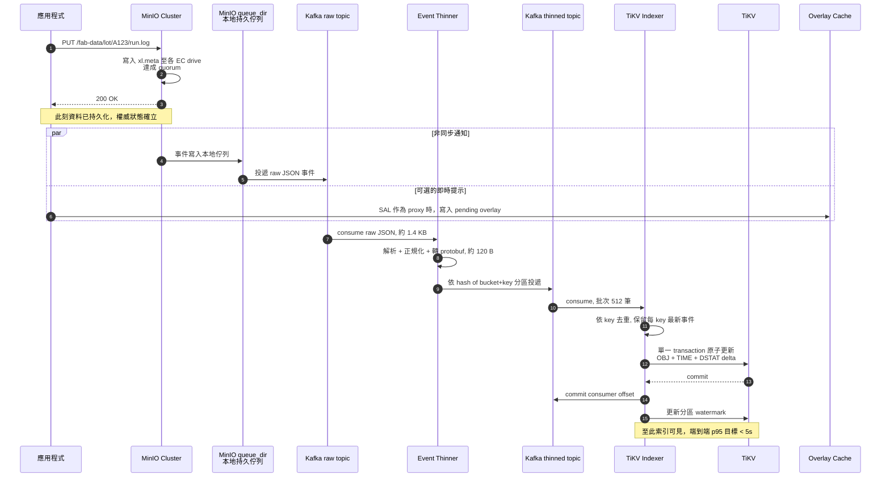

### 6.2 MinIO 通知設定（含關鍵陷阱）

```bash
# 1) 設定 Kafka notification target
mc admin config set fabminio notify_kafka:catalog \
    brokers="kafka-1:9093,kafka-2:9093,kafka-3:9093" \
    topic="minio.events.raw" \
    tls="on" tls_client_auth="2" \
    client_tls_cert="/etc/minio/certs/kafka-client.crt" \
    client_tls_key="/etc/minio/certs/kafka-client.key" \
    sasl="off" \
    compression_codec="zstd" \
    batch_size="500" \
    queue_dir="/var/lib/minio/notify-queue" \
    queue_limit="20000000"

mc admin service restart fabminio

# 2) 為每個 bucket 註冊事件
mc event add fabminio/fab-data arn:minio:sqs::catalog:kafka \
    --event put,delete,replica,ilm \
    --ignore-existing
```

> ### ⚠️ 關鍵營運風險：`queue_limit` 預設值會造成靜默資料遺失
>
> MinIO 的 `queue_dir` 是**每節點各自**的本地持久佇列。當 Kafka 不可達時事件先落地於此；一旦超過 `queue_limit`，MinIO 會**直接丟棄事件並只寫一行 log**，不會 back-pressure，也不會失敗使用者的 PUT。
>
> 預設 `queue_limit=100000`。以 32 節點叢集、穩態 20k events/s 計算，每節點約 625 events/s，預設值只能緩衝 **約 160 秒**的 Kafka 中斷。
>
> **建議設定 `queue_limit=20000000`**（每節點約 20M 筆，約 28 GB 磁碟，可緩衝 **~9 小時** 中斷），並將 `queue_dir` 放在獨立的持久化磁碟上，加上 disk usage 告警。
>
> **但即使如此，事件遺失仍是「何時發生」而非「會不會發生」的問題** — 這正是 §12 對帳機制必須是強制項目、而非 nice-to-have 的原因。

### 6.3 事件正規化（Event Thinner）

Raw JSON 中我們真正需要的欄位極少。Thinner 做四件事：

1. **瘦身**：1.4 KB JSON → ~120 B protobuf（12× 節省，直接反映在 Kafka 保留成本）。
2. **正規化事件類型**：把 `s3:ObjectCreated:Put` / `:CompleteMultipartUpload` / `:Copy` / `:PostObject` 統一映射成 `UPSERT`；`s3:ObjectRemoved:Delete` → `DELETE`；`s3:ObjectRemoved:DeleteMarkerCreated` → `DELETE_MARKER`（**注意：這不是刪除，是新增一個版本**）。
3. **產生 LWW tiebreaker**：`(event_time_ns, sequencer)`，用於解決亂序（見 §6.4）。
4. **重新分區**：以 `hash(bucket + object_key)` 決定 partition，**保證同一個 key 的所有事件落在同一 partition**，即進入同一個 indexer worker → 同 key 事件在管線內天然有序。

```protobuf
message CatalogEvent {
  uint32 site_id      = 1;   // federation 預留
  string bucket       = 2;
  string object_key   = 3;
  EventType type      = 4;   // UPSERT / DELETE / DELETE_MARKER / TRANSITION / RESTORE
  bytes  etag         = 5;   // 16B binary; multipart 另存 part_count
  uint64 size         = 6;
  int64  mod_time_ns  = 7;
  string version_id   = 8;   // 未開版本控制時為空
  uint32 storage_class= 9;
  int64  event_ts_ns  = 10;  // ★ LWW 主要依據，來自 MinIO 伺服器時間
  string sequencer    = 11;  // ★ LWW 次要依據
  uint32 part_count   = 12;
  map<string,string> tags = 13;  // 上限 10 組，超過只進 Tier-2
}
```

### 6.4 亂序與重複事件的處理

S3 事件通知的保證是 **at-least-once 且無全域順序**。跨 key 的亂序無所謂（彼此獨立），但**同一個 key** 的亂序會造成錯誤狀態（例如 DELETE 先於 PUT 抵達 → 物件被錯誤地從索引移除）。

**三層防禦**：

| 層級 | 機制 | 說明 |
|---|---|---|
| **L1 分區** | Kafka partition = `hash(bucket+key)` | 同 key 事件必進同一 partition，Kafka 保證 partition 內有序 → **消除 99% 的亂序** |
| **L2 LWW** | 寫入前比較 `(event_ts_ns, sequencer)` | 若 incoming ≤ stored，直接丟棄。處理跨 partition rebalance 或 replay 造成的殘餘亂序 |
| **L3 對帳** | 週期性與權威資料比對 | 兜底。時鐘偏移、sequencer 缺失等極端狀況由此修正 |

**時鐘偏移防護**：`event_ts_ns` 一律採用 **MinIO 伺服器時間**（事件 payload 中的 `eventTime`），**絕不使用 indexer 本地時間**。全叢集強制 NTP 同步（chrony，偏移告警閾值 50 ms）。若偵測到 `event_ts_ns` 超前本地時鐘 > 5 分鐘，記錄異常並改用 Kafka log append time 作為次要依據。

**冪等性**：TiKV 的更新一律是 conditional upsert（read-modify-write in transaction），同一事件重放 N 次結果相同。

### 6.5 物件狀態機

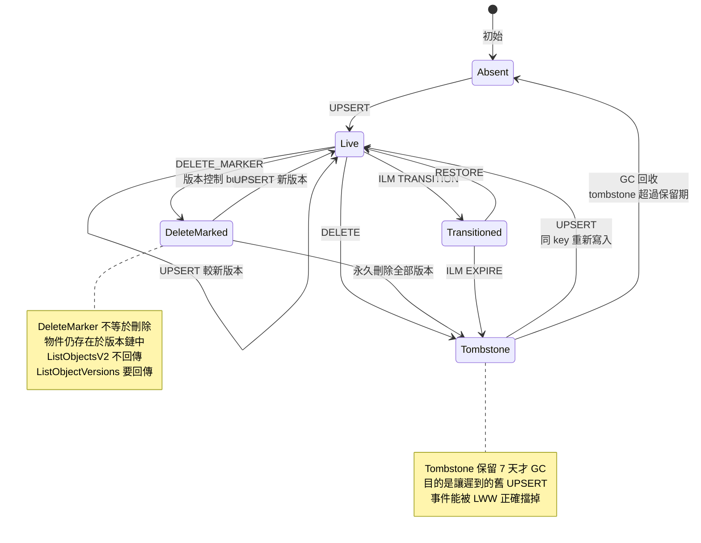

> **易錯點**：`s3:ObjectRemoved:DeleteMarkerCreated` 在版本控制 bucket 中代表「新增了一個 delete marker 版本」，物件資料**並未被刪除**。若 indexer 把它當成 DELETE 處理，會導致 `ListObjectVersions` 漏掉整個版本鏈 — 這是實作上最常見的正確性 bug，必須有專門的整合測試涵蓋。

---

## 7. ADR-001：索引儲存選型

**狀態**：Proposed | **決策者**：Storage Platform 主管

### 7.1 背景與評估維度

主流量是 `ListObjectsV2`，其存取型態是：**「在全域字典序上，從某個位置開始、往後掃 N 筆、並能跳過整個 subtree」**。這個型態極度偏向 **有序 range scan**，而非點查或全文檢索。選型必須以此為第一權重。

### 7.2 選項比較

| 維度 | **TiKV / FoundationDB** | ScyllaDB / Cassandra | PostgreSQL + Citus | OpenSearch / ES | ClickHouse |
|---|---|---|---|---|---|
| 全域有序 range scan | ★★★★★ 原生語意 | ★★★☆ 需精心設計 partition key | ★★★★ 需分區規劃 | ★★★ `search_after` 可行 | ★★ |
| **Delimiter skip-scan** | ★★★★★ seek 即可跳過 subtree | ★★☆ 需在查詢層做 N 路合併 | ★★★★ 可用遞迴 CTE | ★☆ 需 terms agg，高基數昂貴 | ★ |
| 5×10⁹ ~ 2×10¹⁰ 規模 | ★★★★★ | ★★★★★ | ★★☆ 單機吃力 | ★★★☆ 成本高 | ★★★★ |
| 高頻 update / delete | ★★★★ | ★★★★★ LWW 內建於 cell timestamp | ★★★ 有 bloat 問題 | ★☆ delete+reindex，merge 壓力大 | ★ |
| Ad-hoc 屬性查詢 | ★☆ 需自建二級索引 | ★☆ | ★★★★ | ★★★★★ | ★★★★★ |
| 一致性快照分頁 | ★★★★★ MVCC 讀時間戳 | ★★☆ | ★★★★★ MVCC | ★★★ PIT 有成本 | ★★ |
| 交易性多鍵原子更新 | ★★★★★ | ★★☆ 僅 partition 內 | ★★★★★ | ✗ | ✗ |
| 運維複雜度 | 中高 | 中 | 低 | 中高 | 中 |
| 團隊熟悉度 | 低 | 低 | 高 | 中 | 中 |
| 授權 | Apache 2.0 | Scylla 為 AGPL / C* 為 Apache 2.0 | PostgreSQL License | Apache 2.0 | Apache 2.0 |
| 5B 物件硬體估算 | 6 節點 | 8 節點 | 12+ 節點 | 20+ 節點 | 8 節點 |

### 7.3 為什麼**不**建議 Elasticsearch / OpenSearch 作為主索引

主管特別問到這點，這裡逐項說明。這**不是**說 ES 不好，而是說它與這個特定存取型態不匹配：

1. **更新放大（Update Amplification）**
   ES 的 document update 實質是 *delete + re-index*，舊 doc 變成 tombstone，要等 segment merge 才真正回收。Fab 的高 churn 特性（大量短命 scratch/log，寫入後數小時內被 lifecycle 刪除）會產生**極高的 tombstone 比例**，merge 壓力吃掉大量 CPU 與磁碟 I/O，而這些成本完全不產生查詢價值。

2. **Refresh lag 疊加**
   ES 的 `refresh_interval` 預設 1 s；在高寫入吞吐下通常必須調到 30 s 以維持穩定。這個延遲會**疊加**在 Kafka 管線的 lag 之上，直接侵蝕我們的 p95 < 5 s 新鮮度 SLO。

3. **排序分頁的尾延遲（Tail Latency）**
   `search_after` 在功能上可以做有序分頁，但在 5B docs / 數十 shard 的規模下，**每一頁**都需要 coordinator node 向所有 shard fan-out 再合併。p99 完全由最慢的那個 shard 決定，且會隨 shard 數線性惡化。而 TiKV 的 range scan 只命中**該 range 所在的 1–2 個 region**。

4. **Delimiter 沒有原生對應**
   S3 的 `delimiter="/"` 是目錄語意。ES 只能靠 (a) 額外維護 `parent_dir` 欄位 + terms aggregation，在高基數（2.5 億個目錄）下極為昂貴；或 (b) 另外維護 directory doc，等於在 ES 裡重新發明有序 KV。

5. **缺乏交易性**
   我們需要「主索引 + 時間索引 + 目錄統計」三者**原子更新**。ES 做不到，只能容忍中間態，這會讓對帳邏輯複雜度倍增。

6. **成本**
   5B docs 需約 1.5–2.5 TB primary shard，加上 doc_values、副本與 JVM heap 上限（單節點 ~31 GB）造成的 shard 數限制，節點數估計是 TiKV 方案的 **3–4 倍**。

### 7.4 決策

> **採用雙層架構（Two-Tier Index）**
>
> - **Tier-1（主索引）= TiKV** — 承擔 `ListObjectsV2`、`ListObjectVersions`、prefix 聚合，即 95%+ 的查詢流量。
>   選 TiKV 而非 FoundationDB 的理由：Apache 2.0 授權、Go/Rust 生態與團隊技術棧相符、單一 transaction 支援大 value、社群與中文文件資源充足、`tikv-client-go` 成熟。
> - **Tier-2（搜尋索引）= OpenSearch** — 承擔 tag / user-metadata 的 schema-less 查詢、檔名全文檢索、facet 報表。
>   **SLA 刻意放寬**（lag < 60 s、可用性 99%），可獨立降級而不影響主查詢路徑。只索引 metadata 屬性，不索引全部 key（可依 bucket 白名單控制範圍，把 doc 數壓在 10⁸ 量級）。
>
> **兩層由同一條 `catalog.events.v1` topic 餵食，各自獨立的 consumer group** — 互不阻塞，任一層落後或掛掉都不影響另一層。

### 7.5 後果與備援方案

**變得更容易**：LIST 延遲降兩到三個數量級；一致性分頁成為可能；跨維度查詢從「不可能」變成「秒級」。

**變得更困難**：多一個有狀態叢集要維運；團隊需要學習 TiKV（估 4 週 ramp-up）；需自建二級索引（TiKV 無內建 secondary index）。

**風險緩解 — 降級選項**：若 Design Review 認為引入 TiKV 的運維風險過高，退階方案為 **PostgreSQL 16 + declarative partitioning**（依 bucket 分區，再依 `hash(key)` 子分區）。可支撐至約 1×10⁹ 物件，之後再遷移。

> **這個退階選項成本極低，因為索引是 derived 的（INV-2）— 遷移 = 重建，不需資料搬移、不需雙寫、不需回填校驗。這是本設計最重要的架構彈性。**

**需要重新檢視的時機**：物件數超過 2×10¹⁰；或 Tier-2 查詢佔比超過 20%（屆時應考慮把部分屬性查詢下推到 Tier-1 的二級索引）。

---

## 8. 資料模型

### 8.1 Key 編碼

TiKV 是扁平的有序 byte KV。我們用**單 byte namespace tag + 長度安全編碼**切分邏輯表：

| Tag | 名稱 | Key 結構 | Value | 用途 |
|---|---|---|---|---|
| `0x01` | `OBJ` | `01 \| site:u16be \| bkt:u32be \| enc(key)` | `ObjectMeta` protobuf | 主索引，LIST 主力 |
| `0x02` | `VER` | `02 \| site \| bkt \| enc(key) \| ~mtime:u64be \| vid:16B` | `VersionMeta` | 版本鏈，最新版排最前 |
| `0x03` | `TIME` | `03 \| site \| bkt \| mtime:u64be \| enc(key)` | 空 | mtime 區間查詢 |
| `0x04` | `SIZE` | `04 \| site \| bkt \| size:u64be \| enc(key)` | 空 | size 區間查詢、大檔盤點 |
| `0x05` | `DSTAT` | `05 \| site \| bkt \| enc(dir)` | `DirStat{count, bytes, min_mt, max_mt, n_child}` | 目錄聚合 |
| `0x06` | `WMARK` | `06 \| partition:u16be` | `{event_ts, kafka_offset}` | 各 partition watermark |
| `0x07` | `RECON` | `07 \| site \| bkt \| range_id:u16be` | `{checksum, last_verified_ts, n_entries}` | 對帳 checkpoint |
| `0x08` | `TOMB` | `08 \| site \| bkt \| enc(key)` | `{deleted_ts, event_ts}` | 墓碑，7 天後 GC |

**`enc()` — 0x00 轉義編碼**（沿用 FoundationDB tuple layer 的做法）：

```
原始 byte 0x00  →  編碼為  0x00 0xFF
其他 byte       →  原樣
終止符          →  0x00 0x00
```

這個編碼有兩個必要性質：
1. **保序**：`enc(a) < enc(b)` ⟺ `a < b`（字典序），所以 TiKV 的 range scan 直接就是 S3 LIST 的順序；
2. **無歧義**：串接多個欄位時不會有邊界混淆。S3 object key 允許任意 UTF-8 位元組（包含 `/`、空白、甚至控制字元），若用單純 `/` 分隔會產生解析歧義與潛在的注入問題。

> **常見錯誤**：直接用 `bucket + "/" + key` 當索引鍵。當 key 本身含有特殊位元組時會導致 prefix 邊界判斷錯誤，進而**回傳不屬於該 prefix 的物件** — 在 fab 環境這是跨 lot 的資料洩漏，等級為 SEV-1。

### 8.2 Value Schema

```protobuf
message ObjectMeta {
  bytes  etag           = 1;   // 16B binary
  uint32 part_count     = 2;   // multipart 的 "-N" 後綴，0 = 非 multipart
  uint64 size           = 3;
  int64  mod_time_ns    = 4;
  bytes  version_id     = 5;   // 16B UUID，未開版本控制時為空
  uint32 flags          = 6;   // bit0=delete_marker bit1=is_latest
                               // bit2=transitioned bit3=restoring bit4=encrypted
  uint32 storage_class  = 7;
  int64  event_ts_ns    = 8;   // ★ LWW 主鍵
  string sequencer      = 9;   // ★ LWW 次鍵
  repeated Tag tags     = 10;  // 最多 10 組，超出只進 Tier-2
  string owner_id       = 11;
}

message DirStat {
  uint64 direct_count   = 1;   // 直接子物件數
  uint64 total_count    = 2;   // 遞迴子孫物件總數，rollup job 維護
  uint64 direct_bytes   = 3;
  uint64 total_bytes    = 4;
  int64  min_mod_time   = 5;
  int64  max_mod_time   = 6;
  uint32 child_dirs     = 7;
  int64  rollup_ts      = 8;   // total_* 的計算時間，用來判斷新鮮度
}
```

### 8.3 索引關係

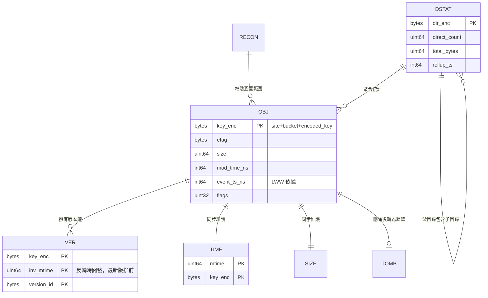

**寫入原子性**：一筆 UPSERT 事件會在**單一 TiKV transaction** 內同時更新 `OBJ`、`TIME`、`SIZE`、`TOMB`（清除）與 `DSTAT` 的 direct 計數增量。TiKV 的 Percolator 交易模型保證這五個 key 的更新是原子的 — 這是相對 ScyllaDB / ES 的關鍵優勢，避免了「主索引有、時間索引沒有」這類難以偵測的部分失敗。

**`DSTAT.total_*` 的更新策略**：遞迴聚合若在寫入路徑同步維護，深層目錄的每次寫入都要更新 8 層祖先 → 熱點嚴重。因此改為**非同步 rollup job**（每 15 分鐘一輪，只重算有變動的子樹），並在 `DirStat.rollup_ts` 標示新鮮度，查詢時一併回傳給 caller 判斷。

---

## 9. 查詢路徑

### 9.1 決策流程

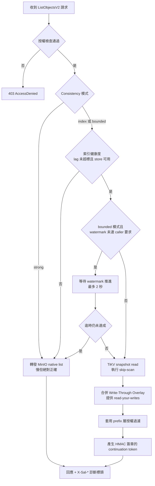

### 9.2 核心演算法：Delimiter Skip-Scan

這是整個設計的**效能命脈**。原生 MinIO 必須掃過 prefix 底下所有 entry 才能折疊出 CommonPrefixes；有序 KV 讓我們可以**直接 seek 跳過整個 subtree**。

```go
// 複雜度：O(R + P)
//   R = 實際回傳的物件數（≤ maxKeys）
//   P = 實際回傳的 CommonPrefix 數（≤ maxKeys）
// 對比 MinIO native：O(prefix 底下的 entry 總數)
func (q *QueryEngine) ListObjectsV2(req ListReq) (*ListResp, error) {
    snapTS := q.tikv.CurrentTS()          // ★ MVCC 快照，保證跨頁一致
    if req.Token != nil {
        snapTS = req.Token.SnapshotTS     // 續頁沿用同一快照
    }
    txn := q.tikv.SnapshotAt(snapTS)

    lower := encOBJ(req.Site, req.Bucket, req.Prefix)
    if req.StartAfter > req.Prefix {
        lower = successor(encOBJ(req.Site, req.Bucket, req.StartAfter))
    }
    if req.Token != nil {
        lower = req.Token.Cursor
    }
    upper := prefixUpperBound(encOBJ(req.Site, req.Bucket, req.Prefix))

    var objects []ObjectEntry
    var commonPrefixes []string
    cursor := lower
    iter := txn.NewIterator(cursor, upper, WithBatchSize(512))

    for len(objects)+len(commonPrefixes) < req.MaxKeys {
        kv, ok := iter.SeekTo(cursor)
        if !ok { break }

        key := decodeKey(kv.Key)

        // ---- Delimiter 折疊 ----
        if req.Delimiter != "" {
            idx := strings.Index(key[len(req.Prefix):], req.Delimiter)
            if idx >= 0 {
                cp := key[:len(req.Prefix)+idx+len(req.Delimiter)]
                commonPrefixes = append(commonPrefixes, cp)

                // ★★★ 關鍵：直接跳到該 subtree 之後，
                //     底下即使有一千萬個物件也完全不掃
                cursor = prefixUpperBound(encOBJ(req.Site, req.Bucket, cp))
                continue
            }
        }

        meta := decodeMeta(kv.Value)
        if meta.Flags&FlagDeleteMarker == 0 {   // delete marker 不進 V2 結果
            objects = append(objects, toEntry(key, meta))
        }
        cursor = successor(kv.Key)
    }

    truncated := iter.HasMore()
    return &ListResp{
        Objects:        objects,
        CommonPrefixes: commonPrefixes,
        IsTruncated:    truncated,
        NextToken:      q.signToken(cursor, snapTS, q.watermark()),
        Watermark:      q.watermark(),
    }, nil
}
```

**效能對比實例** — `ls s3://fab-data/lot/` 且該 bucket 有 5000 個 lot、每 lot 平均 100 萬個物件（共 50 億）：

| | 需要掃描的 entry 數 | 預估耗時 |
|---|---|---|
| MinIO native | ~5×10⁹（全部） | 數小時或 timeout |
| SAL skip-scan | **5000**（每個 lot 只 seek 一次） | **< 50 ms** |

**這是 6 個數量級的差距**，而且差距會隨資料成長而擴大，因為 skip-scan 的成本只取決於**回傳筆數**，與資料總量無關。

### 9.3 一致性分頁（Snapshot Pagination）

Continuation token 內含 `snapshot_ts`，續頁時以同一個 MVCC 時間戳讀取。效果：

- **翻頁過程中新增的物件不會憑空出現，被刪除的不會半途消失** — 這是 MinIO native list 也做不到的正確性提升（native list 的 marker 語意只保證單調前進，不保證快照一致）。
- 限制：TiKV 的 GC safepoint 預設 10 分鐘，超過的 token 會失效。**Token 中嵌入過期時間，過期回傳 `InvalidArgument: continuation token expired`，並在錯誤訊息中明確指示重新開始列舉。** 對於預期會跑很久的完整掃描，建議 caller 改用延伸查詢 API 的 streaming 模式。

**Token 格式**（Base64URL）：

```
version:u8 | snapshot_ts:u64 | watermark:u64 | expire_ts:u64 | cursor_len:u16 | cursor:bytes | hmac_sha256:32B
```

HMAC 簽章的用途：防止 caller 竄改 cursor 越權讀取其他 prefix（**若不簽章，攻擊者可以改 cursor 指向任意 bucket 的任意位置** — 這是外部索引服務容易被忽略的攻擊面）。

### 9.4 延伸查詢 API

```http
POST /v1/query HTTP/1.1
Authorization: AWS4-HMAC-SHA256 Credential=...
Content-Type: application/json

{
  "site":       "fab12",
  "bucket":     "fab-data",
  "prefix":     "lot/A1234567/",
  "filter": {
    "mod_time":      { "gte": "2026-08-07T00:00:00Z", "lt": "2026-08-08T00:00:00Z" },
    "size":          { "gte": 1048576 },
    "storage_class": ["STANDARD"],
    "tags":          { "stage": "etch", "status": "!obsolete" }
  },
  "select":     ["key", "size", "mod_time", "etag", "storage_class"],
  "aggregate":  ["count", "sum(size)"],
  "order_by":   "mod_time DESC",
  "limit":      1000,
  "consistency":"index"
}
```

**查詢規劃器（Query Planner）的路由規則**：

| 條件 | 選用索引 | 執行層 |
|---|---|---|
| 只有 prefix + delimiter | `OBJ` range scan | Tier-1 |
| prefix + mtime 區間，且區間選擇率 < 5% | `TIME` 索引 + `OBJ` 回查 | Tier-1 |
| prefix + mtime 區間，且區間選擇率 ≥ 5% | `OBJ` scan + 逐筆過濾 | Tier-1 |
| 只有 size 條件 | `SIZE` 索引 | Tier-1 |
| 含 tag / user-metadata 條件 | OpenSearch 查得 key 集合 → TiKV 批次回查取權威 metadata | Tier-2 → Tier-1 |
| 純聚合（count / sum） | `DSTAT` 直接讀 | Tier-1 |

> **Tier-2 的結果一律回 Tier-1 驗證**：OpenSearch 只負責「縮小候選集」，最終回傳的 size / mtime / etag **一律以 TiKV 的值為準**。這樣即使 Tier-2 落後或不一致，也不會回傳錯誤的 metadata，只會影響召回完整性（可接受，且有 lag 標頭提示）。

### 9.5 回應標頭（可觀測性契約）

每個回應都附帶診斷標頭，讓 caller 自行判斷結果可信度：

| 標頭 | 範例 | 意義 |
|---|---|---|
| `X-Sal-Source` | `index` / `fallback-native` / `hybrid` | 結果來源 |
| `X-Sal-Watermark` | `2026-08-08T09:14:22.318Z` | 索引已消化到的事件時間 |
| `X-Sal-Lag-Ms` | `1840` | 目前落後毫秒數 |
| `X-Sal-Snapshot-Ts` | `452938471029384704` | 本次分頁的 MVCC 快照 |
| `X-Sal-Overlay-Hits` | `3` | 有幾筆來自 write-through overlay |
| `X-Sal-Recon-Age-Sec` | `184320` | 此 range 上次對帳距今秒數 |
---

## 10. 一致性模型

### 10.1 我們承諾什麼、不承諾什麼

| 保證 | 承諾與否 | 說明 |
|---|---|---|
| **Eventual Consistency** | ✅ | 若停止寫入，索引最終會收斂到與 `xl.meta` 一致 |
| **Bounded Staleness** | ✅ | p95 lag < 5 s，p99 < 30 s，且 lag 值**顯式回傳**給 caller |
| **Monotonic Reads**（同一 session） | ✅ | 靠 continuation token 內的 snapshot_ts |
| **Snapshot Isolation**（單次分頁） | ✅ | MVCC 快照讀 |
| **Read-Your-Writes** | ⚠️ 有條件 | 需 SAL 在寫入路徑上（overlay），或 caller 使用 `bounded` / `strong` 模式 |
| **Linearizability** | ❌ | 唯有 `strong` 模式（轉發 MinIO）才有，且那已不是索引的保證 |

### 10.2 Watermark 機制

每個 indexer worker 為其負責的 Kafka partition 維護一個 watermark（已完整消化的最大 `event_ts_ns`）。全域 watermark：

```
global_watermark = min(watermark[p] for p in all_partitions)
```

取 **min** 而非 max，是為了保證「早於 watermark 的所有事件都已套用」這個語意成立。若任一 partition 卡住，全域 watermark 就不前進 → 這正是我們想要的偵測訊號（而非讓其他 partition 的進度掩蓋問題）。

**空閒 partition 的處理**：若某 partition 長時間無事件，其 watermark 會停滯並拖累全域值。解法：indexer 每 1 秒對無事件的 partition 發布一個 **idle heartbeat watermark**（取 `now - safety_margin`，safety_margin = 2 s）。

### 10.3 Read-Your-Writes：Write-Through Overlay

當 SAL 部署為 MinIO 前方的 transparent proxy 時（Phase 2 之後），可提供近似 RYW：

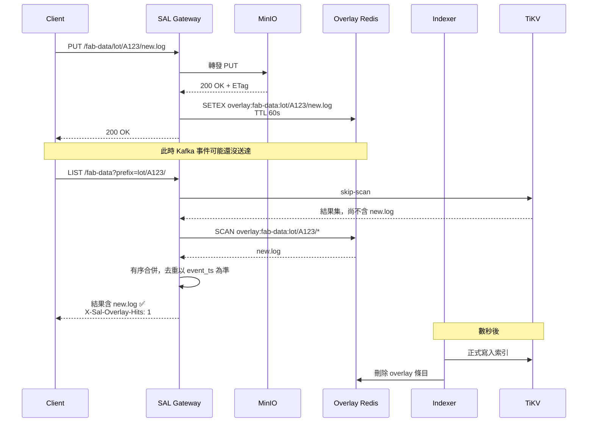

**Overlay 設計要點**：
- TTL = 2 × p99 lag（預設 60 s），到期自動消失，不會累積成第二個真相來源；
- 容量上限：以 20k writes/s × 60 s = 1.2M 條目，每條約 200 B → **~240 MB**，單一 Redis 實例即可；
- **Overlay 的存在與否不影響正確性，只影響新鮮度** — Redis 掛掉時 SAL 照常運作，只是 RYW 保證消失（降級為純 eventual）。這個「fail-open 且不影響正確性」的性質很重要，讓 Redis 不成為關鍵路徑。

### 10.4 一致性等級 API

```http
X-Sal-Consistency: index         # 預設：直接讀索引，最快
X-Sal-Consistency: bounded       # 搭配 X-Sal-Min-Watermark，不滿足則等待或降級
X-Sal-Min-Watermark: 2026-08-08T09:14:00Z
X-Sal-Consistency: strong        # 直接轉發 MinIO native list
```

**建議給各類 caller 的預設值**：

| Caller 類型 | 建議模式 | 理由 |
|---|---|---|
| Dashboard / 報表 / 容量分析 | `index` | 幾秒的落後完全無關緊要 |
| EDA 批次 job 的輸入清單 | `bounded`（min-watermark = job 啟動時間） | 確保看得到 job 啟動前的所有輸出 |
| Lifecycle / 刪除決策 | `strong` | **任何刪除決策都不得依賴衍生索引** ← 硬性規定 |
| 稽核 / 合規盤點 | `strong` 或 index + 事後對帳報告 | 需可辯護的正確性 |

> **硬性規定**：任何會導致**資料刪除**的流程（lifecycle 目標選取、GC、清理腳本），一律使用 `strong` 模式或以 SAL 結果作為候選集後再向 MinIO 逐筆 HEAD 確認。這是 no-data-loss mandate 的直接推論 — 衍生索引的 false positive 若被直接拿去刪檔，就會變成真正的資料遺失。

---

## 11. 對帳與自我修復（Anti-Entropy）

### 11.1 為什麼這一節是整個設計的核心

事件管線**一定會掉事件**。可能的原因包括：MinIO `queue_dir` 溢位、Kafka 長時間中斷、indexer bug、TiKV 部分寫入失敗、MinIO 節點在發出事件前崩潰、網路分割期間的 replication 事件遺漏。

因此 **對帳不是 nice-to-have，而是這個架構能否成立的前提**。整體正確性論證是：

> 熱路徑提供**新鮮度**但不保證完整性 → 溫路徑（對帳）提供**完整性**但慢 → 冷路徑（重建）提供**最終保險**。
> 三者疊加後，FN 機率 ≈ P(事件遺失) × P(對帳週期內未被發現) ≈ 10⁻³ × 10⁻³ ≈ **10⁻⁶** ✅

### 11.2 四層防禦

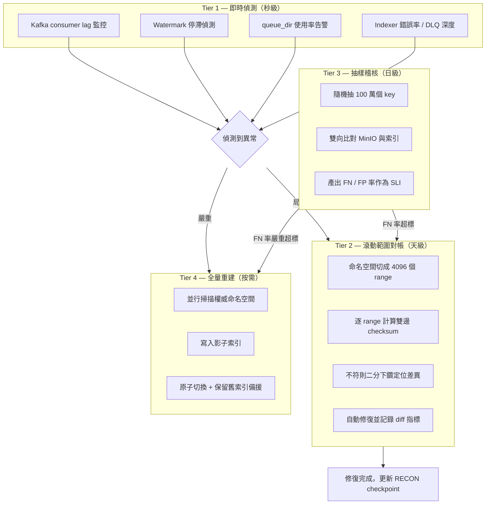

### 11.3 Tier 2 — 滾動範圍對帳（主力機制）

**分區策略**：把每個 bucket 的 key space 切成 4096 個 range，切點以 key 的前綴取樣決定（而非均勻 hash），使每個 range 的 entry 數大致均衡（目標 5B / 4096 ≈ 122 萬筆/range）。切點由 Tier-4 重建時產生，並隨資料成長定期重新平衡。

**對帳流程**：

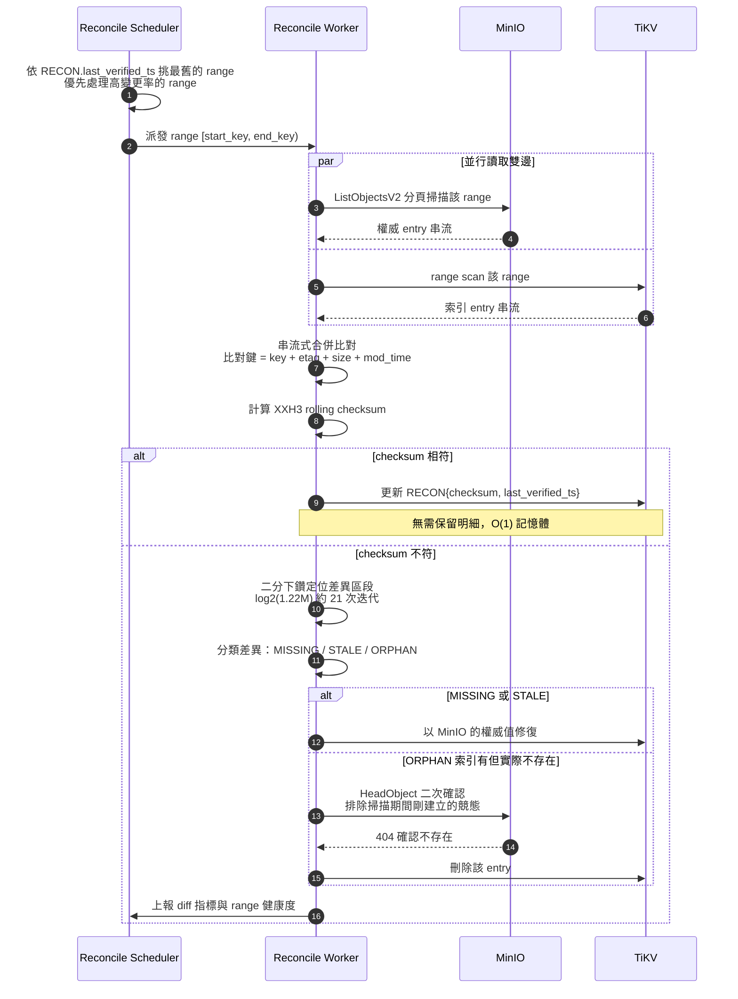

**關鍵設計點**：

1. **串流式比對，O(1) 記憶體**：兩邊都是字典序有序串流，用 merge-join 逐筆比對，不需把 122 萬筆載入記憶體。
2. **Checksum 先行**：99.9% 的 range 是相符的，此時只需算 checksum，成本極低。只有不符的才付出下鑽成本。
3. **競態排除**：對帳期間可能有正常寫入。所有判定為 ORPHAN 的 entry **必須經過 HeadObject 二次確認**才刪除；所有判定為 MISSING 的，若其 `event_ts` 晚於對帳開始時間則忽略（是新寫入，不是遺漏）。
4. **限流**：對帳走 MinIO S3 API 會佔用 IOPS。以 token bucket 限制在**總 IOPS 的 5%**，並在偵測到叢集延遲上升時自動退讓（adaptive throttling）。
5. **優先級排序**：不是純輪替，而是加權 — `priority = age_since_verified × (1 + change_rate)`。高 churn 的 range 更常對帳。

**週期預算**：4096 range × 8 worker 並行，每 range 約 2 分鐘（含限流）→ **一輪約 17 小時**。設定目標 **7 天完成一輪**（留大量餘裕給限流退讓與尖峰時段暫停）。

### 11.4 Tier 3 — 每日抽樣稽核（SLI 來源）

對帳只能證明「已對帳的 range 是對的」。抽樣稽核提供**全局的統計信心**，且產出的數字就是我們對主管與稽核單位的承諾依據：

```
每日 02:00 執行：
  1. 從 MinIO 隨機抽 500,000 個 key（分層抽樣：依 bucket、依 prefix 深度、依 age 分層）
     → 對每個 key 查索引 → 缺漏者計為 False Negative
  2. 從索引隨機抽 500,000 個 entry
     → 對每個發 HeadObject → 404 者計為 False Positive
  3. 產出報告：
     fn_rate = FN / 500000
     fp_rate = FP / 500000
     並依 bucket / prefix 深度 / 物件年齡 分組，找出系統性偏差
```

**告警閾值**：`fn_rate > 1e-6` → P2 告警並觸發受影響 bucket 的加速對帳；`fn_rate > 1e-4` → P1 告警並自動切換該 bucket 至 fallback 模式。

### 11.5 Tier 4 — 全量重建

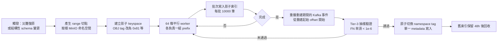

**兩種掃描來源**：

| | 路徑 A：S3 API | 路徑 B：直讀 `xl.meta` |
|---|---|---|
| 方式 | 64 條平行 `ListObjectsV2` 遞迴串流 | 每個 erasure set 挑一顆 drive 做 `readdir` + 讀 `xl.meta` |
| 5B 物件耗時 | 4–8 h | ~1 h |
| 對 MinIO 的影響 | 佔用 gateway CPU 與 IOPS | 只有 drive 讀取，不經 gateway |
| 風險 | 低，官方支援介面 | **高** — 依賴 MinIO 內部格式，版本升級可能破壞 |
| 建議 | **預設路徑** | Feature flag，啟動時檢查 `format.json` 版本白名單，不符即拒絕執行 |

> **路徑 B 的護欄**：唯讀掛載、獨立的低權限帳號、`format.json` 版本白名單檢查、遇到任何無法解析的 `xl.meta` 立即中止並回退至路徑 A。**絕不允許路徑 B 有任何寫入能力。**

---

## 12. 授權與安全

### 12.1 頭號風險：授權洩漏

外部索引服務最大的安全風險是：**索引不知道 MinIO 的 IAM policy，可能回傳 caller 無權看到的 key**。

在 fab 環境這特別嚴重 —— **object key 本身就是機密**。`lot/A1234567/wafer_01/step_0450/tool_ABC123/` 這串路徑洩漏了 lot 編號、製程步驟、機台配置，可以反推產能、良率與製程 recipe。即使 caller 拿不到物件內容，**光是拿到 key 清單就已構成資訊洩漏**。

### 12.2 三種方案評估

| 方案 | 做法 | 正確性 | 延遲 | 評價 |
|---|---|---|---|---|
| **A. SAL 自行驗簽** | SAL 持有所有 secret key 自行驗 SigV4 | 高 | 最低 | ❌ **駁回** — 需複製 credential，攻擊面倍增 |
| **B. 授權探測（Probe）** | 轉發 caller 原始 Authorization 標頭給 MinIO 做一次輕量授權查詢，依 200/403 決定放行 | **最高**（MinIO 就是權威） | +1 RTT（可快取） | ✅ **採用為主方案** |
| **C. 同步 IAM policy** | 用 `madmin` API 同步 policy 至 SAL，內建 policy engine 評估 | 中（有 drift 風險） | 最低 | ⚠️ Phase 2 優化，需持續驗證與 B 一致 |

### 12.3 授權流程（方案 B + 快取）

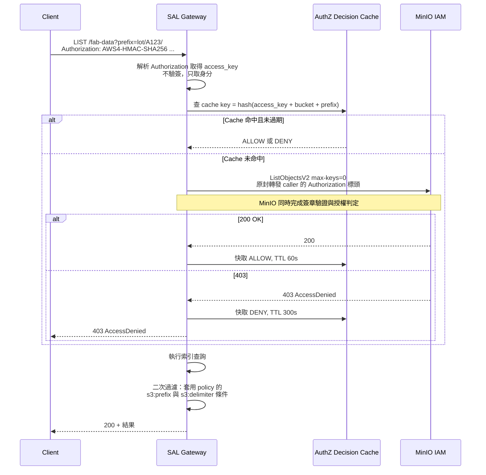

**設計要點**：

1. **簽章驗證交給 MinIO** — SAL 不持有任何 secret key，只轉發標頭。這消滅了「SAL 被入侵 = 全叢集 credential 外洩」的災難情境。
2. **快取 TTL 不對稱**：ALLOW 快取 60 s（權限撤銷後最多 60 s 生效），DENY 快取 300 s（防暴力探測）。**權限撤銷延遲 60 s 需與資安團隊確認可接受**（見 §22 開放問題）。
3. **條件式 policy 必須二次強制**：MinIO policy 可能含 `s3:prefix` 條件（例如只允許列舉 `lot/A123/*`）。授權探測只驗了 bucket 層，**SAL 必須在查詢層再套一次 prefix 白名單**。實作上從 probe 回應中萃取有效 prefix 集合並存入 cache。
4. **Continuation token HMAC 簽章**（§9.3）：防止 caller 竄改 cursor 跳到未授權的 key 範圍。**這是外部索引特有、原生 S3 沒有的攻擊面**，必須在滲透測試項目中明列。

### 12.4 其他安全控制

| 控制項 | 措施 |
|---|---|
| 靜態加密 | TiKV 啟用 encryption-at-rest（AES-256-CTR），金鑰由 HSM / Vault 管理 |
| 傳輸加密 | 全鏈路 mTLS：Client↔SAL、SAL↔TiKV、MinIO↔Kafka、Kafka↔Indexer |
| 稽核日誌 | 每次查詢記錄 `{access_key, bucket, prefix, result_count, source, ts}`，保留 1 年，送 SIEM |
| 最小權限 | SAL 對 MinIO 只需 `s3:ListBucket`（用於 probe 與對帳），**不得**有任何寫入或刪除權限 |
| 網路隔離 | TiKV / Kafka 位於獨立 VLAN，只接受 SAL 與 Indexer 的來源 IP |
| 備份 | 索引**不備份**（INV-2，重建即可），但 range 切點與 RECON checkpoint 需備份以加速重建 |
| 供應鏈 | 所有第三方元件走內部 registry，SBOM 掃描，版本鎖定 |

---

## 13. 失效模式與降級

### 13.1 失效模式分析（FMEA）

| # | 失效情境 | 偵測方式 | 自動處置 | 對使用者的影響 | 殘餘風險 |
|---|---|---|---|---|---|
| F1 | Kafka 全叢集不可用 | Producer 錯誤率、consumer lag 暴增 | MinIO `queue_dir` 緩衝（~9 h）；lag > 15 min 時 SAL 自動切 fallback | LIST 變慢，但**正確** | 若超過 9 h，事件遺失 → Tier-2 對帳修補 |
| F2 | `queue_dir` 溢位 | 磁碟使用率告警 + MinIO error log | 觸發受影響 bucket 的加速對帳 | 短暫的 FN 升高 | 對帳期間存在 FN 窗口 |
| F3 | Indexer 崩潰 / OOM | Liveness probe、consumer group 心跳 | K8s 重啟，consumer group rebalance，從已提交 offset 重放 | lag 短暫上升 | 事件重放需冪等（已設計） |
| F4 | Indexer 邏輯 bug 寫入錯誤資料 | Tier-3 抽樣稽核 FN/FP 率異常 | 告警 + 人工判斷是否重建 | 可能回傳錯誤結果 | **最危險的情境** — 靠稽核發現，可能有數小時窗口 |
| F5 | TiKV region 不可用 | 查詢錯誤率、TiKV 健康檢查 | 熔斷器開啟 → 全量 fallback 至 native list | LIST 變慢，**正確性不受影響** | 無 |
| F6 | TiKV 磁碟寫滿 | 容量監控（80% 告警） | 停止索引寫入（讀仍可用），告警 | lag 持續增長直到超標後 fallback | 需人工擴容 |
| F7 | OpenSearch 不可用 | 健康檢查 | Tier-2 查詢回 503 並建議改用 Tier-1 可表達的條件 | 屬性查詢不可用，LIST 不受影響 | 無 |
| F8 | Redis Overlay 不可用 | 健康檢查 | fail-open，跳過 overlay 合併 | RYW 保證消失，降級為 eventual | 無 |
| F9 | 事件亂序（跨 partition） | LWW 比較時偵測到過期事件 | 直接丟棄，計數上報 | 無 | 若 sequencer 缺失可能誤判 → 對帳修正 |
| F10 | 時鐘偏移 | NTP 偏移監控 | 超過 5 min 時改用 Kafka append time | 可能誤判 LWW | 對帳修正 |
| F11 | MinIO 站點容錯移轉（failover） | 站點健康事件 | 強制對受影響 bucket 全量對帳 | 對帳期間 lag 高 | 需人工確認 |
| F12 | SAL Gateway 過載 | QPS / 延遲 / 佇列深度 | 限流（每 access_key），HPA 擴容 | 部分請求 429 | — |
| F13 | 惡意超大 maxKeys 或深度分頁 | 請求參數檢查 | maxKeys 上限 1000（S3 標準），token 過期強制 | — | — |

### 13.2 降級決策樹

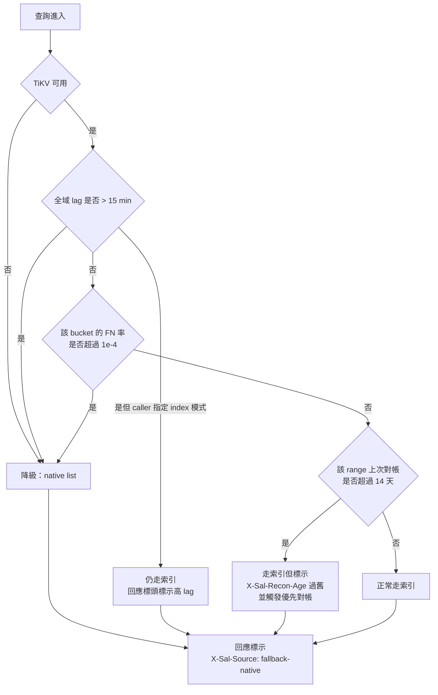

**核心原則：任何不確定的情況一律降級。**
慢是可以接受的（回到現況），錯是不可接受的。熔斷器的設計偏誤方向必須永遠是「多降級」而非「多用索引」。

### 13.3 Fallback 的容量規劃

Fallback 意味著全部 LIST 流量瞬間回到 MinIO —— 也就是**回到現況的效能**。必須事先確認：

- MinIO 目前能承受 100% 的 LIST 流量（現況即如此，所以答案是肯定的）；
- 但若 SAL 上線後 LIST 流量因為「變快了所以大家用更多」而**成長 10 倍**，fallback 時 MinIO 會被壓垮。
- **對策**：Gateway 在 fallback 模式下對每個 access_key 套用嚴格限流（回到上線前的基準流量水位 × 1.2），超出者回 `503 SlowDown` 並帶 `Retry-After`。**這個限流值必須在 Phase 0 就量測並寫死為基準線。**

---

## 14. 可觀測性

### 14.1 關鍵指標

| 類別 | 指標 | 類型 | 告警閾值 |
|---|---|---|---|
| **新鮮度** | `sal_index_lag_seconds{partition}` | Gauge | p95 > 5s (P3) / > 60s (P2) / > 900s (P1) |
| | `sal_watermark_skew_seconds` | Gauge | > 30s (P3) — 偵測落後的 partition |
| **正確性** | `sal_audit_false_negative_rate` | Gauge (daily) | > 1e-6 (P2) / > 1e-4 (P1) |
| | `sal_audit_false_positive_rate` | Gauge (daily) | > 1e-5 (P3) |
| | `sal_recon_range_age_seconds` | Histogram | p99 > 14d (P2) |
| | `sal_recon_diff_total{type}` | Counter | 突增 > 10× 基準 (P2) |
| **效能** | `sal_query_duration_seconds{op,mode}` | Histogram | p99 > 200ms (P3) |
| | `sal_scan_entries_examined` / `returned` | Histogram | 比值 > 10 表示 skip-scan 失效 (P3) |
| **可用性** | `sal_fallback_ratio` | Gauge | > 1% (P3) / > 10% (P2) |
| | `sal_availability` | SLI | < 99.9% (P2) |
| **管線** | `sal_kafka_consumer_lag{partition}` | Gauge | > 100k msgs (P2) |
| | `minio_notify_queue_usage_ratio` | Gauge | > 50% (P2) / > 80% (P1) |
| | `sal_events_dropped_total{reason}` | Counter | > 0 (P1) — **不應該發生** |
| **容量** | `sal_index_size_bytes` / `sal_index_entries` | Gauge | 磁碟 > 80% (P2) |

### 14.2 SLO 與錯誤預算

| SLO | 目標 | 月度錯誤預算 |
|---|---|---|
| LIST 可用性（含 fallback） | 99.9% | 43.2 min |
| LIST p99 延遲 < 200 ms（索引模式） | 99% 的時間 | 7.2 h |
| Index lag p95 < 5 s | 99% 的時間 | 7.2 h |
| False Negative 率 < 1e-6 | 100% 的稽核日 | 0 天（任一日超標即消耗全部預算） |

**錯誤預算耗盡的處置**：暫停所有非緊急的功能發布，全隊投入可靠性改善，直到預算回復。FN 率的預算為零，反映「正確性沒有妥協空間」。

### 14.3 稽核報告（給主管與治理單位）

每週自動產出：
- 命名空間對帳覆蓋率（本週對帳了幾 % 的 range、最舊的 range 多久沒對）
- FN / FP 率趨勢圖（7 天 / 30 天）
- Fallback 事件清單與根因
- 查詢量、節省的 MinIO IOPS 估算、前 20 大查詢者
- 容量趨勢與擴容預測
---

## 15. 部署拓撲

### 15.1 單站點拓撲

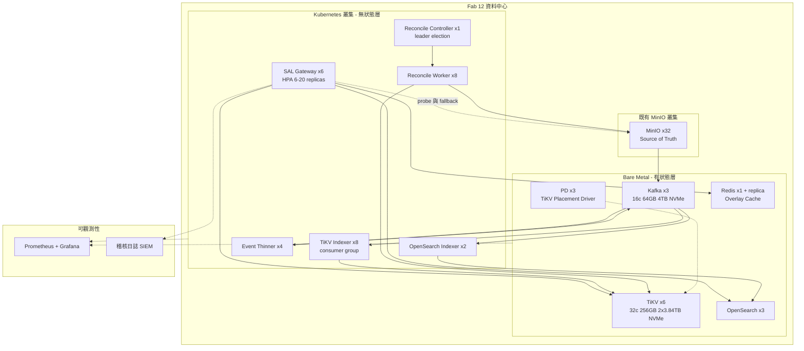

**部署原則**：
- **無狀態層跑 K8s**（易擴縮、易滾動更新）；**有狀態層跑 bare metal**（避免 K8s 儲存抽象在高 IOPS 下的額外開銷與故障模式）。
- TiKV 與 MinIO **不共置**：MinIO 節點的 IOPS 已是瓶頸，索引寫入會直接排擠資料路徑。
- Reconcile Worker 部署在**與 MinIO 同網段**以降低對帳掃描的網路成本。

### 15.2 多站點與 Federation（Phase 3 預留）

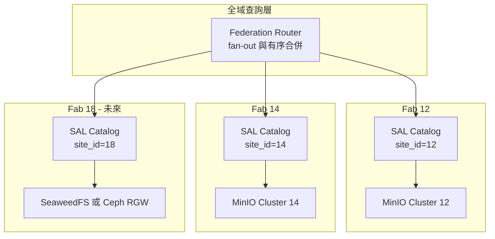

**設計決定：每站點獨立索引，不建全域統一索引。**

理由：
- **故障隔離** — 一個 fab 的索引問題不影響其他 fab；
- **資料主權與網路** — fab 之間頻寬有限且有資安隔離要求，跨站點同步事件流不切實際；
- **合併成本可控** — 跨站點查詢由 Federation Router 做 k-way merge（k = 站點數，通常 < 10），每站點回傳的已是有序串流，合併是 O(N log k)，開銷可忽略。

`site_id` 已內建於 key 編碼的第一個欄位（§8.1），因此站點合併時**不需要重新編碼**，未來擴充零成本。這也是為什麼即使 Phase 1 只有一個站點，也要先把 `site_id` 放進 schema。

---

## 16. 上線計畫

### 16.1 五階段推進

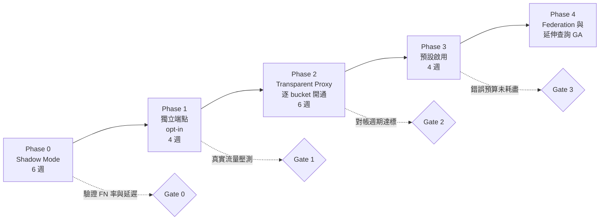

| 階段 | 內容 | 出場條件（Gate） | 回滾方式 |
|---|---|---|---|
| **Phase 0**<br/>Shadow Mode | 建置全套管線，索引但**不對外服務**。離線對照 native list 結果，量測 FN/FP 與延遲 | FN < 1e-6 連續 7 天；p99 < 120 ms；lag p95 < 5 s；對帳一輪完成 | 直接停服務，零影響 |
| **Phase 1**<br/>獨立端點 | 開放 `sal.fab12.corp` 供**容忍型工作負載**（dashboard、報表、容量分析）自願接入 | 5 個以上真實 caller 使用 2 週無 P2 以上事故 | 使用者改回原端點 |
| **Phase 2**<br/>透明代理 | SAL 置於 MinIO S3 端點前方，**逐 bucket 以 feature flag 開通**。LIST 走索引，其餘全部 pass-through | 涵蓋 80% LIST 流量，fallback 率 < 1%，錯誤預算未耗盡 | 單一 flag 關閉該 bucket，秒級生效 |
| **Phase 3**<br/>預設啟用 | 全 bucket 預設走索引，native list 保留為 fallback | 連續 30 天達成全部 SLO | 全域 kill switch |
| **Phase 4**<br/>GA | 延伸查詢 API 正式對外、Federation 接入、Tier-2 全面啟用 | — | — |

### 16.2 時程

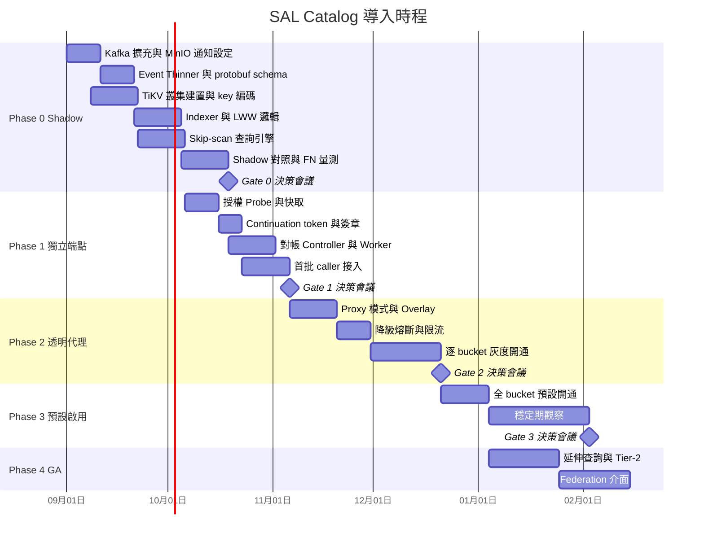

**總時程約 7 個月**，其中前 3 個月（至 Gate 0）是最關鍵的驗證期 —— **在投入生產流量之前，就以真實資料規模驗證所有效能與正確性假設**。

### 16.3 Phase 0 必須量測的基準線

Phase 0 的核心價值不是「把系統做出來」，而是**用真實資料把本文件中所有標示為「估算」的數字換成實測值**：

| 待量測項目 | 為何關鍵 |
|---|---|
| 實際平均 key 長度與 prefix 重複度 | 決定索引容量與壓縮率，直接影響硬體採購 |
| 實際事件率（穩態與尖峰）與尖峰持續時間 | 決定 Kafka 與 indexer 規模、`queue_limit` 設定 |
| 目錄扇出分布（p50 / p99 / max） | 驗證 skip-scan 效益、是否需要額外分片 |
| 現況 LIST 流量佔 MinIO 總 IOPS 比例 | ROI 計算的核心輸入 + fallback 限流基準線 |
| 現況各類 LIST 的實際延遲分布 | 效益倍率的分母，也是使用者感知改善的依據 |
| MinIO 全量掃描的實際吞吐 | 決定重建與對帳的時間預算 |
| 事件遺失率（shadow 期間 FN 的實測值） | 驗證對帳週期設定是否足夠 |

---

## 17. 風險登錄

| # | 風險 | 影響 | 機率 | 緩解措施 | 殘餘風險 |
|---|---|---|---|---|---|
| R1 | **索引靜默偏離**（divergence）未被發現，使用者拿到不完整清單 | 高 — 可能導致 job 遺漏資料 | 中 | 四層對帳 + 每日抽樣稽核 + FN 率 SLI + 回應標頭暴露 lag | 低 — 最壞情況是一天的偵測延遲 |
| R2 | **授權洩漏** — 回傳 caller 無權見到的 key | **極高** — fab 機密外洩，SEV-1 | 低 | 授權 probe 由 MinIO 判定 + prefix 二次過濾 + token HMAC + 滲透測試 | 低，但需列為滲透測試必測項 |
| R3 | 團隊對 TiKV 不熟悉，運維事故 | 中 | 中 | 4 週 ramp-up + 廠商/社群支援評估 + runbook + 混沌演練；退階方案 PostgreSQL | 中 — 建議 Phase 0 即進行故障演練 |
| R4 | 索引成為 LIST 的單點，掛掉時 MinIO 被回流量壓垮 | 高 | 中 | Fallback 模式強制限流至上線前基準線 × 1.2 | 低 |
| R5 | MinIO 版本升級破壞事件格式或 `xl.meta` 格式 | 中 | 中 | 事件 schema 版本化 + 升級前於 staging 驗證；路徑 B 加版本白名單 | 低 |
| R6 | Kafka 長時間中斷造成大量事件遺失 | 中 | 低 | `queue_limit` 提高至 9 h 緩衝 + 溢位告警 + 自動觸發加速對帳 | 低 |
| R7 | 使用者因為「變快了」而大幅增加 LIST 用量，超出容量規劃 | 中 | **高** | 上線後持續監控用量成長；per-key 限流；容量預測告警 | 中 — **這是最可能發生的風險**，需預留擴容路徑 |
| R8 | Scope creep — 使用者要求把索引當成通用 metadata DB | 中 | 高 | 明確的 §2.2 非目標清單；INV-1/INV-2 寫入服務契約 | 中 — 需主管在治理層面支持 |
| R9 | 對帳掃描排擠 MinIO 正常流量 | 中 | 中 | Token bucket 限流至 5% IOPS + adaptive throttling + 尖峰時段暫停 | 低 |
| R10 | 3 人團隊 2 quarter 的估算過於樂觀 | 中 | 中 | 階段化 Gate 設計，Phase 0 完成即有可量測價值；Phase 4 可延後 | 中 |

> **最需要主管關注的兩項**：**R7**（容量規劃需要預留擴容預算）與 **R8**（需要治理層面的支持，明確拒絕把衍生索引當成權威資料庫的需求）。這兩項都不是技術問題，而是需要組織決策的問題。

---

## 18. 成本與效益分析

### 18.1 投入

| 項目 | 規格 | 估算 |
|---|---|---|
| TiKV 節點 | 6 × 2U（32c / 256 GB / 2×3.84 TB NVMe） | 待報價 |
| PD 節點 | 3 × 1U（小型） | 待報價 |
| OpenSearch 節點 | 3 × 2U | 待報價 |
| Kafka 擴充 | 3 broker（或擴充既有叢集） | 待報價 |
| Redis | 1 主 1 從（小型，可虛擬化） | 低 |
| 無狀態層 | 跑在既有 K8s 叢集，約 40 vCPU / 80 GB | 增量成本低 |
| **人力** | 3 工程師 × 2 quarter = **1.5 FTE-year** | 主要成本 |
| **維運** | 上線後估 0.3 FTE 持續維護 | 持續成本 |

### 18.2 效益（ROI 計算框架）

由於精確數字需 Phase 0 實測，此處提供**計算框架與待填輸入**，避免以未經驗證的數字作為決策依據：

**效益一：釋放 MinIO IOPS**
```
節省 IOPS = 現況 LIST 流量佔總 IOPS 比例 × 總 IOPS × 90%（走索引的比例）
        ↑ Phase 0 量測                    ↑ 已知
若 LIST 佔 25% 的 IOPS，等同於瞬間獲得 22% 的叢集效能提升，
換算為「延後下一次擴容 N 個月」的資本支出遞延。
```
> 這是效益中**最容易量化、也最容易向財務單位說明**的一項，建議作為 ROI 的主論述。

**效益二：工程師等待時間**
```
節省工時/年 = 受影響工程師數 × 每日 LIST 等待分鐘數 × 250 工作日 / 60
            ↑ Phase 0 由查詢稽核日誌統計
```

**效益三：批次作業窗口**
```
夜間 capacity / chargeback / 稽核報表：6 h → < 1 min
→ 釋放夜間批次窗口，且不再排擠早班的正常存取
```

**效益四：解鎖新能力（難以量化但戰略價值高）**
- 精準的 lifecycle / tiering 目標選取 → 冷資料下沉的儲存成本節省
- 即時的 per-lot / per-project chargeback → 成本歸屬與治理
- 「找出所有超過保留期的資料」→ 合規稽核從不可能變成可行
- 為未來的 federation 與異質後端遷移打下基礎

**效益五：戰略避險**
- MinIO CE 已封存，AIStor 為商業授權。自建 Catalog **降低對單一廠商的依賴**，並讓未來評估 SeaweedFS / Ceph 等替代方案時，metadata 查詢能力**不會成為遷移障礙**（索引層抽象於後端之上）。

### 18.3 不做的代價

| 若維持現狀 | 後果 |
|---|---|
| 物件數持續成長至 10B | LIST 延遲**線性惡化**至現況 2 倍，部分工作流會完全不可用 |
| LIST 持續佔用 MinIO IOPS | 提前觸發擴容，資本支出提前發生 |
| 無法做 metadata 查詢 | 合規與治理需求只能靠人工 / 一次性腳本，且每次都要全掃 |
| 改買 AIStor | 解決問題，但接受商業授權綁定與跨後端能力受限 |

---

## 19. 開放問題（需 Design Review 決議）

| # | 問題 | 需誰決策 | 建議 |
|---|---|---|---|
| Q1 | 授權快取 60 s TTL 造成的權限撤銷延遲是否可接受？ | 資安 | 建議接受；若不可，改為 10 s 並承擔額外 probe 負載 |
| Q2 | 是否允許 Tier-4 重建使用「直讀 `xl.meta`」路徑？ | MinIO 維運 + 資安 | 建議允許但預設關閉，僅災難復原時經核可啟用 |
| Q3 | Kafka 使用既有共用叢集或建專用叢集？ | Platform | 建議**專用**——事件量大且尖峰劇烈，避免影響其他業務 |
| Q4 | Tier-2 OpenSearch 涵蓋哪些 bucket？全部或白名單？ | 業務 + Platform | 建議白名單起步，把 doc 數控制在 10⁸ 量級 |
| Q5 | Phase 1 是否需支援 `ListObjectVersions`？ | 業務 | 視版本控制 bucket 的實際使用率而定，建議 Phase 2 |
| Q6 | Fallback 限流基準線設多少？ | Platform | Phase 0 量測後寫死，建議上線前流量 × 1.2 |
| Q7 | 索引服務的 on-call 歸屬？ | 主管 | 建議與 MinIO 同一 on-call rotation，避免責任邊界模糊 |
| Q8 | Federation（Phase 4）的優先級與時程？ | 主管 | 建議先完成 Phase 0–3 再議 |

---

## 20. 附錄

### A. 名詞對照

| 術語 | 說明 |
|---|---|
| **Derived Index** | 衍生索引。可由權威資料完全重建，本身無獨立價值 |
| **Authoritative Store** | 權威儲存。本案中恆為 MinIO 的 `xl.meta` |
| **Watermark** | 索引已完整消化到的事件時間點，用於量化新鮮度 |
| **Bounded Staleness** | 有界落後。保證落後量不超過某上限，且該上限可被觀測 |
| **LWW** | Last-Writer-Wins，以時間戳決定衝突勝方的解決策略 |
| **Skip-Scan** | 在有序 KV 上直接 seek 越過整個 subtree，不逐筆掃描 |
| **Anti-Entropy** | 反熵。週期性比對兩份副本並修復差異的機制 |
| **LOSF** | Lots of Small Files，海量小檔工作負載 |
| **FN / FP** | False Negative（實際存在但索引缺漏）/ False Positive（索引有但實際不存在） |
| **Event Thinner** | 將冗長事件 JSON 轉為精簡 protobuf 的無狀態轉換層 |
| **Overlay** | 寫入後暫存於快取的條目，用於提供 read-your-writes |

### B. API 摘要

| 方法 | 路徑 | 說明 |
|---|---|---|
| `GET` | `/{bucket}?list-type=2&...` | S3 相容列舉（FR-1） |
| `GET` | `/{bucket}?versions&...` | S3 相容版本列舉（FR-2） |
| `POST` | `/v1/query` | 延伸查詢與聚合（FR-3/4/5） |
| `GET` | `/v1/stat/{bucket}/{prefix}` | 目錄統計快查（FR-5） |
| `GET` | `/v1/admin/health` | 健康度、lag、fallback 狀態 |
| `GET` | `/v1/admin/watermark` | 各 partition 與全域 watermark |
| `POST` | `/v1/admin/reconcile` | 手動觸發指定 range 對帳 |
| `POST` | `/v1/admin/rebuild` | 觸發全量重建（需雙人核可） |
| `GET` | `/v1/admin/audit/latest` | 最新一次抽樣稽核報告 |

### C. 設計檢查表（Design Review 用）

- [ ] 索引在任何情況下都不是權威資料來源（INV-1）
- [ ] 索引可完整丟棄重建，且重建時間有預算（INV-2）
- [ ] 每個回應都暴露 staleness，caller 可自行判斷（INV-3）
- [ ] 所有失效路徑都有降級方案，且降級後仍**正確**（INV-4）
- [ ] 事件遺失有偵測機制，且有自動修補路徑
- [ ] 亂序與重複事件有明確的解決策略（L1/L2/L3）
- [ ] 授權語意與 MinIO 完全一致，且有二次過濾
- [ ] Continuation token 有簽章，無法竄改越權
- [ ] 對帳有量化 SLI（FN/FP 率），不是「有做就好」
- [ ] Fallback 有容量規劃與限流，不會壓垮 MinIO
- [ ] 有明確的非目標清單，防止 scope creep
- [ ] 選型有退階方案，且退階成本低

### D. 參考資料

- MinIO 官方部落格：Searching and Indexing Namespace and Metadata with MinIO Catalog（AIStor Catalog 的問題定義）
- MinIO AIStor 文件：Data Management / Catalog（GraphQL Metadata Query）
- MinIO 原始碼：`cmd/erasure-server-pool.go` — `ListObjects()` 與 `listPath()` 的多路合併實作
- MinIO 文件：Bucket Notifications / `notify_kafka` 設定參數（`queue_dir`、`queue_limit`）
- TiKV 文件：Transaction model（Percolator）、Region split、MVCC GC safepoint
- FoundationDB：Tuple Layer 編碼規範（本案 `enc()` 的設計來源）
- AWS S3 API Reference：`ListObjectsV2`、`ListObjectVersions` 語意規格

---

**文件結束 — 建議下一步：召開 Design Review，重點討論 §7 選型、§12 授權方案、§19 開放問題，並核可 Phase 0 的 6 週 POC 預算。**
