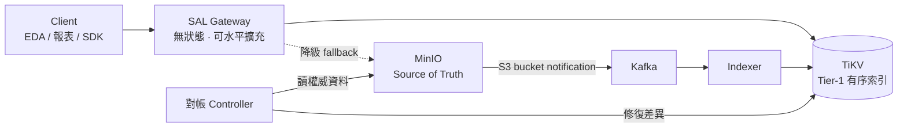
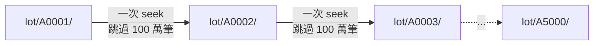
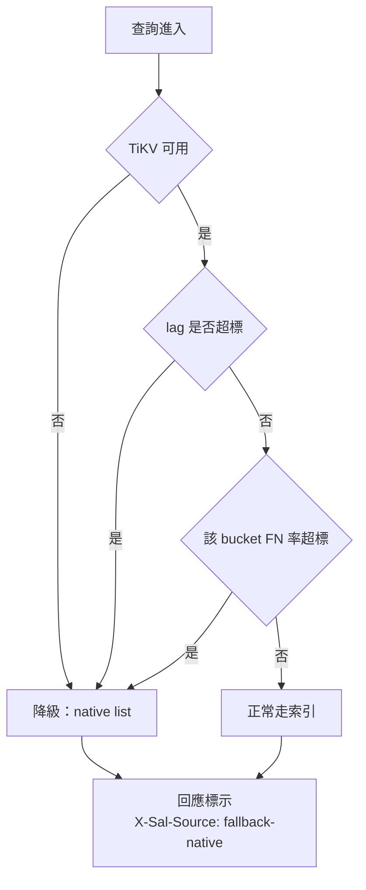
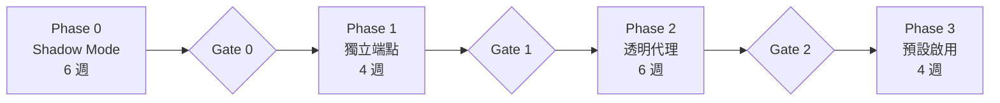

<!--
使用說明：本檔為 Marp 格式簡報。
  預覽：VS Code 安裝 "Marp for VS Code" 擴充套件即可即時預覽
  匯出：marp SAL-Catalog-Design-Review-Deck.md --pdf
  （mermaid 圖需搭配支援 mermaid 的 Marp 主題，或於 VS Code Markdown Preview 檢視）
本檔也可當純 markdown 閱讀。完整技術細節見 SAL-Catalog-Metadata-Service-Design.md
-->

# SAL Catalog
## Object Metadata Index Service

**用一個「可隨時丟棄重建」的衍生索引，把 MinIO 的 LIST 從分鐘級降到毫秒級**


> 完整技術文件：`SAL-Catalog-Metadata-Service-Design.md`（23 節 / 15 張架構圖）

<!--
講稿：
今天的目標不是要各位核可整個七個月的專案，只要核可前六週的 POC。
六週結束時我會帶著實測數字回來，那時候再決定要不要往下走。
這份設計最重要的一件事，我在第三頁講：這個系統壞掉的最壞後果是「變慢」，不是「資料錯」。
-->

---

# 現況：LIST 已經是 fab S3 的效能天花板

命名空間規模：**~5×10⁹ objects**

| 場景 | 現況耗時 |
|---|---|
| 大 prefix 的 `ls` | 30 秒 – 3 分鐘，經常 timeout |
| 夜間 capacity / chargeback 報表 | **4 – 8 小時全掃**，排擠早班正常存取 |
| 「找出過去 24h 修改的檔案」 | **不支援** — 只能全命名空間掃描 |
| 「找出所有超過保留期的資料」 | **不支援** — 合規稽核只能靠一次性腳本 |

**根因**：MinIO 沒有全域 metadata 索引。每次 LIST 都在 erasure set 的所有 drive 上做目錄樹 walk + N 路合併排序。

> **成本正比於「prefix 底下有多少東西」，而不是「你要幾筆」。**
> 這代表：**資料愈成長，LIST 只會愈慢**，而且是線性惡化。

<!--
講稿：
這一頁只要傳達一件事：這不是調參數能解決的問題，是架構問題。
MinIO 的分散式 metadata 設計是它高可用、無單點的優點，LIST 慢是同一個設計的代價。
另外請注意第三、四列 —— 那不是「慢」，是「做不到」。這部分的效益是從 0 到 1，不是倍率問題。
-->

---

# 為什麼風險比想像中低：四條不可動搖的原則

| # | 原則 | 為什麼重要 |
|---|---|---|
| **INV-1** | `xl.meta` 永遠是唯一 source of truth | 索引只回答「有哪些 key」。**所有資料存取仍走 MinIO** |
| **INV-2** | 索引可整份丟棄重建 | **索引無獨立價值 → 沒有資料遺失風險** |
| **INV-3** | 最終一致 + **有界落後** | 每筆回應都帶 lag 值，caller 自行判斷可信度 |
| **INV-4** | 一定要有降級路徑 | 索引不可用時自動回到 native list：**慢，但永遠正確** |

<br/>

> ### 這個專案最壞的失敗模式是「變回現在的速度」，不是「資料出錯」。
>
> 這是它與「自建儲存層」的根本差異，也是我認為這是我們少數
> **可以自己做、而且應該自己做** 的元件的理由。

<!--
講稿：
這頁是整場最重要的一頁，請多停留 30 秒。
主管第一個反應通常是「又要多養一個有狀態系統，出事怎麼辦」。
答案是：這個系統的定位是 cache，不是 database。cache 壞了就繞過它，不會有人掉資料。
INV-2 還有一個實務好處：如果我們選型選錯了，換一套的成本是「重建」，不是「資料遷移 + 雙寫 + 回填校驗」。
-->

---

# 架構一頁圖



**三條路徑，缺一不可：**

| 路徑 | 週期 | 職責 |
|---|---|---|
| **熱**：事件驅動增量更新 | 秒級 | 提供**新鮮度**，但**不保證完整性**（事件會掉） |
| **溫**：滾動範圍對帳 | 天級 | 提供**完整性**，補上熱路徑漏掉的 |
| **冷**：全量重建 | 按需 | 最終保險，災難復原 |

<!--
講稿：
資料路徑（GET/PUT body）完全不經過 SAL，這點請確認大家都聽清楚 —— 我們不碰資料面。
下面那張表是整個正確性論證的骨架，第七頁我會展開算給大家看。
重點：我沒有假裝事件不會掉。事件一定會掉，所以溫路徑是強制項目，不是 nice-to-have。
-->

---

# 決定 1：索引存哪裡 —— 為什麼不是 Elasticsearch

**結論：Tier-1 用 TiKV（有序 KV），Tier-2 才用 OpenSearch。**

| 維度 | **TiKV** | ScyllaDB | PostgreSQL | **OpenSearch** |
|---|---|---|---|---|
| 全域有序 range scan | ★★★★★ | ★★★☆ | ★★★★ | ★★★ |
| **Delimiter skip-scan** | ★★★★★ | ★★☆ | ★★★★ | ★☆ |
| 高頻 update / delete | ★★★★ | ★★★★★ | ★★★ | **★☆** |
| Ad-hoc 屬性查詢 | ★☆ | ★☆ | ★★★★ | ★★★★★ |
| 5B 物件所需節點數 | **6** | 8 | 12+ | **20+** |

**ES 不適合當主索引的四個具體原因：**

1. **Update = delete + reindex** → fab 的高 churn（大量短命 scratch/log）會製造嚴重 segment merge 壓力
2. **`refresh_interval` lag 疊加**在 Kafka lag 之上 → 直接侵蝕新鮮度 SLO
3. **每一頁都要跨 shard fan-out** → p99 被最慢的 shard 綁架
4. **Delimiter（目錄語意）沒有原生對應** → 只能靠高基數 terms aggregation

<!--
講稿：
這題是主管上次特別問的，所以我拉出來單獨一頁。
一句話總結：ListObjectsV2 本質是「有序 range scan」，跟有序 KV 是同構的，跟倒排索引不是。
不是 ES 不好，是存取型態不匹配。所以我把 ES 放在 Tier-2 做它擅長的 tag / metadata 搜尋，
而且 SLA 刻意放寬、可以獨立掛掉不影響主查詢路徑。
如果 review 覺得引入 TiKV 運維風險太高，退階方案是 PostgreSQL 分區表，可撐到 1B —— 因為 INV-2，換掉的成本很低。
-->

---

# 決定 2：效能命脈是 Delimiter Skip-Scan

有序 KV 讓我們可以 **直接 seek 跳過整個 subtree**，不必逐筆掃描：



**實例**：`ls s3://fab-data/lot/` — 5000 個 lot，每 lot 100 萬物件（共 50 億）

| | 需掃描的 entry 數 | 預估耗時 |
|---|---|---|
| MinIO native | **5,000,000,000** | 數小時 / timeout |
| SAL skip-scan | **5,000** | **< 50 ms** |

> **複雜度從 O(prefix 底下物件數) 變成 O(回傳筆數)。**
> 這代表效能與資料總量**脫鉤** —— 資料成長到 200 億，這個查詢依然是 50 ms。

<!--
講稿：
如果只能記住一張投影片，請記這張。
關鍵不是「快 40 倍」，是「複雜度的階數變了」。
現在的架構下，資料每成長一倍，LIST 就慢一倍；改完之後，成長對這類查詢的影響是零。
這也是為什麼我認為這件事愈早做愈划算 —— 現在 5B 做，比 10B 的時候做省一半力氣。
-->

---

# 決定 3：怎麼保證「不會漏檔案」

**前提：事件一定會掉。** `queue_dir` 溢位、Kafka 中斷、節點在發事件前崩潰⋯⋯

**四層防禦：**

| 層 | 機制 | 週期 |
|---|---|---|
| **L1 偵測** | consumer lag / watermark 停滯 / queue 使用率告警 | 秒級 |
| **L2 對帳** | 命名空間切 4096 個 range，逐 range 算 checksum 比對修復 | 7 天一輪 |
| **L3 稽核** | 每日隨機抽 100 萬 key **雙向**比對，產出 FN/FP 率 | 每日 |
| **L4 重建** | 全量重建至影子索引，驗證後原子切換 | 按需 |

**正確性論證：**

```
FN 機率 ≈ P(事件遺失) × P(對帳週期內未被發現) ≈ 10⁻³ × 10⁻³ ≈ 10⁻⁶  ✅
```

> **硬性規定**：任何**會刪除資料**的流程（lifecycle、GC、清理腳本）
> 一律使用 `strong` 模式或逐筆向 MinIO 確認 —— **刪除決策絕不依賴衍生索引。**

<!--
講稿：
L3 是我要向各位承諾的數字來源。每天早上會有一份報告，上面就是 FN 率跟 FP 率。
FN 率超過 1e-6 是 P2 告警、超過 1e-4 該 bucket 自動切 fallback。這是可稽核的，不是口頭保證。
最後那條紅線請特別注意：衍生索引的 false positive 如果被拿去直接刪檔，就會從「索引不準」變成「真的掉資料」。
所以我把它寫成硬性規定，不是建議。
-->

---

# 頭號風險不是效能，是授權洩漏

### 在 fab 環境，**object key 本身就是機密**

```
lot/A1234567/wafer_01/step_0450/tool_ABC123/run_20260101.log
    ↑ lot 編號      ↑ 製程步驟    ↑ 機台配置
```

**即使拿不到檔案內容，光是拿到 key 清單就能反推產能、良率與製程 recipe。**

| 方案 | 評價 |
|---|---|
| SAL 自行驗 SigV4（需持有 secret key） | ❌ **駁回** — 攻擊面倍增 |
| **轉發 caller 原始 Authorization 給 MinIO 做授權 probe** | ✅ **採用** — MinIO 就是權威，SAL 零 credential |
| 同步 IAM policy 至 SAL 自行評估 | ⚠️ Phase 2 優化，有 drift 風險 |

**另外兩道必要防線：**
- Policy 的 `s3:prefix` 條件必須在查詢層**二次強制**（probe 只驗了 bucket 層）
- Continuation token 必須 **HMAC 簽章** — 否則可竄改 cursor 越權讀取其他 prefix
  *（這是外部索引特有、原生 S3 沒有的攻擊面，已列為滲透測試必測項）*

<!--
講稿：
這一頁是我希望資安同仁一起在場的原因。
設計上最重要的決定：SAL 不持有任何 secret key。這樣就算 SAL 被入侵，也不會變成全叢集 credential 外洩。
代價是每次冷查詢多一個 round trip，用 60 秒的授權決策快取吸收掉。
Q1 開放問題：60 秒的權限撤銷延遲能不能接受？需要資安拍板。
-->

---

# 任何不確定的情況，一律降級



**熔斷器的設計偏誤方向永遠是「多降級」而非「多用索引」。慢可以接受，錯不行。**

> ### ⚠️ 但 fallback 有一個容量陷阱
>
> 若上線後 LIST 用量因為「變快了所以大家用更多」而成長 10 倍，
> fallback 時 MinIO 會被瞬間壓垮。
>
> **對策**：fallback 模式強制限流至「上線前基準流量 × 1.2」。
> **這個基準值必須在 Phase 0 就量測並寫死。**

<!--
講稿：
下面那個陷阱是我 review 自己設計時才想到的，覺得值得單獨講。
這是典型的「成功造成的失敗」——效能改善本身會誘發用量成長，然後降級路徑就撐不住了。
所以 Phase 0 的產出不只是「能不能做」，還包括「fallback 限流值設多少」這個必要參數。
-->

---

# 上線計畫：五個 Gate，每一步都能秒級回滾



| 階段 | 內容 | Gate 出場條件 | 回滾方式 |
|---|---|---|---|
| **P0** | 建管線但**不對外服務**，離線對照 native list | FN < 1e-6 連續 7 天；p99 < 120 ms | 停服務，**零影響** |
| **P1** | 獨立端點供容忍型工作負載自願接入 | 5+ 真實 caller 用 2 週無 P2 事故 | 改回原端點 |
| **P2** | 透明代理，**逐 bucket** feature flag 開通 | 涵蓋 80% 流量，fallback < 1% | 單一 flag，**秒級** |
| **P3** | 全 bucket 預設走索引 | 連續 30 天達成全部 SLO | 全域 kill switch |

**總時程約 7 個月，但前 3 個月（至 Gate 0）是最關鍵的驗證期。**

<!--
講稿：
請注意 Phase 0 的性質：那六週我們不碰任何生產流量，只是在旁邊跑一份影子索引，
然後每天拿它跟 native list 的結果對照，算 FN 率。
換句話說，前六週的下檔風險是「浪費六週」，不是「弄壞生產環境」。
這也是為什麼我今天只請各位核可到 Gate 0。
-->

---

# 風險登錄 Top 5

| # | 風險 | 影響 | 機率 | 緩解 |
|---|---|---|---|---|
| **R2** | **授權洩漏** — 回傳 caller 無權見的 key | **極高** | 低 | Probe 由 MinIO 判定 + prefix 二次過濾 + token 簽章 + 滲透測試 |
| **R1** | 索引靜默偏離未被發現 | 高 | 中 | 四層對帳 + 每日 FN/FP SLI + 回應暴露 lag |
| **R7** | **用量因變快而暴增，超出容量規劃** | 中 | **高** | 持續監控 + per-key 限流 + 預留擴容路徑 |
| **R8** | **Scope creep** — 被要求當成通用 metadata DB | 中 | **高** | 明確非目標清單 + INV-1/2 寫入服務契約 |
| **R3** | 團隊對 TiKV 不熟悉 | 中 | 中 | 4 週 ramp-up + 混沌演練 + 退階方案 PostgreSQL |

<br/>

> ### 需要主管在治理層面支持的兩項（非技術問題）
>
> **R7** — 請預留擴容預算。效能改善會誘發用量成長，這幾乎必然發生。
> **R8** — 請支持我們拒絕「把衍生索引當權威資料庫」的需求。這是 INV-1 的組織層面防線。

<!--
講稿：
R2 影響最大但機率低，因為我們有四道防線；R7 R8 機率最高，而且都不是我能靠技術解決的。
R8 特別想請主管背書：一旦這個索引好用了，一定會有人來問「可不可以直接查它就好、不要再打 MinIO」。
那一刻如果我們鬆手，這個系統就從 cache 變成 shadow database，所有風險論證就全部失效。
-->

---

# 投入、效益，與今天的請求

**投入**

| 項目 | 規模 |
|---|---|
| 硬體 | 6× TiKV + 3× PD + 3× Kafka + 3× OpenSearch（待報價） |
| 人力 | 3 工程師 × 2 quarter = **1.5 FTE-year**，上線後 0.3 FTE 維運 |

**效益（Phase 0 量測後可精算）**

| 效益 | 說明 |
|---|---|
| **釋放 MinIO IOPS** ← 主論述 | 若 LIST 佔 25% IOPS，等同瞬間拿回 22% 叢集效能 → **擴容資本支出遞延 N 個月** |
| 批次窗口 | 夜間報表 6 h → < 1 min，不再排擠早班 |
| 解鎖新能力 | 精準 tiering 目標選取、per-lot chargeback、保留期合規稽核 |
| **戰略避險** | MinIO CE 已封存；自建 Catalog 降低廠商綁定，且不阻礙未來評估 SeaweedFS / Ceph |

> ## 今日請求核可
> ### ➊ Phase 0：6 週 Shadow Mode POC（3 工程師）
> ### ➋ §19 八項開放問題的決策窗口 —— 特別是 **Q1 授權快取 TTL**（資安）與 **Q3 Kafka 專用叢集**（Platform）

<!--
講稿：
效益我刻意沒有編金額，只給計算框架 —— 因為分母（LIST 佔 MinIO 總 IOPS 的比例）要 Phase 0 量測。
如果各位需要具體金額，那第一週我就先把這個數字量出來單獨報一次，因為它也是最好向財務解釋的一項。
今天的 Ask 就兩件：六週 POC，加上八個開放問題的決策窗口。
六週後我帶實測數字回來，那時候再決定 Gate 0 過不過。
-->

---

<!-- _paginate: false -->

# 備援投影片
## Backup Slides

以下為 Q&A 可能用到的補充資料

---

# 備援 A：容量估算

假設平均 object key 長度 140 bytes（fab 典型路徑深度 6–8 層）

| 項目 | 每筆 | 5×10⁹ 物件 |
|---|---|---|
| 主索引 `OBJ` | ~225 B | 1.13 TB |
| 時間索引 `TIME` | ~190 B | 0.95 TB |
| 目錄統計 `DSTAT` | — | 0.03 TB |
| **邏輯合計** | | **2.11 TB** |
| zstd 壓縮（key 前綴重複度高） | ÷ 2.5 | 0.85 TB |
| Space amplification 餘裕 | × 1.5 | 1.27 TB |
| **× 3 副本** | | **3.8 TB** |
| 成長至 2×10¹⁰ 的餘裕 | × 4 | **15 TB** |

**節點規劃**：6 × TiKV（32c / 256 GB / 2×3.84 TB NVMe）→ 可用約 23 TB
**從 5B 起步，headroom 至 200 億物件無需擴容。**

---

# 備援 B：一個會靜默丟資料的預設值

MinIO 的 `queue_dir` 是**每節點各自**的本地持久佇列。Kafka 不可達時事件先落地於此。

> **一旦超過 `queue_limit`，MinIO 直接丟棄事件並只寫一行 log** ——
> 不會 back-pressure，也不會失敗使用者的 PUT。

| | 值 | 可緩衝的 Kafka 中斷時間 |
|---|---|---|
| **預設** | `queue_limit = 100,000` | **約 160 秒** ⚠️ |
| **建議** | `queue_limit = 20,000,000` | **約 9 小時** |

（以 32 節點、穩態 20k events/s 計算；每節點約 28 GB 磁碟）

**但即使調到 9 小時，事件遺失仍是「何時發生」而非「會不會發生」的問題。**
→ 這正是第 7 頁對帳機制必須是**強制項目**的原因。

---

# 備援 C：一致性等級與各類 caller 的建議

```http
X-Sal-Consistency: index      # 預設，最快，直接讀索引
X-Sal-Consistency: bounded    # 搭配 X-Sal-Min-Watermark，不滿足則等待或降級
X-Sal-Consistency: strong     # 直接轉發 MinIO native list
```

| Caller 類型 | 建議模式 | 理由 |
|---|---|---|
| Dashboard / 報表 / 容量分析 | `index` | 幾秒落後完全無關緊要 |
| EDA 批次 job 的輸入清單 | `bounded`（min-watermark = job 啟動時間） | 確保看得到 job 啟動前的所有輸出 |
| **Lifecycle / 刪除決策** | **`strong`** | **刪除決策絕不依賴衍生索引** |
| 稽核 / 合規盤點 | `strong` 或 index + 事後對帳報告 | 需可辯護的正確性 |

**每個回應都帶診斷標頭**：`X-Sal-Source`、`X-Sal-Watermark`、`X-Sal-Lag-Ms`、`X-Sal-Recon-Age-Sec`
→ **staleness 是顯式暴露的，不是藏起來的。**

---

# 備援 D：Phase 0 必須量測的七項基準線

Phase 0 的核心價值不是「把系統做出來」，而是**把設計文件裡所有「估算」換成實測值**：

| 待量測項目 | 為何關鍵 |
|---|---|
| 實際平均 key 長度與 prefix 重複度 | 決定索引容量與壓縮率 → 直接影響硬體採購 |
| 實際事件率（穩態 / 尖峰 / 尖峰持續時間） | 決定 Kafka 規模與 `queue_limit` |
| 目錄扇出分布（p50 / p99 / max） | 驗證 skip-scan 效益是否成立 |
| **LIST 佔 MinIO 總 IOPS 比例** | **ROI 主論述的分母** + fallback 限流基準線 |
| 現況各類 LIST 的實際延遲分布 | 效益倍率的分母 |
| MinIO 全量掃描的實際吞吐 | 決定重建與對帳的時間預算 |
| **事件遺失率（shadow 期實測 FN）** | **驗證 7 天對帳週期是否足夠** |

> 六週後的 Gate 0 會議，我會帶著這七個數字回來，
> 以及一份「本設計中哪些假設被推翻了」的誠實清單。
