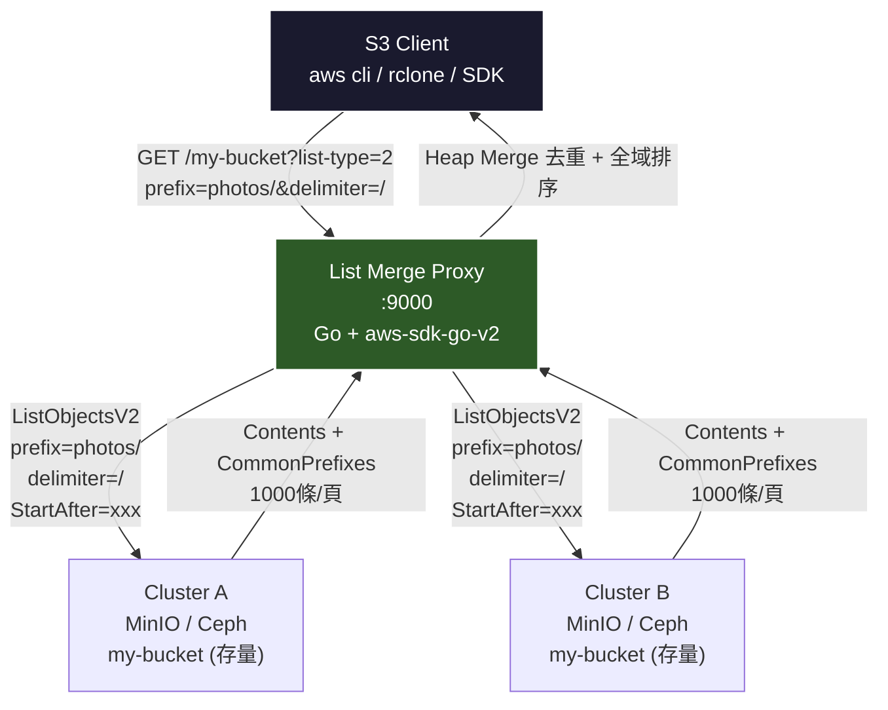
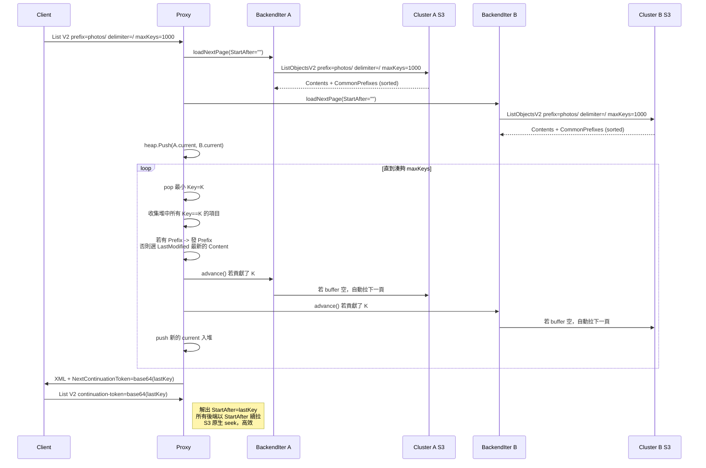
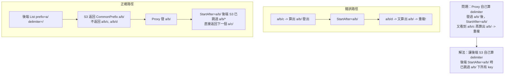
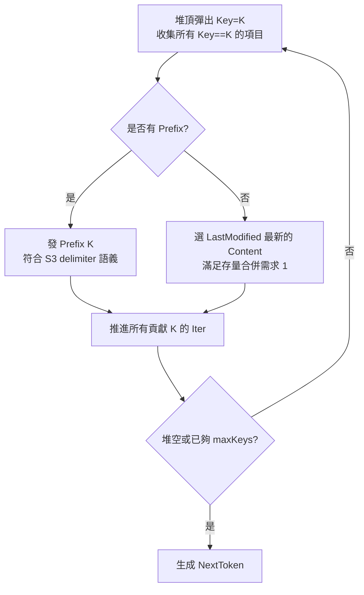

# S3 跨集群同 Bucket List Merge - 完整方案 (Mermaid 版)

## 需求
- Cluster A 和 B 都有 my-bucket，已有大量存量，Key 可能重複
- List 要返回並集，去重取最新
- 需要正確處理 delimiter=/ 的 CommonPrefixes

## 架構圖



```mermaid
flowchart LR
    subgraph BackendA[Cluster A]
        A1[ListObjectsV2<br/>StartAfter]
        A2[Buffer<br/>1000 keys]
    end
    subgraph BackendB[Cluster B]
        B1[ListObjectsV2<br/>StartAfter]
        B2[Buffer<br/>1000 keys]
    end
    subgraph Proxy[Proxy Heap Merge]
        H[Min-Heap<br/>按 Key 排序]
        D{Dedup<br/>同 Key 取最新}
        P{Delimiter?<br/>Prefix 去重}
        R[Result<br/>maxKeys條]
    end
    A2 --> H
    B2 --> H
    H --> D --> P --> R
    R -->|NextToken = base64(lastKey)| Client
```

## 流式 Heap Merge 詳細流程



## Delimiter 跨頁去重問題解法



## 去重邏輯



## 效能對比

| 項目 | 全量版 | 流式版 (本方案) |
|------|--------|----------------|
| 每次請求 S3 調用 | 拉該 prefix 全量 N/1000 次 | 每後端 1 頁 |
| 10M List 1000 條 | ~10秒 | ~50ms |
| 記憶體 | O(N) | O(maxKeys * backends) |
| Token | base64(lastKey) | base64(lastKey) + 後端按 StartAfter 續拉 |

## 配置

```yaml
addr: :9000
primary: cluster-a
backends:
  - name: cluster-a
    endpoint: http://minio-a:9000
    accessKey: xxx
    secretKey: xxx
    bucket: my-bucket
    usePathStyle: true
  - name: cluster-b
    endpoint: http://minio-b:9000
    accessKey: xxx
    secretKey: xxx
    bucket: my-bucket
    usePathStyle: true
```

## 運行

```bash
go mod init s3-list-merge-proxy
go get github.com/aws/aws-sdk-go-v2/config github.com/aws/aws-sdk-go-v2/credentials github.com/aws/aws-sdk-go-v2/service/s3 gopkg.in/yaml.v3
go run main-streaming.go -config config.yaml
```

```bash
aws --endpoint-url http://localhost:9000 s3 ls s3://my-bucket --recursive
aws --endpoint-url http://localhost:9000 s3 ls s3://my-bucket --prefix photos/ --delimiter /
aws --endpoint-url http://localhost:9000 s3api list-objects-v2 --bucket my-bucket --prefix photos/ --delimiter "/" --max-keys 2
```
