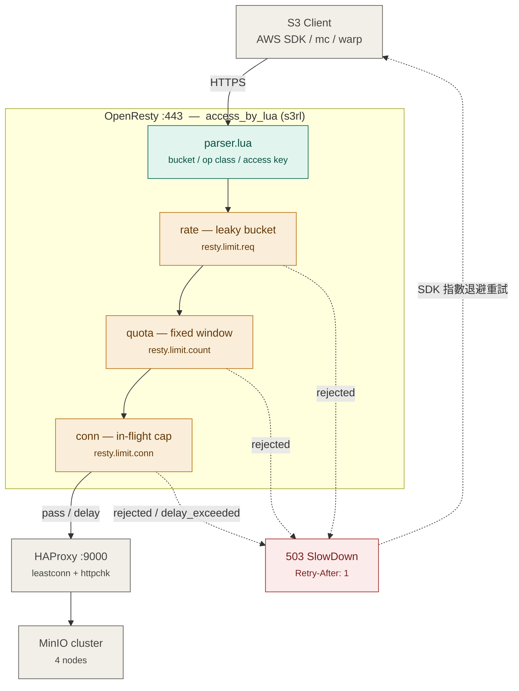

我先把整套實作寫成可直接部署的檔案樹,再說明關鍵設計與踩雷點。

先確認流程方向:`S3 Client → OpenResty (限流層) → HAProxy → MinIO Cluster`。整套已經照真實絕對路徑做好目錄結構,`tar` 解開後直接 `rsync -av ./usr/ /usr/ && rsync -av ./etc/ /etc/` 即可。所有 Lua 檔已通過 LuaJIT 語法檢查。

## 核心設計

**限流維度是 `(bucket, operation class)`,不是 `(bucket)`**。S3 各類操作成本差三個數量級 —— `ListObjectsV2` 在你 5B object 的場景要掃 metadata,`GetObject` 只是一次 lookup。如果用單一 rps 綁整個 bucket,不是 list 打爆 metadata 層,就是為了保護 list 而把 read 也一起餓死。`parser.lua` 把請求分成 `list / read / write / delete / meta / other` 六類,各自獨立限。

**三層串接,`conn` 才是主力**:

| 層 | 機制 | 擋什麼 |
|---|---|---|
| `rate` | leaky bucket (`limit_req`) | 平均速率,平滑突發 |
| `quota` | fixed window (`limit_count`) | 日/月總量,防租戶失控 |
| `conn` | 在途併發 (`limit_conn`) | 慢查詢堆積打穿後端 |

在 fab 這種 list 延遲高的場景,壓 `rps` 效果有限(一個 list 跑 3 秒,rps=50 一樣能堆 150 個在途)。真正保護 MinIO metadata 層的是 `conn`,`wafer-map-index` 我在範例裡直接給 `conn: 1`。任一層 reject 時前面已 commit 的層會 rollback,`log_by_lua` 一定會還 conn slot。

**排隊優先於拒絕**。`max_delay` 內用 `ngx.sleep()` 平滑掉,client 無感;超過才回 `503 SlowDown` + `Retry-After`,讓 AWS SDK 自己指數退避。直接回 429 的話容易觸發重試風暴,反而更慘。

## 三個會炸的地方

1. **SigV4 簽 Host header** — `proxy_set_header Host $http_host;` 這行改掉整個 cluster 簽章全錯。
2. **URI 正規化** — nginx 預設會 merge `//` 並重新 %-encode,canonical URI 就跟 client 簽的不一樣。所以開了 `merge_slashes off` 並用 `proxy_pass http://s3_haproxy$request_uri;` 保留原始字串。
3. **Request buffering** — `STREAMING-AWS4-HMAC-SHA256-PAYLOAD` 的 chunk signature 一旦被緩衝重組就對不上,`proxy_request_buffering off` 必須開。

## 多節點的坑

`lua_shared_dict` 只在單機共享。3 台 OpenResty = 實際限額變 3 倍。建議先把 `limits.json` 數值除以節點數(零延遲、零額外故障點);真要精準再接 `redis_bucket.lua`,但 Redis 就進了 S3 資料面的關鍵路徑,那支已經寫成 fail-open。

HAProxy 那層我刻意**不做**限流,只留一道「拒絕非 OpenResty 來源」的 ACL —— 否則有人直連 :9000 就整個繞過去了。

改限額不需要 reload nginx,改 `/etc/openresty/s3rl/limits.json` 五秒內全 worker 生效,或走 `PUT /-/s3rl/config`(原子寫入)。上線前先用 `GET /-/s3rl/policy?bucket=xxx` 確認 prefix rule 和 exact bucket 的覆寫順序符合預期。
