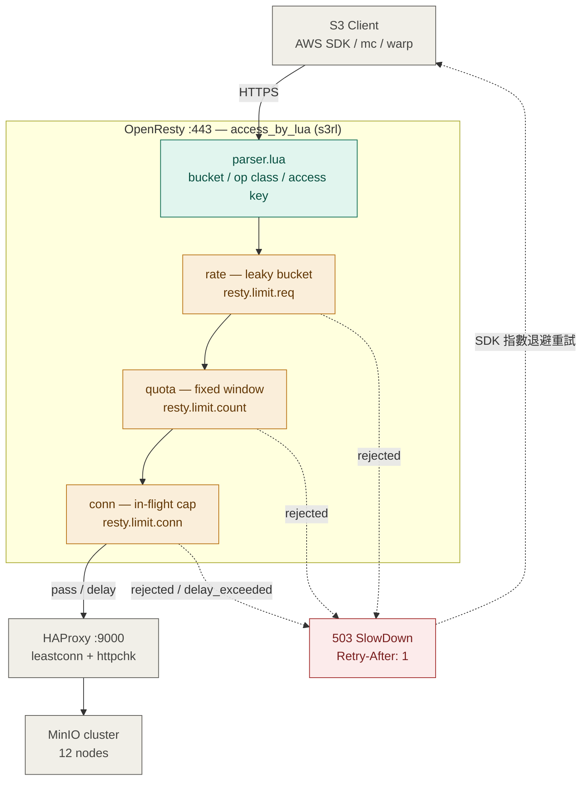
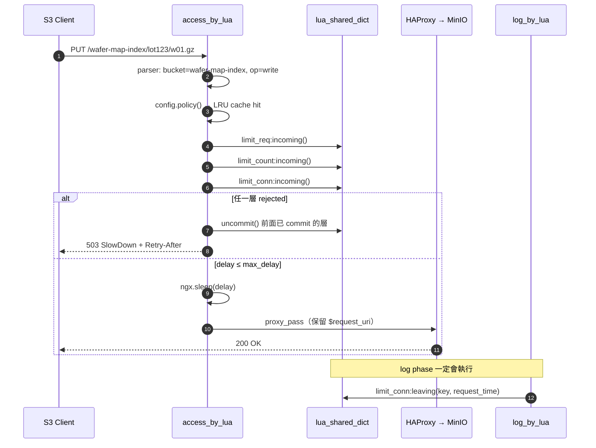

# OpenResty S3 Bucket-Level Rate Limiting

```
S3 Client ──HTTPS──> OpenResty :443 ──HTTP──> HAProxy :9000 ──> MinIO :9000 x N
                     (bucket 限流層)          (LB + health)     (資料層)
```


 
## 請求生命週期
 



## 檔案清單

| 路徑 | 用途 |
|---|---|
| `/usr/local/openresty/nginx/conf/nginx.conf` | 主設定、shared dict、upstream |
| `/usr/local/openresty/nginx/conf/conf.d/s3-gateway.conf` | server block、proxy 參數 |
| `/usr/local/openresty/lualib/s3rl/parser.lua` | bucket/key 解析、operation 分類、AK 抽取 |
| `/usr/local/openresty/lualib/s3rl/config.lua` | 設定載入、熱抽換、policy 解析 |
| `/usr/local/openresty/lualib/s3rl/limiter.lua` | rate / quota / conn 三層限制 |
| `/usr/local/openresty/lualib/s3rl/response.lua` | S3 相容 XML 錯誤 |
| `/usr/local/openresty/lualib/s3rl/metrics.lua` | Prometheus 計數 |
| `/usr/local/openresty/lualib/s3rl/handler.lua` | access / log phase 入口 |
| `/usr/local/openresty/lualib/s3rl/admin.lua` | 管理 API |
| `/usr/local/openresty/lualib/s3rl/redis_bucket.lua` | 選用：多節點全域限流 |
| `/etc/openresty/s3rl/limits.json` | 限流政策（唯一需要日常編輯的檔案） |
| `/etc/haproxy/haproxy.cfg` | 後端 LB |

## 安裝

```bash
# 1. OpenResty + lua-resty-limit-traffic（1.19+ 已內建 opm 套件）
yum install -y openresty openresty-opm
opm get openresty/lua-resty-limit-traffic

# 2. 佈署
rsync -av ./usr/  /usr/
rsync -av ./etc/  /etc/
mkdir -p /var/log/openresty /etc/openresty/ssl
chown -R nginx:nginx /var/log/openresty /etc/openresty/s3rl

# 3. 驗證語法
/usr/local/openresty/bin/openresty -t

# 4. 啟動
systemctl enable --now openresty
```

## 驗證

```bash
# policy 實際套用結果
curl -s 'http://127.0.0.1/-/s3rl/policy?bucket=fab12-oven-raw' | jq

# 壓 ListObjectsV2 看有沒有被擋
warp list --host=s3.fab.local --bucket=wafer-map-index --concurrent=64 --duration=60s

# 觀察
curl -s http://127.0.0.1/-/s3rl/metrics | grep s3rl_
tail -f /var/log/openresty/s3-access.log | jq 'select(.rl != "pass")'
```

## 改限額（不需 reload nginx）

```bash
# 直接改檔，5 秒內全 worker 生效
vi /etc/openresty/s3rl/limits.json

# 或走 API（原子寫入）
curl -X PUT http://127.0.0.1/-/s3rl/config \
     -H 'Content-Type: application/json' \
     --data-binary @limits.json
```

## 調參起手式

1. 先全部設 `enabled: true` 但把數值放大 10 倍，跑一週收 `s3rl_requests_total`。
2. 取每個 bucket 的 P99 rps，`rps = P99 × 1.3`、`burst = rps × 2`。
3. `conn` 才是真正保護 MinIO metadata 層的那一層 —— 用
   `conn ≈ 目標 rps × 平均延遲`。ListObjectsV2 在 5B object 規模延遲高，
   `conn` 給小（個位數）比壓 `rps` 有效得多。
4. `max_delay` 控制「排隊 vs 直接拒絕」：0.2~0.5s 內排隊（SDK 無感），
   超過就回 503 SlowDown 讓 SDK 自己退避。

## 多節點注意

`lua_shared_dict` 只在單機共享。3 台 OpenResty = 實際限額變 3 倍。
- 簡單解：`limits.json` 的數值除以節點數（推薦，零延遲、零故障點）
- 精準解：接 `s3rl/redis_bucket.lua`（+0.2~0.5ms，Redis 需 fail-open）
